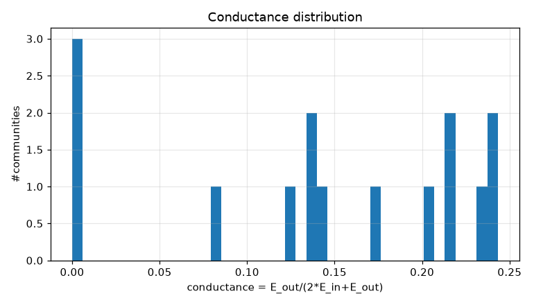
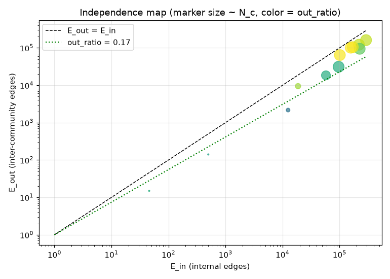
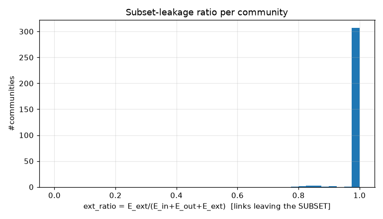
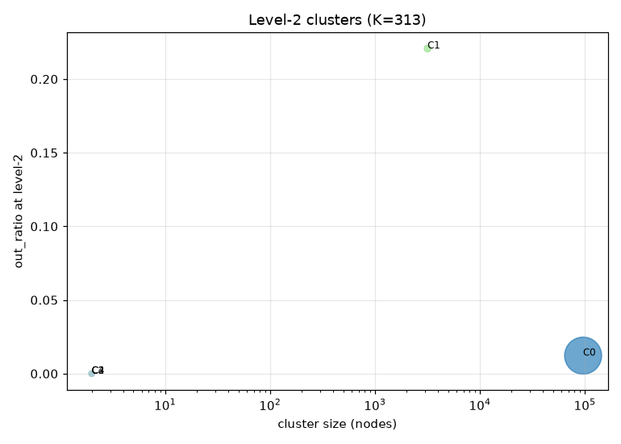
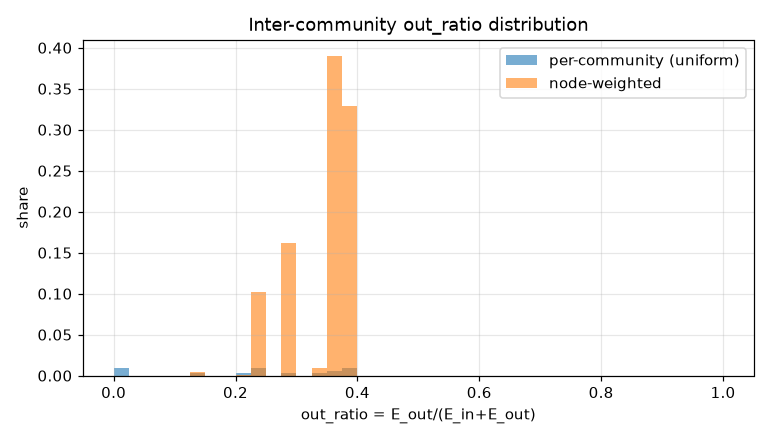
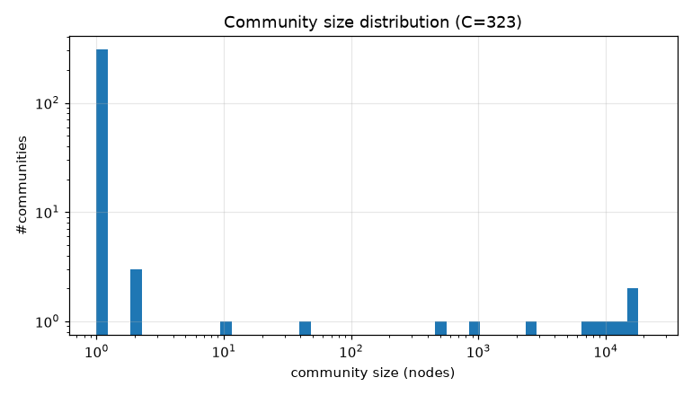

# コミュニティ分割 PoC レポート: bfs_geo_100k

生成: 2026-09-25T14:07:51 / seed=42 / resolution=0.5 / dump=2026-09-02

## 1. サブセット概要

| 項目 | 値 |
|---|---|
| 戦略 | outlink_bfs |
| ノード数 | 100,000 |
| 内部エッジ(有向・解決後) | 6,874,293 |
| 内部エッジ(無向・一意) | 1,709,930 |
| サブセット外へのリンク(outgoing) | 13,286,361 |
| サブセット外からのリンク(incoming) | 26,024,757 |
| リーク率 out/(int+out) | 0.659 |
| ページID範囲 | 10〜5,288,953 |

## 2. resolution スイープ(コミュニティサイズ分布)

| resolution | #comms | 最大シェア | top5シェア | サイズ中央値 | p25 | p75 | cross_edge_fraction |
|---|---|---|---|---|---|---|---|
| 0.5 | 323 | 0.221 | 0.799 | 1.000 | 1.000 | 1.000 | 0.208 |
| 1.0 | 340 | 0.139 | 0.527 | 1.000 | 1.000 | 1.000 | 0.255 |
| 2.0 | 364 | 0.065 | 0.271 | 1.000 | 1.000 | 1.000 | 0.316 |

## 3. 全体指標(採用 resolution)

| 指標 | 値 |
|---|---|
| コミュニティ数 | 323 |
| 最大コミュニティのノードシェア | 0.221 |
| 上位5コミュニティのシェア | 0.799 |
| cross_edge_fraction(全体) | 0.208 |
| out_ratio(エッジ重み付き平均) | 0.344 |
| out_ratio(ノード重み付き中央値) | 0.356 |
| out_ratio p25/p50/p75 | 0.184/0.246/0.356 |
| conductance p25/p50/p75 | 0.102/0.140/0.217 |
| サブセット外へのリンク数(有向) | 13,286,361 |
| サブセット外からのリンク数(有向) | 26,024,757 |

## 4. 上位コミュニティ(サイズ順 top 15)

| comm | 代表記事 | N_c | E_in | E_out | E_ext(場外) | out_ratio | conductance | avg_deg | 境界ノード率 |
|---|---|---|---|---|---|---|---|---|---|
| 0 | 愛知県、大阪府、京都府 | 22,146 | 292,492 | 161,671 | 6,722,261 | 0.356 | 0.217 | 26.4 | 0.815 |
| 1 | 世紀、ギリシア語、空港の一覧 | 16,855 | 219,547 | 121,648 | 8,670,943 | 0.357 | 0.217 | 26.1 | 0.795 |
| 2 | 東京都、宮城県、文化放送 | 16,202 | 226,115 | 94,686 | 9,421,329 | 0.295 | 0.173 | 27.9 | 0.811 |
| 3 | 純資産、日本のナンバープレート、中央区_(東京都) | 13,213 | 171,361 | 105,056 | 4,039,321 | 0.380 | 0.235 | 25.9 | 0.905 |
| 4 | 内閣総理大臣、東京大学大学院法学政治学研究科・法学部、一般社団法人 | 11,487 | 157,543 | 101,360 | 3,738,232 | 0.391 | 0.243 | 27.4 | 0.916 |
| 5 | ドメイン_(分類学)、Bibcode、ChemSpider | 8,141 | 101,485 | 64,372 | 2,230,129 | 0.388 | 0.241 | 24.9 | 0.842 |
| 6 | 無四球試合、兄弟スポーツ選手一覧、J3リーグ | 7,456 | 96,490 | 31,280 | 2,857,930 | 0.245 | 0.139 | 25.9 | 0.731 |
| 7 | バイパス道路、スマートインターチェンジ、西日本高速道路 | 2,693 | 57,873 | 18,475 | 1,042,587 | 0.242 | 0.138 | 43.0 | 0.916 |
| 8 | 西鉄バス、諏訪之瀬島、離島振興法 | 956 | 18,747 | 9,492 | 300,613 | 0.336 | 0.202 | 39.2 | 0.933 |
| 9 | 長野県道114号・新潟県道225号川尻小谷糸魚川線、愛知県道189号・岐阜県道113号善師野多治見線、愛知県道・長野県道10号設楽根羽線 | 485 | 12,544 | 2,172 | 273,390 | 0.148 | 0.080 | 51.7 | 0.868 |
| 10 | 東春日井郡、大森_(名古屋市)、小幡_(名古屋市) | 41 | 500 | 141 | 6,615 | 0.220 | 0.124 | 24.4 | 0.732 |
| 11 | TVグローボ、ア・レイ・ドゥ・アモール、セグンド・ソル | 11 | 46 | 15 | 485 | 0.246 | 0.140 | 8.4 | 0.273 |
| 12 | 日本縦断・民謡大全集、日本民謡決定版 | 2 | 1 | 0 | 50 | 0.000 | 0.000 | 1.0 | 0.000 |
| 13 | 美浜町立上野間小学校、上野間村 | 2 | 1 | 0 | 60 | 0.000 | 0.000 | 1.0 | 0.000 |
| 14 | 六軒町_(西宮市)、鷲林寺_(地名) | 2 | 1 | 0 | 262 | 0.000 | 0.000 | 1.0 | 0.000 |

## 5. コミュニティ間エッジ top 20

| comm A | comm B | エッジ数 | A代表 | B代表 |
|---|---|---|---|---|
| 0 | 1 | 38,742 | 愛知県、大阪府 | 世紀、ギリシア語 |
| 0 | 3 | 35,498 | 愛知県、大阪府 | 純資産、日本のナンバープレート |
| 0 | 4 | 27,875 | 愛知県、大阪府 | 内閣総理大臣、東京大学大学院法学政治学研究科・法学部 |
| 1 | 4 | 26,568 | 世紀、ギリシア語 | 内閣総理大臣、東京大学大学院法学政治学研究科・法学部 |
| 0 | 2 | 20,394 | 愛知県、大阪府 | 東京都、宮城県 |
| 2 | 3 | 19,714 | 東京都、宮城県 | 純資産、日本のナンバープレート |
| 0 | 5 | 19,217 | 愛知県、大阪府 | ドメイン_(分類学)、Bibcode |
| 1 | 2 | 18,220 | 世紀、ギリシア語 | 東京都、宮城県 |
| 1 | 5 | 16,878 | 世紀、ギリシア語 | ドメイン_(分類学)、Bibcode |
| 3 | 4 | 16,515 | 純資産、日本のナンバープレート | 内閣総理大臣、東京大学大学院法学政治学研究科・法学部 |
| 2 | 4 | 16,009 | 東京都、宮城県 | 内閣総理大臣、東京大学大学院法学政治学研究科・法学部 |
| 1 | 3 | 12,851 | 世紀、ギリシア語 | 純資産、日本のナンバープレート |
| 2 | 6 | 9,937 | 東京都、宮城県 | 無四球試合、兄弟スポーツ選手一覧 |
| 0 | 7 | 9,739 | 愛知県、大阪府 | バイパス道路、スマートインターチェンジ |
| 2 | 5 | 9,355 | 東京都、宮城県 | ドメイン_(分類学)、Bibcode |
| 3 | 5 | 8,458 | 純資産、日本のナンバープレート | ドメイン_(分類学)、Bibcode |
| 4 | 5 | 8,262 | 内閣総理大臣、東京大学大学院法学政治学研究科・法学部 | ドメイン_(分類学)、Bibcode |
| 1 | 6 | 6,714 | 世紀、ギリシア語 | 無四球試合、兄弟スポーツ選手一覧 |
| 3 | 7 | 5,903 | 純資産、日本のナンバープレート | バイパス道路、スマートインターチェンジ |
| 0 | 6 | 4,650 | 愛知県、大阪府 | 無四球試合、兄弟スポーツ選手一覧 |

## 6. ハブ記事の影響(次数 top 20)

| # | 記事 | 内部次数 | 場外次数 | comm | フラグ |
|---|---|---|---|---|---|
| 1 | 東京都 | 120 | 99,989 | 2 |  |
| 2 | 北海道 | 61 | 47,250 | 0 |  |
| 3 | 愛知県 | 120 | 42,031 | 0 |  |
| 4 | 大阪府 | 120 | 41,413 | 0 |  |
| 5 | 福岡県 | 120 | 30,858 | 0 |  |
| 6 | 市町村 | 89 | 28,737 | 0 |  |
| 7 | 長野県 | 60 | 22,688 | 0 |  |
| 8 | 広島県 | 60 | 22,279 | 0 |  |
| 9 | 京都府 | 120 | 22,025 | 0 |  |
| 10 | 新潟県 | 60 | 21,207 | 0 |  |
| 11 | 宮城県 | 120 | 19,241 | 2 |  |
| 12 | アメリカ合衆国の映画 | 94 | 9,694 | 2 |  |
| 13 | AKB48 | 111 | 9,589 | 2 |  |
| 14 | 地名 | 68 | 9,572 | 0 |  |
| 15 | 宝塚歌劇団103期生 | 56 | 9,582 | 2 |  |
| 16 | 天皇杯_JFA_全日本サッカー選手権大会 | 106 | 9,519 | 6 |  |
| 17 | モスクワ | 111 | 9,441 | 1 |  |
| 18 | イスラエル | 69 | 9,415 | 1 |  |
| 19 | ローマ | 63 | 9,349 | 1 |  |
| 20 | 国際サッカー連盟 | 66 | 9,267 | 6 |  |

- 上位1%ノードが接する内部エッジのシェア: 0.062
- 内部次数 max: 120 / p50・p90・p99: 28.000・71.000・100.000

## 7. 階層化テスト(level-2)

| 指標 | 値 |
|---|---|
| 上位クラスタ数 K | 313 |
| 最大クラスタのシェア | 0.965 |
| out_ratio2(エッジ重み付き平均) | 0.023 |
| コミュニティ間グラフ modularity | -0.019 |

| cluster | #comms | N_nodes | E_in(記事) | E_between(comm間) | E_out2 | E_ext(場外) | out_ratio2 | conductance2 |
|---|---|---|---|---|---|---|---|---|
| 0 | 10 | 96,508 | 1284326 | 334843 | 20035 | 37987858 | 0.012 | 0.006 |
| 1 | 2 | 3,178 | 70417 | 306 | 20035 | 1315977 | 0.221 | 0.124 |
| 2 | 1 | 2 | 1 | 0 | 0 | 50 | 0.000 | 0.000 |
| 3 | 1 | 2 | 1 | 0 | 0 | 60 | 0.000 | 0.000 |
| 4 | 1 | 2 | 1 | 0 | 0 | 262 | 0.000 | 0.000 |
| 5 | 1 | 1 | 0 | 0 | 0 | 9 | - | - |
| 6 | 1 | 1 | 0 | 0 | 0 | 19 | - | - |
| 7 | 1 | 1 | 0 | 0 | 0 | 108 | - | - |
| 8 | 1 | 1 | 0 | 0 | 0 | 5 | - | - |
| 9 | 1 | 1 | 0 | 0 | 0 | 15 | - | - |
| 10 | 1 | 1 | 0 | 0 | 0 | 41 | - | - |
| 11 | 1 | 1 | 0 | 0 | 0 | 25 | - | - |
| 12 | 1 | 1 | 0 | 0 | 0 | 25 | - | - |
| 13 | 1 | 1 | 0 | 0 | 0 | 48 | - | - |
| 14 | 1 | 1 | 0 | 0 | 0 | 26 | - | - |

## 8. 図

