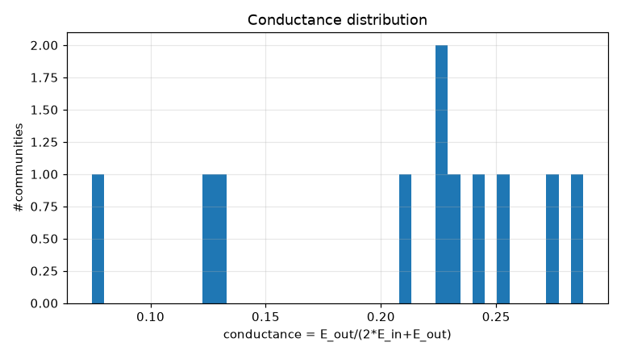
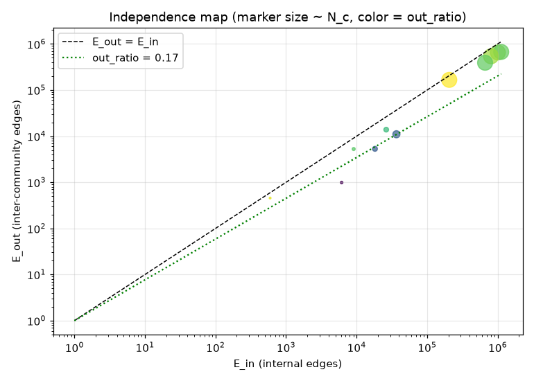
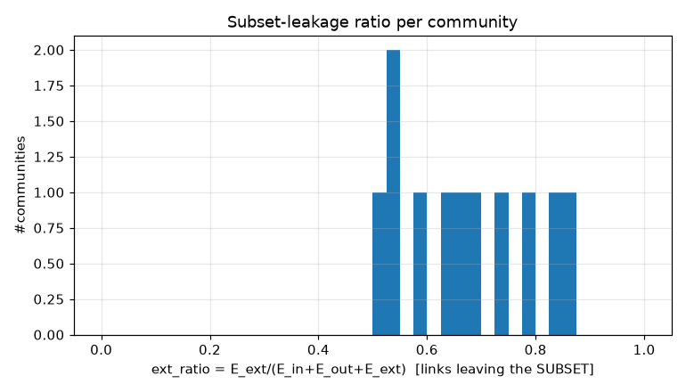
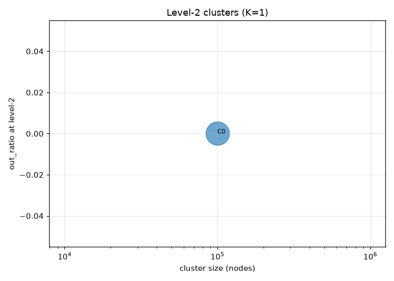
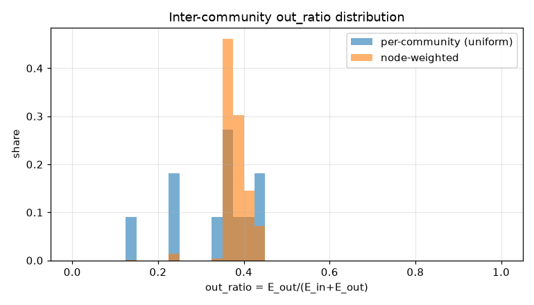
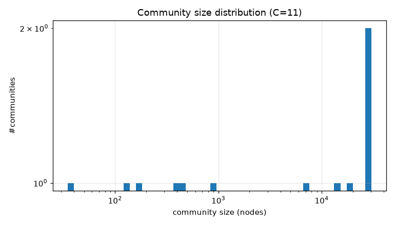

# コミュニティ分割 PoC レポート: bfs_geo_100k

生成: 2026-09-25T14:24:15 / seed=42 / resolution=0.5 / dump=2026-09-02

## 1. サブセット概要

| 項目 | 値 |
|---|---|
| 戦略 | outlink_bfs |
| ノード数 | 100,000 |
| 内部エッジ(有向・解決後) | 6,874,293 |
| 内部エッジ(無向・一意) | 5,131,639 |
| サブセット外へのリンク(outgoing) | 13,286,361 |
| サブセット外からのリンク(incoming) | 26,024,757 |
| リーク率 out/(int+out) | 0.659 |
| ページID範囲 | 10〜5,288,953 |

## 2. resolution スイープ(コミュニティサイズ分布)

| resolution | #comms | 最大シェア | top5シェア | サイズ中央値 | p25 | p75 | cross_edge_fraction |
|---|---|---|---|---|---|---|---|
| 0.5 | 11 | 0.303 | 0.979 | 919.000 | 288.000 | 16412.000 | 0.240 |
| 1.0 | 23 | 0.151 | 0.607 | 2136.000 | 378.500 | 7857.000 | 0.331 |
| 2.0 | 45 | 0.086 | 0.336 | 1415.000 | 807.000 | 3009.000 | 0.397 |

## 3. 全体指標(採用 resolution)

| 指標 | 値 |
|---|---|
| コミュニティ数 | 11 |
| 最大コミュニティのノードシェア | 0.303 |
| 上位5コミュニティのシェア | 0.979 |
| cross_edge_fraction(全体) | 0.240 |
| out_ratio(エッジ重み付き平均) | 0.387 |
| out_ratio(ノード重み付き中央値) | 0.394 |
| out_ratio p25/p50/p75 | 0.288/0.371/0.398 |
| conductance p25/p50/p75 | 0.169/0.228/0.248 |
| サブセット外へのリンク数(有向) | 13,286,361 |
| サブセット外からのリンク数(有向) | 26,024,757 |

## 4. 上位コミュニティ(サイズ順 top 15)

| comm | 代表記事 | N_c | E_in | E_out | E_ext(場外) | out_ratio | conductance | avg_deg | 境界ノード率 |
|---|---|---|---|---|---|---|---|---|---|
| 0 | 内閣総理大臣、日本共産党、19世紀 | 30,273 | 1,006,747 | 653,552 | 10,401,354 | 0.394 | 0.245 | 66.5 | 0.903 |
| 1 | 東京都、北海道、大阪府 | 27,675 | 1,122,921 | 671,832 | 8,283,224 | 0.374 | 0.230 | 81.2 | 0.923 |
| 5 | 毎日新聞社、スポーツニッポン、ジャパン・ニュース・ネットワーク | 18,286 | 663,092 | 391,374 | 10,423,088 | 0.371 | 0.228 | 72.5 | 0.967 |
| 2 | 明治維新、天皇、8月29日 | 14,538 | 805,690 | 540,294 | 6,855,875 | 0.401 | 0.251 | 110.8 | 0.930 |
| 6 | 大学、文部科学省、筑波大学 | 7,139 | 206,007 | 166,434 | 2,406,450 | 0.447 | 0.288 | 57.7 | 0.962 |
| 3 | 建設省、大阪府道10号・兵庫県道100号大阪池田線、岡山県道・兵庫県道96号岡山赤穂線 | 919 | 36,681 | 11,012 | 491,131 | 0.231 | 0.131 | 79.8 | 0.999 |
| 4 | 長野県道・愛知県道・静岡県道1号飯田富山佐久間線、静岡県道・愛知県道173号湖西東細谷線、中部地方の道路一覧 | 437 | 18,203 | 5,313 | 266,943 | 0.226 | 0.127 | 83.3 | 1.000 |
| 8 | 日本語の方言、近畿方言、業界用語 | 405 | 26,297 | 13,844 | 89,932 | 0.345 | 0.208 | 129.9 | 0.995 |
| 10 | 美術館、国立文化財機構、公立 | 171 | 9,094 | 5,261 | 51,712 | 0.366 | 0.224 | 106.4 | 1.000 |
| 9 | ISO_3166、国名コード、ISO_3166-2:RU | 122 | 6,133 | 987 | 39,067 | 0.139 | 0.074 | 100.5 | 0.984 |
| 7 | アスペクト比、東京都旗、静岡県旗 | 35 | 595 | 455 | 2,342 | 0.433 | 0.277 | 34.0 | 1.000 |

## 5. コミュニティ間エッジ top 20

| comm A | comm B | エッジ数 | A代表 | B代表 |
|---|---|---|---|---|
| 0 | 1 | 260,197 | 内閣総理大臣、日本共産党 | 東京都、北海道 |
| 0 | 2 | 208,111 | 内閣総理大臣、日本共産党 | 明治維新、天皇 |
| 1 | 2 | 204,565 | 東京都、北海道 | 明治維新、天皇 |
| 1 | 5 | 139,511 | 東京都、北海道 | 毎日新聞社、スポーツニッポン |
| 0 | 5 | 121,185 | 内閣総理大臣、日本共産党 | 毎日新聞社、スポーツニッポン |
| 2 | 5 | 94,166 | 明治維新、天皇 | 毎日新聞社、スポーツニッポン |
| 0 | 6 | 55,936 | 内閣総理大臣、日本共産党 | 大学、文部科学省 |
| 1 | 6 | 47,839 | 東京都、北海道 | 大学、文部科学省 |
| 5 | 6 | 34,061 | 毎日新聞社、スポーツニッポン | 大学、文部科学省 |
| 2 | 6 | 27,873 | 明治維新、天皇 | 大学、文部科学省 |
| 1 | 3 | 9,434 | 東京都、北海道 | 建設省、大阪府道10号・兵庫県道100号大阪池田線 |
| 0 | 8 | 5,783 | 内閣総理大臣、日本共産党 | 日本語の方言、近畿方言 |
| 1 | 4 | 4,647 | 東京都、北海道 | 長野県道・愛知県道・静岡県道1号飯田富山佐久間線、静岡県道・愛知県道173号湖西東細谷線 |
| 1 | 8 | 3,177 | 東京都、北海道 | 日本語の方言、近畿方言 |
| 2 | 8 | 2,898 | 明治維新、天皇 | 日本語の方言、近畿方言 |
| 1 | 10 | 2,292 | 東京都、北海道 | 美術館、国立文化財機構 |
| 5 | 8 | 1,633 | 毎日新聞社、スポーツニッポン | 日本語の方言、近畿方言 |
| 2 | 10 | 1,324 | 明治維新、天皇 | 美術館、国立文化財機構 |
| 0 | 9 | 947 | 内閣総理大臣、日本共産党 | ISO_3166、国名コード |
| 2 | 3 | 904 | 明治維新、天皇 | 建設省、大阪府道10号・兵庫県道100号大阪池田線 |

## 6. ハブ記事の影響(次数 top 20)

| # | 記事 | 内部次数 | 場外次数 | comm | フラグ |
|---|---|---|---|---|---|
| 1 | 東京都 | 14,055 | 99,989 | 1 |  |
| 2 | 北海道 | 9,879 | 47,250 | 1 |  |
| 3 | 大阪府 | 7,119 | 41,413 | 1 |  |
| 4 | 愛知県 | 6,479 | 42,031 | 1 |  |
| 5 | 福岡県 | 5,915 | 30,858 | 1 |  |
| 6 | 市町村 | 3,974 | 28,737 | 1 |  |
| 7 | 長野県 | 4,876 | 22,688 | 1 |  |
| 8 | 広島県 | 4,732 | 22,279 | 1 |  |
| 9 | 京都府 | 4,404 | 22,025 | 1 |  |
| 10 | 新潟県 | 4,513 | 21,207 | 1 |  |
| 11 | 宮城県 | 4,604 | 19,241 | 1 |  |
| 12 | 仙台市 | 2,389 | 8,809 | 1 |  |
| 13 | 8月10日 | 2,145 | 8,963 | 2 | date |
| 14 | 10月3日 | 2,046 | 9,029 | 2 | date |
| 15 | 10月14日 | 2,132 | 8,921 | 2 | date |
| 16 | 10月6日 | 1,952 | 9,002 | 2 | date |
| 17 | 4月23日 | 1,990 | 8,960 | 2 | date |
| 18 | 9月20日 | 2,106 | 8,844 | 2 | date |
| 19 | 4月28日 | 2,130 | 8,809 | 2 | date |
| 20 | 5月10日 | 1,989 | 8,914 | 2 | date |

- 上位1%ノードが接する内部エッジのシェア: 0.255
- 内部次数 max: 14,055 / p50・p90・p99: 49.000・234.000・829.000

## 7. 階層化テスト(level-2)

| 指標 | 値 |
|---|---|
| 上位クラスタ数 K | 1 |
| 最大クラスタのシェア | 1.000 |
| out_ratio2(エッジ重み付き平均) | 0.000 |
| コミュニティ間グラフ modularity | 0.000 |

| cluster | #comms | N_nodes | E_in(記事) | E_between(comm間) | E_out2 | E_ext(場外) | out_ratio2 | conductance2 |
|---|---|---|---|---|---|---|---|---|
| 0 | 11 | 100,000 | 3901460 | 1230179 | 0 | 39311118 | 0.000 | 0.000 |

## 8. 図

