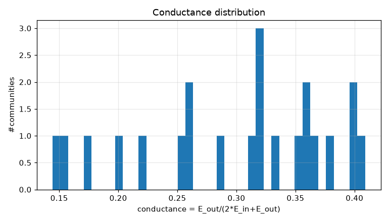
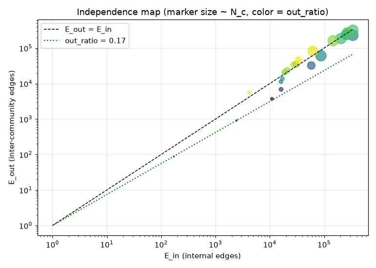
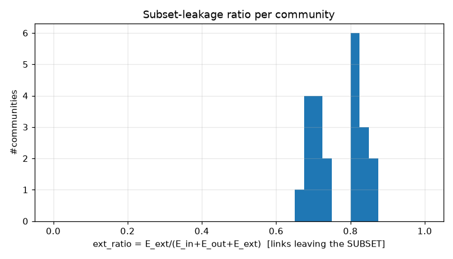
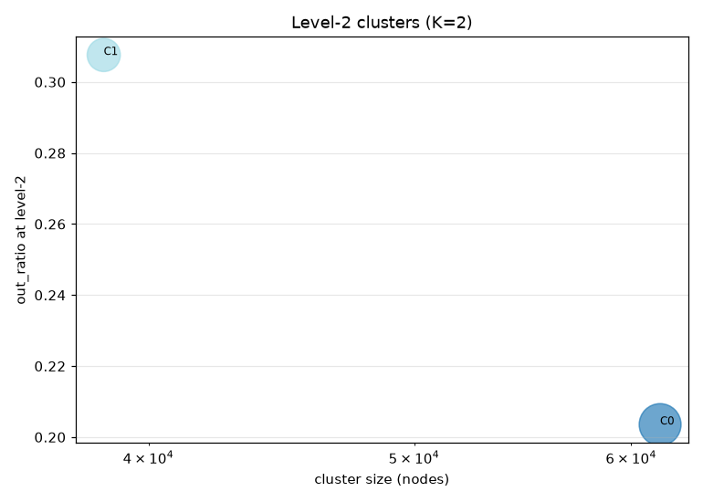
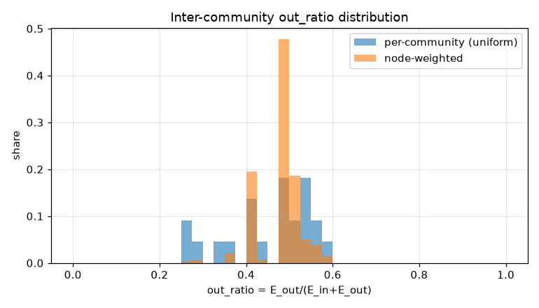
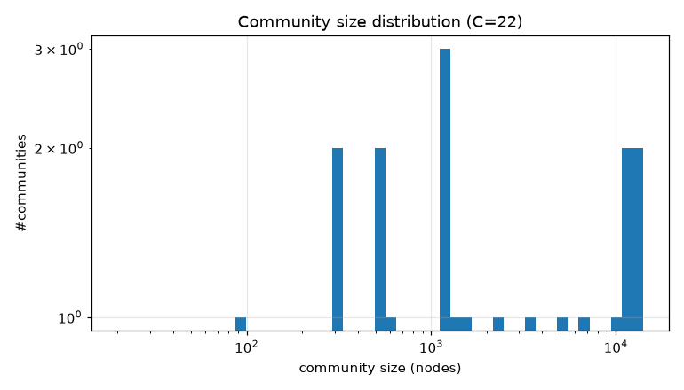

# コミュニティ分割 PoC レポート: bfs_geo_100k

生成: 2026-09-25T14:16:41 / seed=42 / resolution=1.0 / dump=2026-09-02

## 1. サブセット概要

| 項目 | 値 |
|---|---|
| 戦略 | outlink_bfs |
| ノード数 | 100,000 |
| 内部エッジ(有向・解決後) | 6,874,293 |
| 内部エッジ(無向・一意) | 3,258,389 |
| サブセット外へのリンク(outgoing) | 13,286,361 |
| サブセット外からのリンク(incoming) | 26,024,757 |
| リーク率 out/(int+out) | 0.659 |
| ページID範囲 | 10〜5,288,953 |

## 2. resolution スイープ(コミュニティサイズ分布)

| resolution | #comms | 最大シェア | top5シェア | サイズ中央値 | p25 | p75 | cross_edge_fraction |
|---|---|---|---|---|---|---|---|
| 1.0 | 22 | 0.141 | 0.637 | 1473.500 | 557.750 | 9416.500 | 0.313 |

## 3. 全体指標(採用 resolution)

| 指標 | 値 |
|---|---|
| コミュニティ数 | 22 |
| 最大コミュニティのノードシェア | 0.141 |
| 上位5コミュニティのシェア | 0.637 |
| cross_edge_fraction(全体) | 0.313 |
| out_ratio(エッジ重み付き平均) | 0.477 |
| out_ratio(ノード重み付き中央値) | 0.483 |
| out_ratio p25/p50/p75 | 0.405/0.482/0.530 |
| conductance p25/p50/p75 | 0.254/0.318/0.361 |
| サブセット外へのリンク数(有向) | 13,286,361 |
| サブセット外からのリンク数(有向) | 26,024,757 |

## 4. 上位コミュニティ(サイズ順 top 15)

| comm | 代表記事 | N_c | E_in | E_out | E_ext(場外) | out_ratio | conductance | avg_deg | 境界ノード率 |
|---|---|---|---|---|---|---|---|---|---|
| 0 | 東京都、福岡県、大河ドラマ | 14,065 | 339,406 | 229,876 | 8,410,107 | 0.404 | 0.253 | 48.3 | 0.964 |
| 1 | 19世紀、太平洋、外務省 | 13,472 | 269,201 | 249,591 | 5,115,909 | 0.481 | 0.317 | 40.0 | 0.946 |
| 2 | 明治維新、徳川家康、1872年 | 12,797 | 340,201 | 320,582 | 6,038,738 | 0.485 | 0.320 | 53.2 | 0.922 |
| 3 | 北海道、市町村、長野県 | 12,253 | 272,415 | 274,980 | 3,494,548 | 0.502 | 0.335 | 44.5 | 0.942 |
| 4 | 大阪府、駅ナンバリング、国鉄分割民営化 | 11,073 | 257,295 | 240,299 | 3,296,659 | 0.483 | 0.318 | 46.5 | 0.987 |
| 5 | 食品、農林水産省、農業 | 10,412 | 204,384 | 186,324 | 3,188,237 | 0.477 | 0.313 | 39.3 | 0.909 |
| 6 | 日本共産党、内閣総理大臣、厚生労働省 | 6,430 | 147,037 | 161,641 | 2,231,473 | 0.524 | 0.355 | 45.7 | 0.991 |
| 7 | 2020年東京オリンピック、卓球、柔道 | 4,876 | 87,872 | 61,133 | 1,757,294 | 0.410 | 0.258 | 36.0 | 0.952 |
| 8 | 大学、文部科学省、京都大学の人物一覧 | 3,535 | 62,108 | 82,929 | 1,102,464 | 0.572 | 0.400 | 35.1 | 0.988 |
| 9 | 福岡ソフトバンクホークス、阪神タイガース、広島東洋カープ | 2,186 | 58,213 | 32,469 | 1,020,571 | 0.358 | 0.218 | 53.3 | 0.984 |
| 10 | 携帯電話、コンピュータ、オペレーティングシステム | 1,509 | 30,580 | 35,162 | 778,798 | 0.535 | 0.365 | 40.5 | 0.970 |
| 11 | 建築、土木工学、温泉 | 1,438 | 33,802 | 46,765 | 530,844 | 0.580 | 0.409 | 47.0 | 0.998 |
| 12 | 船、フェリー、島 | 1,214 | 27,663 | 33,628 | 292,933 | 0.549 | 0.378 | 45.6 | 0.998 |
| 13 | 博物館、図書館及び関連組織のための国際標準識別子、川端康成 | 1,162 | 21,010 | 23,817 | 511,002 | 0.531 | 0.362 | 36.2 | 0.978 |
| 14 | 愛知県、区_(行政区画)、岡崎市 | 1,130 | 18,762 | 20,924 | 445,122 | 0.527 | 0.358 | 33.2 | 0.982 |

## 5. コミュニティ間エッジ top 20

| comm A | comm B | エッジ数 | A代表 | B代表 |
|---|---|---|---|---|
| 1 | 2 | 61,884 | 19世紀、太平洋 | 明治維新、徳川家康 |
| 2 | 3 | 58,337 | 明治維新、徳川家康 | 北海道、市町村 |
| 3 | 4 | 58,272 | 北海道、市町村 | 大阪府、駅ナンバリング |
| 0 | 2 | 43,313 | 東京都、福岡県 | 明治維新、徳川家康 |
| 2 | 4 | 41,166 | 明治維新、徳川家康 | 大阪府、駅ナンバリング |
| 1 | 5 | 39,276 | 19世紀、太平洋 | 食品、農林水産省 |
| 0 | 4 | 35,756 | 東京都、福岡県 | 大阪府、駅ナンバリング |
| 3 | 5 | 35,285 | 北海道、市町村 | 食品、農林水産省 |
| 1 | 6 | 34,684 | 19世紀、太平洋 | 日本共産党、内閣総理大臣 |
| 2 | 6 | 29,091 | 明治維新、徳川家康 | 日本共産党、内閣総理大臣 |
| 0 | 1 | 25,054 | 東京都、福岡県 | 19世紀、太平洋 |
| 0 | 3 | 23,943 | 東京都、福岡県 | 北海道、市町村 |
| 0 | 5 | 22,803 | 東京都、福岡県 | 食品、農林水産省 |
| 4 | 5 | 22,364 | 大阪府、駅ナンバリング | 食品、農林水産省 |
| 1 | 3 | 21,635 | 19世紀、太平洋 | 北海道、市町村 |
| 2 | 5 | 21,549 | 明治維新、徳川家康 | 食品、農林水産省 |
| 3 | 6 | 20,905 | 北海道、市町村 | 日本共産党、内閣総理大臣 |
| 0 | 6 | 19,115 | 東京都、福岡県 | 日本共産党、内閣総理大臣 |
| 4 | 6 | 18,954 | 大阪府、駅ナンバリング | 日本共産党、内閣総理大臣 |
| 1 | 4 | 17,682 | 19世紀、太平洋 | 大阪府、駅ナンバリング |

## 6. ハブ記事の影響(次数 top 20)

| # | 記事 | 内部次数 | 場外次数 | comm | フラグ |
|---|---|---|---|---|---|
| 1 | 東京都 | 8,747 | 99,989 | 0 |  |
| 2 | 北海道 | 6,198 | 47,250 | 3 |  |
| 3 | 愛知県 | 3,904 | 42,031 | 14 |  |
| 4 | 大阪府 | 4,233 | 41,413 | 4 |  |
| 5 | 福岡県 | 3,165 | 30,858 | 0 |  |
| 6 | 市町村 | 3,263 | 28,737 | 3 |  |
| 7 | 長野県 | 3,064 | 22,688 | 3 |  |
| 8 | 広島県 | 2,945 | 22,279 | 3 |  |
| 9 | 京都府 | 2,486 | 22,025 | 3 |  |
| 10 | 新潟県 | 2,811 | 21,207 | 3 |  |
| 11 | 宮城県 | 2,616 | 19,241 | 3 |  |
| 12 | イスラエル | 933 | 9,415 | 1 |  |
| 13 | 駅ナンバリング | 1,346 | 8,884 | 4 |  |
| 14 | AKB48 | 640 | 9,589 | 0 |  |
| 15 | トヨタ自動車 | 944 | 9,182 | 4 |  |
| 16 | ローマ | 713 | 9,349 | 1 |  |
| 17 | 天皇杯_JFA_全日本サッカー選手権大会 | 500 | 9,519 | 7 |  |
| 18 | 地名 | 423 | 9,572 | 14 |  |
| 19 | モスクワ | 514 | 9,441 | 1 |  |
| 20 | アメリカ合衆国の映画 | 242 | 9,694 | 0 |  |

- 上位1%ノードが接する内部エッジのシェア: 0.204
- 内部次数 max: 8,747 / p50・p90・p99: 47.000・117.000・432.000

## 7. 階層化テスト(level-2)

| 指標 | 値 |
|---|---|
| 上位クラスタ数 K | 2 |
| 最大クラスタのシェア | 0.615 |
| out_ratio2(エッジ重み付き平均) | 0.245 |
| コミュニティ間グラフ modularity | -0.009 |

| cluster | #comms | N_nodes | E_in(記事) | E_between(comm間) | E_out2 | E_ext(場外) | out_ratio2 | conductance2 |
|---|---|---|---|---|---|---|---|---|
| 0 | 13 | 61,475 | 1393197 | 386615 | 454817 | 27605454 | 0.204 | 0.113 |
| 1 | 9 | 38,525 | 843950 | 179810 | 454817 | 11705664 | 0.308 | 0.182 |

## 8. 図

