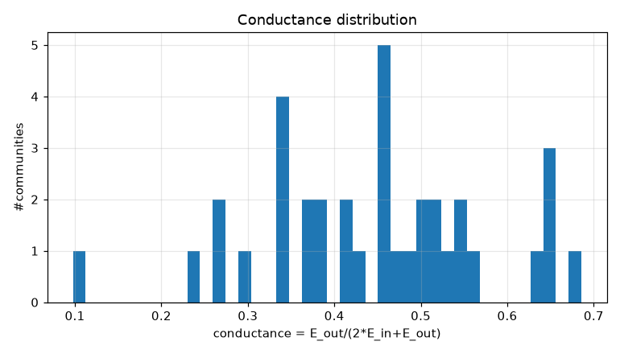
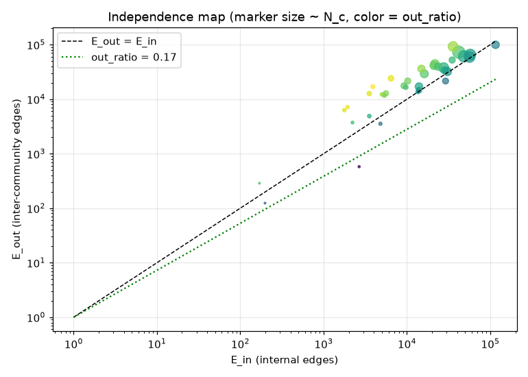
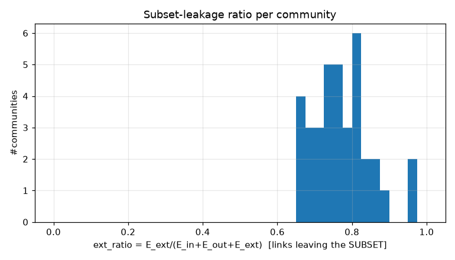
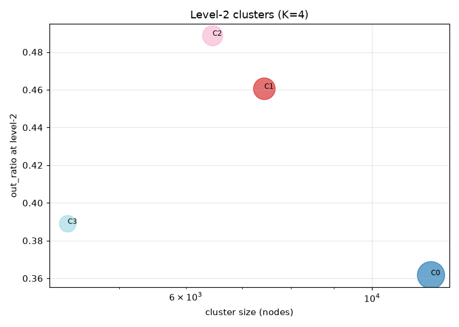
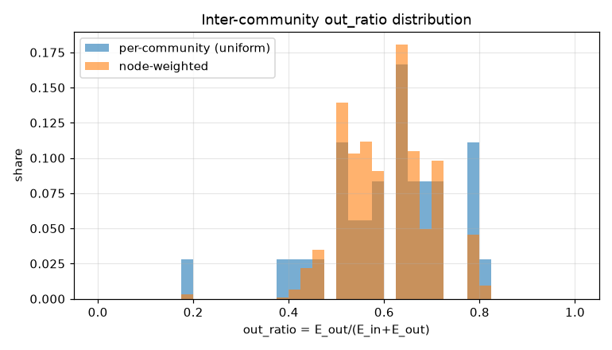
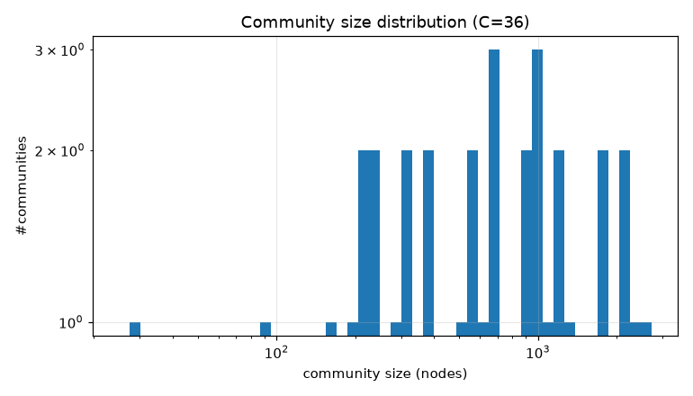

# コミュニティ分割 PoC レポート: bfs_geo_30k

生成: 2026-09-25T13:34:40 / seed=42 / resolution=2.0 / dump=2026-09-02

## 1. サブセット概要

| 項目 | 値 |
|---|---|
| 戦略 | outlink_bfs |
| ノード数 | 30,000 |
| 内部エッジ(有向・解決後) | 1,662,557 |
| 内部エッジ(無向・一意) | 1,239,983 |
| サブセット外へのリンク(outgoing) | 5,905,734 |
| サブセット外からのリンク(incoming) | 14,617,961 |
| リーク率 out/(int+out) | 0.780 |
| ページID範囲 | 10〜5,289,017 |

## 2. resolution スイープ(コミュニティサイズ分布)

| resolution | #comms | 最大シェア | top5シェア | サイズ中央値 | p25 | p75 | cross_edge_fraction |
|---|---|---|---|---|---|---|---|
| 0.5 | 11 | 0.363 | 0.970 | 563.000 | 74.000 | 3575.500 | 0.241 |
| 1.0 | 17 | 0.161 | 0.596 | 1404.000 | 662.000 | 2880.000 | 0.364 |
| 2.0 | 36 | 0.091 | 0.369 | 638.500 | 276.750 | 1150.250 | 0.418 |

## 3. 全体指標(採用 resolution)

| 指標 | 値 |
|---|---|
| コミュニティ数 | 36 |
| 最大コミュニティのノードシェア | 0.091 |
| 上位5コミュニティのシェア | 0.369 |
| cross_edge_fraction(全体) | 0.418 |
| out_ratio(エッジ重み付き平均) | 0.590 |
| out_ratio(ノード重み付き中央値) | 0.600 |
| out_ratio p25/p50/p75 | 0.529/0.627/0.689 |
| conductance p25/p50/p75 | 0.359/0.457/0.525 |
| サブセット外へのリンク数(有向) | 5,905,734 |
| サブセット外からのリンク数(有向) | 14,617,961 |

## 4. 上位コミュニティ(サイズ順 top 15)

| comm | 代表記事 | N_c | E_in | E_out | E_ext(場外) | out_ratio | conductance | avg_deg | 境界ノード率 |
|---|---|---|---|---|---|---|---|---|---|
| 0 | 19世紀、外務省、17世紀 | 2,724 | 41,898 | 72,661 | 1,885,188 | 0.634 | 0.464 | 30.8 | 0.969 |
| 1 | 毎日新聞社、中日新聞、東京新聞 | 2,331 | 48,427 | 61,082 | 2,207,053 | 0.558 | 0.387 | 41.6 | 0.976 |
| 2 | 明治維新、1868年、室町時代 | 2,145 | 57,418 | 65,718 | 1,078,814 | 0.534 | 0.364 | 53.5 | 0.984 |
| 3 | 東海旅客鉄道、国鉄分割民営化、九州旅客鉄道 | 2,079 | 56,377 | 59,379 | 1,119,884 | 0.513 | 0.345 | 54.2 | 0.991 |
| 4 | 農業、日本料理、米 | 1,791 | 27,568 | 37,747 | 856,783 | 0.578 | 0.406 | 30.8 | 0.933 |
| 5 | 長野県、宮城県、地方公共団体 | 1,749 | 35,787 | 92,613 | 1,102,842 | 0.721 | 0.564 | 40.9 | 0.973 |
| 6 | トヨタ自動車、純資産、中央区_(東京都) | 1,362 | 21,642 | 44,196 | 886,194 | 0.671 | 0.505 | 31.8 | 0.983 |
| 7 | 北陸地方、文部科学省、大学 | 1,251 | 30,532 | 32,156 | 772,892 | 0.513 | 0.345 | 48.8 | 0.975 |
| 8 | 天皇、神道、日本書紀 | 1,157 | 21,076 | 41,361 | 727,892 | 0.662 | 0.495 | 36.4 | 0.980 |
| 9 | 阪神タイガース、福岡ソフトバンクホークス、広島東洋カープ | 1,148 | 16,170 | 29,182 | 1,049,721 | 0.643 | 0.474 | 28.2 | 0.967 |
| 10 | 8月29日、3月13日、3月12日 | 1,038 | 115,780 | 99,608 | 2,683,709 | 0.462 | 0.301 | 223.1 | 0.974 |
| 11 | 2020年東京オリンピック、力士、日本サッカー協会 | 1,025 | 13,939 | 17,039 | 649,392 | 0.550 | 0.379 | 27.2 | 0.947 |
| 12 | 内閣総理大臣、日本共産党、昭和天皇 | 988 | 23,648 | 39,494 | 756,776 | 0.625 | 0.455 | 47.9 | 0.998 |
| 13 | 厚生労働省、経済産業省、環境省 | 948 | 14,900 | 36,168 | 409,432 | 0.708 | 0.548 | 31.4 | 0.984 |
| 14 | 日本の地理、川、トンネル | 943 | 28,454 | 33,907 | 399,933 | 0.544 | 0.373 | 60.3 | 0.993 |

## 5. コミュニティ間エッジ top 20

| comm A | comm B | エッジ数 | A代表 | B代表 |
|---|---|---|---|---|
| 2 | 10 | 17,274 | 明治維新、1868年 | 8月29日、3月13日 |
| 0 | 10 | 10,373 | 19世紀、外務省 | 8月29日、3月13日 |
| 3 | 10 | 10,236 | 東海旅客鉄道、国鉄分割民営化 | 8月29日、3月13日 |
| 2 | 8 | 9,876 | 明治維新、1868年 | 天皇、神道 |
| 1 | 10 | 8,798 | 毎日新聞社、中日新聞 | 8月29日、3月13日 |
| 5 | 10 | 8,119 | 長野県、宮城県 | 8月29日、3月13日 |
| 2 | 5 | 7,776 | 明治維新、1868年 | 長野県、宮城県 |
| 1 | 9 | 7,631 | 毎日新聞社、中日新聞 | 阪神タイガース、福岡ソフトバンクホークス |
| 10 | 12 | 6,813 | 8月29日、3月13日 | 内閣総理大臣、日本共産党 |
| 0 | 15 | 6,622 | 19世紀、外務省 | 日本史の出来事一覧、太平洋 |
| 0 | 12 | 6,536 | 19世紀、外務省 | 内閣総理大臣、日本共産党 |
| 3 | 5 | 6,448 | 東海旅客鉄道、国鉄分割民営化 | 長野県、宮城県 |
| 1 | 6 | 6,380 | 毎日新聞社、中日新聞 | トヨタ自動車、純資産 |
| 3 | 6 | 5,383 | 東海旅客鉄道、国鉄分割民営化 | トヨタ自動車、純資産 |
| 5 | 17 | 5,378 | 長野県、宮城県 | 新潟県、道の駅 |
| 0 | 4 | 5,106 | 19世紀、外務省 | 農業、日本料理 |
| 1 | 5 | 4,658 | 毎日新聞社、中日新聞 | 長野県、宮城県 |
| 5 | 14 | 4,493 | 長野県、宮城県 | 日本の地理、川 |
| 8 | 10 | 4,348 | 天皇、神道 | 8月29日、3月13日 |
| 4 | 5 | 4,030 | 農業、日本料理 | 長野県、宮城県 |

## 6. ハブ記事の影響(次数 top 20)

| # | 記事 | 内部次数 | 場外次数 | comm | フラグ |
|---|---|---|---|---|---|
| 1 | 東京都 | 5,198 | 109,058 | 19 |  |
| 2 | 北海道 | 4,233 | 53,328 | 26 |  |
| 3 | 大阪府 | 2,805 | 46,062 | 23 |  |
| 4 | 愛知県 | 2,713 | 46,057 | 18 |  |
| 5 | 福岡県 | 2,404 | 34,663 | 25 |  |
| 6 | 市町村 | 1,441 | 31,289 | 5 |  |
| 7 | 長野県 | 2,071 | 25,686 | 5 |  |
| 8 | 広島県 | 1,922 | 25,268 | 30 |  |
| 9 | 京都府 | 1,880 | 24,676 | 29 |  |
| 10 | 新潟県 | 1,878 | 23,987 | 17 |  |
| 11 | 宮城県 | 1,945 | 22,014 | 5 |  |
| 12 | 仙台市 | 1,140 | 10,259 | 5 |  |
| 13 | 8月10日 | 1,014 | 10,258 | 10 | date |
| 14 | 10月3日 | 968 | 10,237 | 10 | date |
| 15 | 10月14日 | 1,029 | 10,174 | 10 | date |
| 16 | トヨタ自動車 | 745 | 10,448 | 6 |  |
| 17 | 9月20日 | 981 | 10,114 | 10 | date |
| 18 | 10月6日 | 915 | 10,172 | 10 | date |
| 19 | 4月23日 | 958 | 10,125 | 10 | date |
| 20 | AKB48 | 494 | 10,577 | 1 |  |

- 上位1%ノードが接する内部エッジのシェア: 0.212
- 内部次数 max: 5,198 / p50・p90・p99: 39.000・199.000・720.000

## 7. 階層化テスト(level-2)

| 指標 | 値 |
|---|---|
| 上位クラスタ数 K | 4 |
| 最大クラスタのシェア | 0.392 |
| out_ratio2(エッジ重み付き平均) | 0.412 |
| コミュニティ間グラフ modularity | -0.014 |

| cluster | #comms | N_nodes | E_in(記事) | E_between(comm間) | E_out2 | E_ext(場外) | out_ratio2 | conductance2 |
|---|---|---|---|---|---|---|---|---|
| 0 | 19 | 11,758 | 262631 | 99346 | 205087 | 6060792 | 0.362 | 0.221 |
| 1 | 8 | 7,443 | 157635 | 40787 | 169396 | 4743709 | 0.461 | 0.299 |
| 2 | 6 | 6,459 | 106783 | 24981 | 125922 | 5228779 | 0.489 | 0.323 |
| 3 | 3 | 4,340 | 194274 | 31498 | 143691 | 4490415 | 0.389 | 0.241 |

## 8. 図

