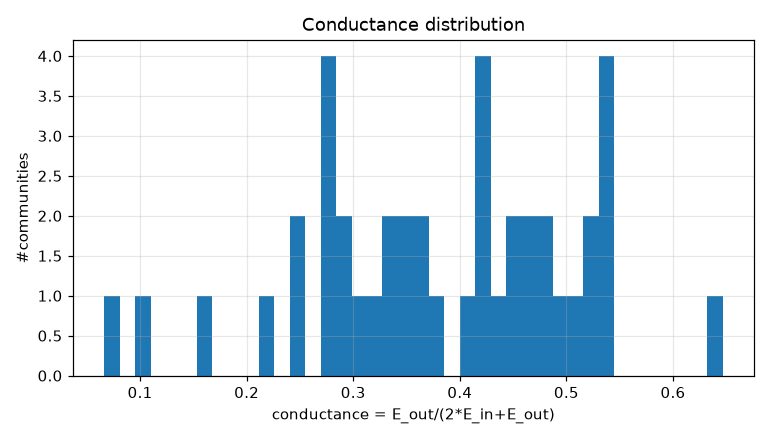
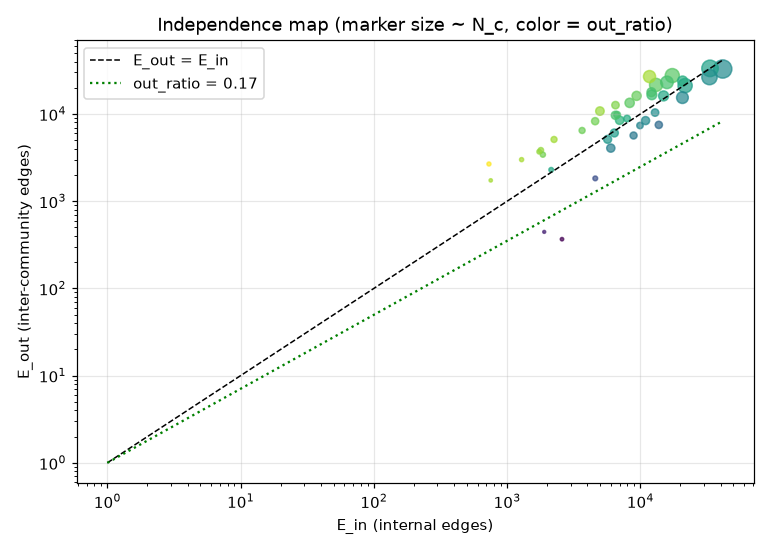
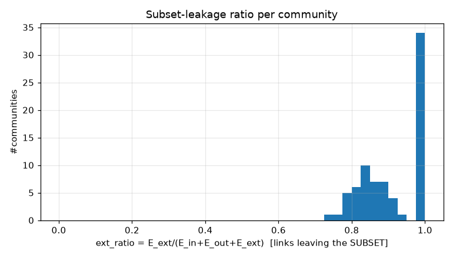
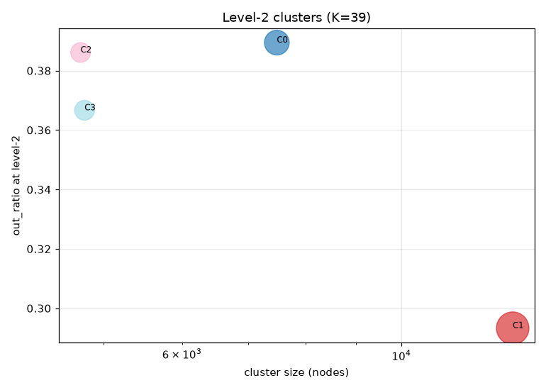
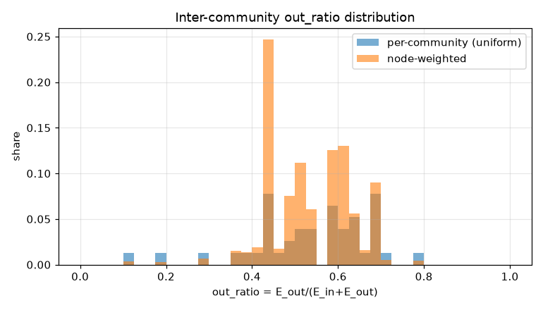
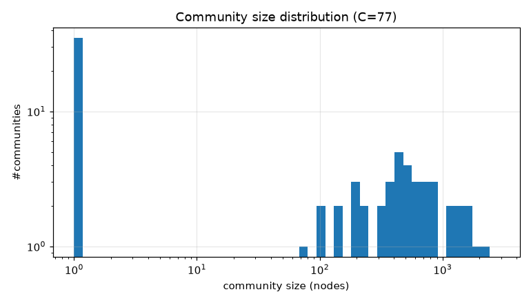

# コミュニティ分割 PoC レポート: bfs_geo_30k

生成: 2026-09-25T13:43:30 / seed=42 / resolution=2.0 / dump=2026-09-02

## 1. サブセット概要

| 項目 | 値 |
|---|---|
| 戦略 | outlink_bfs |
| ノード数 | 30,000 |
| 内部エッジ(有向・解決後) | 1,662,557 |
| 内部エッジ(無向・一意) | 675,500 |
| サブセット外へのリンク(outgoing) | 5,905,734 |
| サブセット外からのリンク(incoming) | 14,617,961 |
| リーク率 out/(int+out) | 0.780 |
| ページID範囲 | 10〜5,289,017 |

## 2. resolution スイープ(コミュニティサイズ分布)

| resolution | #comms | 最大シェア | top5シェア | サイズ中央値 | p25 | p75 | cross_edge_fraction |
|---|---|---|---|---|---|---|---|
| 0.5 | 46 | 0.236 | 0.915 | 1.000 | 1.000 | 1.000 | 0.243 |
| 1.0 | 56 | 0.138 | 0.580 | 1.000 | 1.000 | 495.750 | 0.303 |
| 2.0 | 77 | 0.095 | 0.353 | 137.000 | 1.000 | 559.000 | 0.363 |

## 3. 全体指標(採用 resolution)

| 指標 | 値 |
|---|---|
| コミュニティ数 | 77 |
| 最大コミュニティのノードシェア | 0.095 |
| 上位5コミュニティのシェア | 0.353 |
| cross_edge_fraction(全体) | 0.363 |
| out_ratio(エッジ重み付き平均) | 0.533 |
| out_ratio(ノード重み付き中央値) | 0.519 |
| out_ratio p25/p50/p75 | 0.446/0.562/0.643 |
| conductance p25/p50/p75 | 0.287/0.391/0.473 |
| サブセット外へのリンク数(有向) | 5,905,734 |
| サブセット外からのリンク数(有向) | 14,617,961 |

## 4. 上位コミュニティ(サイズ順 top 15)

| comm | 代表記事 | N_c | E_in | E_out | E_ext(場外) | out_ratio | conductance | avg_deg | 境界ノード率 |
|---|---|---|---|---|---|---|---|---|---|
| 0 | 文化放送、中日新聞、中日新聞社 | 2,848 | 41,542 | 32,843 | 2,734,233 | 0.442 | 0.283 | 29.2 | 0.917 |
| 1 | 室町時代、神社、豊臣秀吉 | 2,326 | 33,365 | 33,407 | 1,286,317 | 0.500 | 0.334 | 28.7 | 0.951 |
| 2 | 東海旅客鉄道、近畿日本鉄道、JTB | 2,006 | 33,039 | 26,536 | 1,095,125 | 0.445 | 0.287 | 32.9 | 0.955 |
| 3 | 塩、釣り、食肉 | 1,729 | 21,680 | 21,168 | 820,985 | 0.494 | 0.328 | 25.1 | 0.894 |
| 4 | 宗教、欧州連合、日中関係史 | 1,696 | 17,371 | 27,604 | 1,067,696 | 0.614 | 0.443 | 20.5 | 0.956 |
| 5 | 降水量、東アジア、ソウル特別市 | 1,468 | 13,129 | 21,577 | 1,015,177 | 0.622 | 0.451 | 17.9 | 0.914 |
| 6 | 純資産、東京証券取引所、中央区_(東京都) | 1,339 | 15,840 | 23,077 | 887,382 | 0.593 | 0.421 | 23.7 | 0.954 |
| 7 | 地方公共団体、宮城県、日本の市町村の廃置分合 | 1,250 | 11,725 | 26,891 | 731,951 | 0.696 | 0.534 | 18.8 | 0.926 |
| 8 | 東北大学、東洋大学、北関東 | 1,172 | 20,705 | 15,430 | 710,349 | 0.427 | 0.271 | 35.3 | 0.949 |
| 9 | 衆議院小選挙区制選挙区一覧、内閣総理大臣、無所属 | 851 | 14,950 | 16,138 | 712,489 | 0.519 | 0.351 | 35.1 | 0.981 |
| 10 | 西暦、7月23日、10月27日 | 844 | 20,771 | 23,916 | 2,626,588 | 0.535 | 0.365 | 49.2 | 0.962 |
| 11 | 藩、昭和天皇、河出書房新社 | 811 | 12,203 | 16,610 | 455,628 | 0.576 | 0.405 | 30.1 | 0.994 |
| 12 | 薪、持続可能な開発、国立環境研究所 | 740 | 8,317 | 13,430 | 427,870 | 0.618 | 0.447 | 22.5 | 0.959 |
| 13 | 一般社団法人、中日本高速道路、行政機関 | 710 | 9,377 | 16,152 | 329,025 | 0.633 | 0.463 | 26.4 | 0.963 |
| 14 | 国勢調査_(日本)、内閣_(日本)、日本の文化 | 672 | 12,114 | 17,799 | 556,714 | 0.595 | 0.424 | 36.1 | 0.963 |

## 5. コミュニティ間エッジ top 20

| comm A | comm B | エッジ数 | A代表 | B代表 |
|---|---|---|---|---|
| 1 | 10 | 6,011 | 室町時代、神社 | 西暦、7月23日 |
| 1 | 11 | 5,052 | 室町時代、神社 | 藩、昭和天皇 |
| 0 | 6 | 4,588 | 文化放送、中日新聞 | 純資産、東京証券取引所 |
| 4 | 5 | 3,820 | 宗教、欧州連合 | 降水量、東アジア |
| 2 | 6 | 2,814 | 東海旅客鉄道、近畿日本鉄道 | 純資産、東京証券取引所 |
| 4 | 9 | 2,688 | 宗教、欧州連合 | 衆議院小選挙区制選挙区一覧、内閣総理大臣 |
| 2 | 7 | 2,110 | 東海旅客鉄道、近畿日本鉄道 | 地方公共団体、宮城県 |
| 1 | 7 | 2,103 | 室町時代、神社 | 地方公共団体、宮城県 |
| 0 | 4 | 1,947 | 文化放送、中日新聞 | 宗教、欧州連合 |
| 3 | 12 | 1,941 | 塩、釣り | 薪、持続可能な開発 |
| 0 | 10 | 1,889 | 文化放送、中日新聞 | 西暦、7月23日 |
| 0 | 21 | 1,841 | 文化放送、中日新聞 | 長嶋茂雄、新庄剛志 |
| 0 | 2 | 1,839 | 文化放送、中日新聞 | 東海旅客鉄道、近畿日本鉄道 |
| 0 | 14 | 1,813 | 文化放送、中日新聞 | 国勢調査_(日本)、内閣_(日本) |
| 3 | 5 | 1,798 | 塩、釣り | 降水量、東アジア |
| 4 | 14 | 1,752 | 宗教、欧州連合 | 国勢調査_(日本)、内閣_(日本) |
| 1 | 14 | 1,726 | 室町時代、神社 | 国勢調査_(日本)、内閣_(日本) |
| 1 | 4 | 1,689 | 室町時代、神社 | 宗教、欧州連合 |
| 4 | 10 | 1,669 | 宗教、欧州連合 | 西暦、7月23日 |
| 9 | 13 | 1,615 | 衆議院小選挙区制選挙区一覧、内閣総理大臣 | 一般社団法人、中日本高速道路 |

## 6. ハブ記事の影響(次数 top 20)

| # | 記事 | 内部次数 | 場外次数 | comm | フラグ |
|---|---|---|---|---|---|
| 1 | 東京都 | 200 | 109,058 | 15 |  |
| 2 | 北海道 | 102 | 53,328 | 30 |  |
| 3 | 大阪府 | 199 | 46,062 | 31 |  |
| 4 | 愛知県 | 200 | 46,057 | 16 |  |
| 5 | 福岡県 | 199 | 34,663 | 18 |  |
| 6 | 市町村 | 158 | 31,289 | 7 |  |
| 7 | 長野県 | 100 | 25,686 | 25 |  |
| 8 | 広島県 | 100 | 25,268 | 32 |  |
| 9 | 京都府 | 200 | 24,676 | 33 |  |
| 10 | 新潟県 | 100 | 23,987 | 7 |  |
| 11 | 宮城県 | 198 | 22,014 | 7 |  |
| 12 | AKB48 | 126 | 10,577 | 0 |  |
| 13 | トヨタ自動車 | 104 | 10,448 | 6 |  |
| 14 | イスラエル | 111 | 10,424 | 5 |  |
| 15 | 駅ナンバリング | 179 | 10,297 | 2 |  |
| 16 | 仙台市 | 193 | 10,259 | 7 |  |
| 17 | 8月10日 | 144 | 10,258 | 10 | date |
| 18 | 10月3日 | 155 | 10,237 | 10 | date |
| 19 | 10月14日 | 155 | 10,174 | 10 | date |
| 20 | 10月6日 | 155 | 10,172 | 10 | date |

- 上位1%ノードが接する内部エッジのシェア: 0.076
- 内部次数 max: 200 / p50・p90・p99: 29.000・110.000・160.000

## 7. 階層化テスト(level-2)

| 指標 | 値 |
|---|---|
| 上位クラスタ数 K | 39 |
| 最大クラスタのシェア | 0.432 |
| out_ratio2(エッジ重み付き平均) | 0.347 |
| コミュニティ間グラフ modularity | -0.016 |

| cluster | #comms | N_nodes | E_in(記事) | E_between(comm間) | E_out2 | E_ext(場外) | out_ratio2 | conductance2 |
|---|---|---|---|---|---|---|---|---|
| 1 | 13 | 12,964 | 172197 | 52766 | 93364 | 9403435 | 0.293 | 0.172 |
| 0 | 14 | 7,483 | 101504 | 23100 | 79478 | 4210759 | 0.389 | 0.242 |
| 3 | 6 | 4,781 | 80793 | 15417 | 55698 | 4748357 | 0.367 | 0.224 |
| 2 | 9 | 4,737 | 75660 | 12172 | 55242 | 2160143 | 0.386 | 0.239 |
| 4 | 1 | 1 | 0 | 0 | 0 | 37 | - | - |
| 5 | 1 | 1 | 0 | 0 | 0 | 60 | - | - |
| 6 | 1 | 1 | 0 | 0 | 0 | 33 | - | - |
| 7 | 1 | 1 | 0 | 0 | 0 | 23 | - | - |
| 8 | 1 | 1 | 0 | 0 | 0 | 86 | - | - |
| 9 | 1 | 1 | 0 | 0 | 0 | 11 | - | - |
| 10 | 1 | 1 | 0 | 0 | 0 | 19 | - | - |
| 11 | 1 | 1 | 0 | 0 | 0 | 45 | - | - |
| 12 | 1 | 1 | 0 | 0 | 0 | 16 | - | - |
| 13 | 1 | 1 | 0 | 0 | 0 | 54 | - | - |
| 14 | 1 | 1 | 0 | 0 | 0 | 24 | - | - |

## 8. 図

