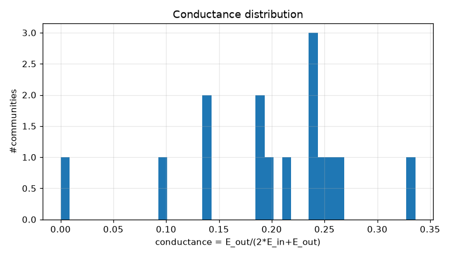
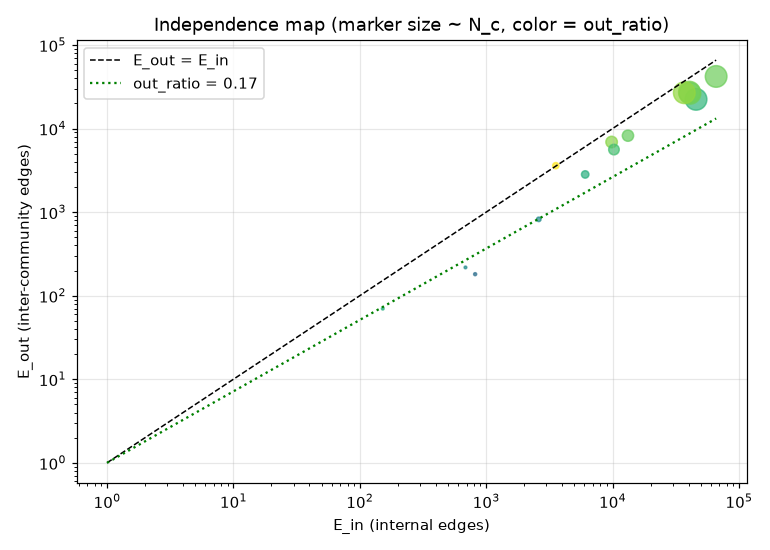
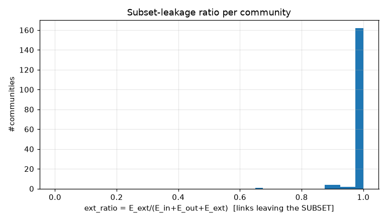
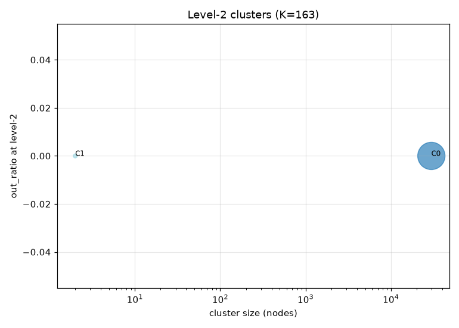
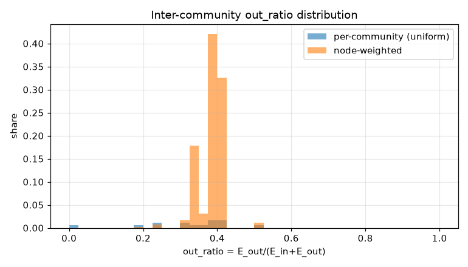
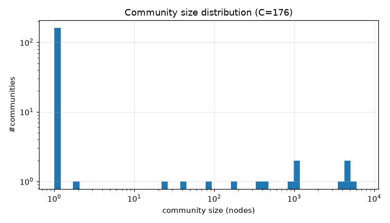

# コミュニティ分割 PoC レポート: bfs_geo_30k

生成: 2026-09-25T13:42:53 / seed=42 / resolution=0.5 / dump=2026-09-02

## 1. サブセット概要

| 項目 | 値 |
|---|---|
| 戦略 | outlink_bfs |
| ノード数 | 30,000 |
| 内部エッジ(有向・解決後) | 1,662,557 |
| 内部エッジ(無向・一意) | 364,409 |
| サブセット外へのリンク(outgoing) | 5,905,734 |
| サブセット外からのリンク(incoming) | 14,617,961 |
| リーク率 out/(int+out) | 0.780 |
| ページID範囲 | 10〜5,289,017 |

## 2. resolution スイープ(コミュニティサイズ分布)

| resolution | #comms | 最大シェア | top5シェア | サイズ中央値 | p25 | p75 | cross_edge_fraction |
|---|---|---|---|---|---|---|---|
| 0.5 | 176 | 0.242 | 0.852 | 1.000 | 1.000 | 1.000 | 0.238 |
| 1.0 | 189 | 0.136 | 0.526 | 1.000 | 1.000 | 1.000 | 0.285 |
| 2.0 | 208 | 0.074 | 0.338 | 1.000 | 1.000 | 1.000 | 0.337 |

## 3. 全体指標(採用 resolution)

| 指標 | 値 |
|---|---|
| コミュニティ数 | 176 |
| 最大コミュニティのノードシェア | 0.242 |
| 上位5コミュニティのシェア | 0.852 |
| cross_edge_fraction(全体) | 0.238 |
| out_ratio(エッジ重み付き平均) | 0.385 |
| out_ratio(ノード重み付き中央値) | 0.389 |
| out_ratio p25/p50/p75 | 0.278/0.353/0.397 |
| conductance p25/p50/p75 | 0.162/0.215/0.248 |
| サブセット外へのリンク数(有向) | 5,905,734 |
| サブセット外からのリンク数(有向) | 14,617,961 |

## 4. 上位コミュニティ(サイズ順 top 15)

| comm | 代表記事 | N_c | E_in | E_out | E_ext(場外) | out_ratio | conductance | avg_deg | 境界ノード率 |
|---|---|---|---|---|---|---|---|---|---|
| 0 | 京都府、仙台市、宮城県 | 7,270 | 66,030 | 42,074 | 6,497,058 | 0.389 | 0.242 | 18.2 | 0.762 |
| 1 | 東京都、福岡県、中日新聞社 | 5,355 | 45,801 | 22,392 | 4,792,761 | 0.328 | 0.196 | 17.1 | 0.749 |
| 2 | 中央区_(東京都)、大阪府、JTB | 4,610 | 40,577 | 27,316 | 2,424,447 | 0.402 | 0.252 | 17.6 | 0.865 |
| 3 | 牛肉、薪、湿地 | 4,262 | 41,033 | 26,405 | 2,035,956 | 0.392 | 0.243 | 19.3 | 0.837 |
| 4 | 日本の文化、マレーシア、東アジア | 4,051 | 36,962 | 26,876 | 2,604,156 | 0.421 | 0.267 | 18.2 | 0.846 |
| 5 | 青山学院大学、同志社大学、東洋大学 | 1,127 | 9,835 | 6,908 | 647,569 | 0.413 | 0.260 | 17.5 | 0.886 |
| 6 | Google_マップ、標高、高さ | 1,087 | 13,248 | 8,232 | 397,440 | 0.383 | 0.237 | 24.4 | 0.909 |
| 7 | 愛知県、バイパス道路、国道197号 | 953 | 10,262 | 5,611 | 572,108 | 0.353 | 0.215 | 21.5 | 0.825 |
| 8 | 八丈方言、書誌学、首都圏方言 | 470 | 6,077 | 2,827 | 200,433 | 0.317 | 0.189 | 25.9 | 0.811 |
| 9 | 工業団地、温泉街、日帰り入浴施設 | 336 | 3,556 | 3,598 | 203,565 | 0.503 | 0.336 | 21.2 | 0.976 |
| 10 | 図書館及び関連組織のための国際標準識別子、北網圏北見文化センター、イルフ童画館 | 170 | 2,607 | 820 | 65,302 | 0.239 | 0.136 | 30.7 | 0.894 |
| 11 | 岡山県道・広島県道12号足立東城線、広島県道・岡山県道102号下御領井原線、山口県道・広島県道117号乙瀬小方線 | 78 | 818 | 181 | 46,771 | 0.181 | 0.100 | 21.0 | 0.885 |
| 12 | 東北農政局、北海道農政事務所、北陸農政局 | 43 | 686 | 218 | 4,380 | 0.241 | 0.137 | 31.9 | 0.767 |
| 13 | 女流棋士_(将棋)、伊藤果、将棋棋士一覧 | 25 | 152 | 70 | 22,974 | 0.315 | 0.187 | 12.2 | 0.840 |
| 14 | 船町_(豊橋市)、春日町_(豊橋市) | 2 | 1 | 0 | 1,174 | 0.000 | 0.000 | 1.0 | 0.000 |

## 5. コミュニティ間エッジ top 20

| comm A | comm B | エッジ数 | A代表 | B代表 |
|---|---|---|---|---|
| 0 | 4 | 9,629 | 京都府、仙台市 | 日本の文化、マレーシア |
| 0 | 3 | 8,749 | 京都府、仙台市 | 牛肉、薪 |
| 0 | 2 | 8,086 | 京都府、仙台市 | 中央区_(東京都)、大阪府 |
| 0 | 1 | 6,567 | 京都府、仙台市 | 東京都、福岡県 |
| 1 | 2 | 5,531 | 東京都、福岡県 | 中央区_(東京都)、大阪府 |
| 3 | 4 | 4,886 | 牛肉、薪 | 日本の文化、マレーシア |
| 1 | 4 | 4,571 | 東京都、福岡県 | 日本の文化、マレーシア |
| 2 | 3 | 4,491 | 中央区_(東京都)、大阪府 | 牛肉、薪 |
| 2 | 4 | 4,084 | 中央区_(東京都)、大阪府 | 日本の文化、マレーシア |
| 1 | 3 | 2,885 | 東京都、福岡県 | 牛肉、薪 |
| 0 | 6 | 2,723 | 京都府、仙台市 | Google_マップ、標高 |
| 3 | 6 | 2,439 | 牛肉、薪 | Google_マップ、標高 |
| 0 | 7 | 2,147 | 京都府、仙台市 | 愛知県、バイパス道路 |
| 2 | 7 | 1,599 | 中央区_(東京都)、大阪府 | 愛知県、バイパス道路 |
| 0 | 5 | 1,597 | 京都府、仙台市 | 青山学院大学、同志社大学 |
| 4 | 5 | 1,591 | 日本の文化、マレーシア | 青山学院大学、同志社大学 |
| 1 | 5 | 1,245 | 東京都、福岡県 | 青山学院大学、同志社大学 |
| 0 | 9 | 1,211 | 京都府、仙台市 | 工業団地、温泉街 |
| 2 | 5 | 1,170 | 中央区_(東京都)、大阪府 | 青山学院大学、同志社大学 |
| 2 | 6 | 1,154 | 中央区_(東京都)、大阪府 | Google_マップ、標高 |

## 6. ハブ記事の影響(次数 top 20)

| # | 記事 | 内部次数 | 場外次数 | comm | フラグ |
|---|---|---|---|---|---|
| 1 | 東京都 | 80 | 109,058 | 1 |  |
| 2 | 北海道 | 41 | 53,328 | 1 |  |
| 3 | 大阪府 | 79 | 46,062 | 2 |  |
| 4 | 愛知県 | 80 | 46,057 | 7 |  |
| 5 | 福岡県 | 80 | 34,663 | 1 |  |
| 6 | 市町村 | 63 | 31,289 | 0 |  |
| 7 | 長野県 | 40 | 25,686 | 0 |  |
| 8 | 広島県 | 40 | 25,268 | 0 |  |
| 9 | 京都府 | 80 | 24,676 | 0 |  |
| 10 | 新潟県 | 40 | 23,987 | 1 |  |
| 11 | 宮城県 | 79 | 22,014 | 0 |  |
| 12 | AKB48 | 67 | 10,577 | 1 |  |
| 13 | トヨタ自動車 | 40 | 10,448 | 2 |  |
| 14 | イスラエル | 50 | 10,424 | 4 |  |
| 15 | 駅ナンバリング | 69 | 10,297 | 2 |  |
| 16 | 仙台市 | 80 | 10,259 | 0 |  |
| 17 | 8月10日 | 60 | 10,258 | 0 | date |
| 18 | 10月3日 | 62 | 10,237 | 0 | date |
| 19 | 10月14日 | 62 | 10,174 | 0 | date |
| 20 | 10月6日 | 60 | 10,172 | 0 | date |

- 上位1%ノードが接する内部エッジのシェア: 0.057
- 内部次数 max: 80 / p50・p90・p99: 21.000・49.000・66.000

## 7. 階層化テスト(level-2)

| 指標 | 値 |
|---|---|
| 上位クラスタ数 K | 163 |
| 最大クラスタのシェア | 0.995 |
| out_ratio2(エッジ重み付き平均) | 0.000 |
| コミュニティ間グラフ modularity | 0.000 |

| cluster | #comms | N_nodes | E_in(記事) | E_between(comm間) | E_out2 | E_ext(場外) | out_ratio2 | conductance2 |
|---|---|---|---|---|---|---|---|---|
| 0 | 14 | 29,837 | 277644 | 86764 | 0 | 20514920 | 0.000 | 0.000 |
| 1 | 1 | 2 | 1 | 0 | 0 | 1174 | 0.000 | 0.000 |
| 2 | 1 | 1 | 0 | 0 | 0 | 37 | - | - |
| 3 | 1 | 1 | 0 | 0 | 0 | 95 | - | - |
| 4 | 1 | 1 | 0 | 0 | 0 | 54 | - | - |
| 5 | 1 | 1 | 0 | 0 | 0 | 73 | - | - |
| 6 | 1 | 1 | 0 | 0 | 0 | 50 | - | - |
| 7 | 1 | 1 | 0 | 0 | 0 | 86 | - | - |
| 8 | 1 | 1 | 0 | 0 | 0 | 60 | - | - |
| 9 | 1 | 1 | 0 | 0 | 0 | 60 | - | - |
| 10 | 1 | 1 | 0 | 0 | 0 | 297 | - | - |
| 11 | 1 | 1 | 0 | 0 | 0 | 54 | - | - |
| 12 | 1 | 1 | 0 | 0 | 0 | 52 | - | - |
| 13 | 1 | 1 | 0 | 0 | 0 | 33 | - | - |
| 14 | 1 | 1 | 0 | 0 | 0 | 28 | - | - |

## 8. 図

