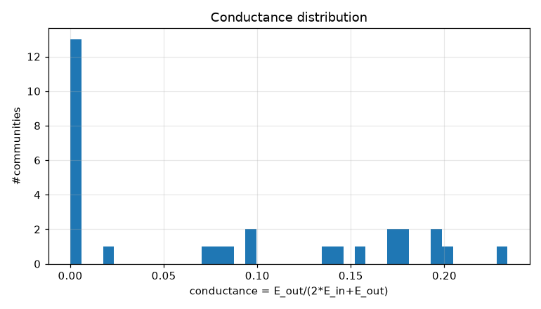
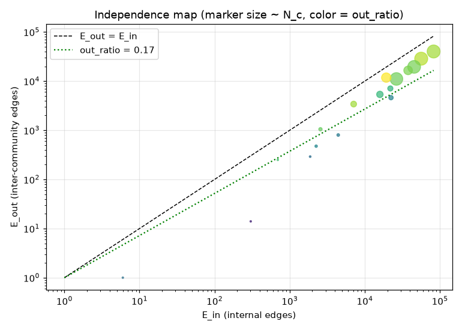
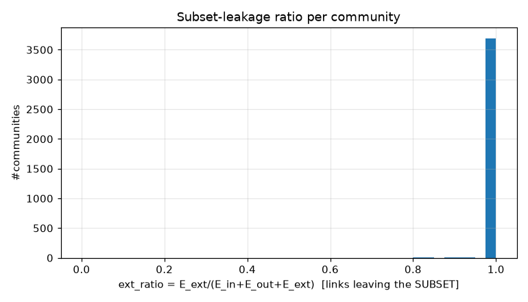
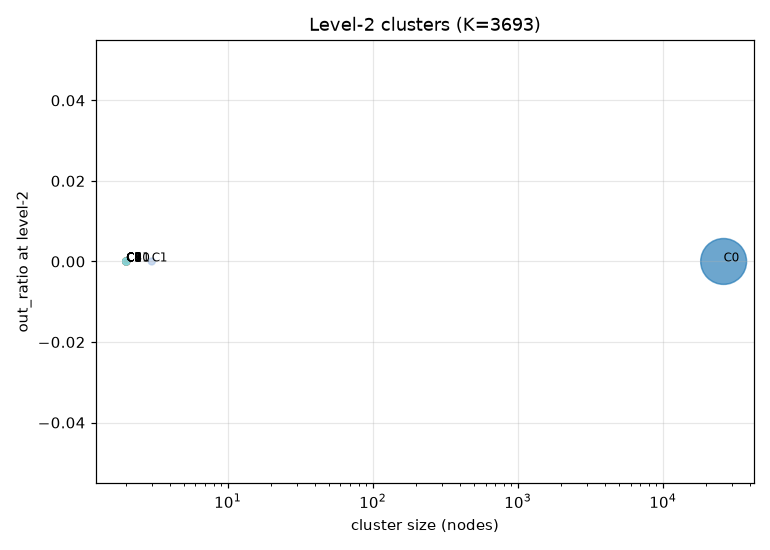
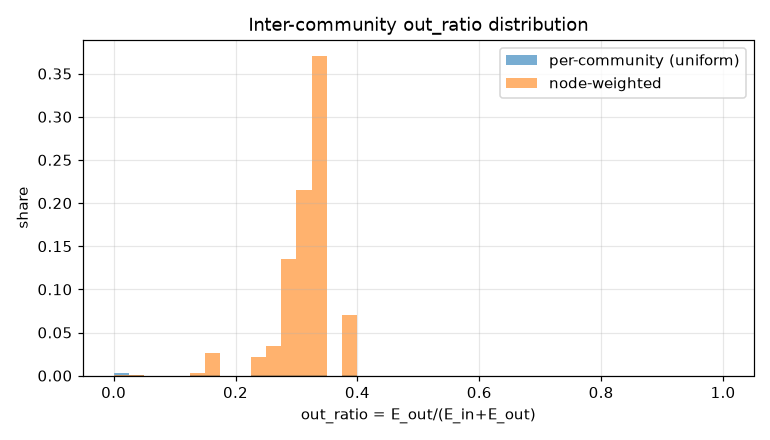
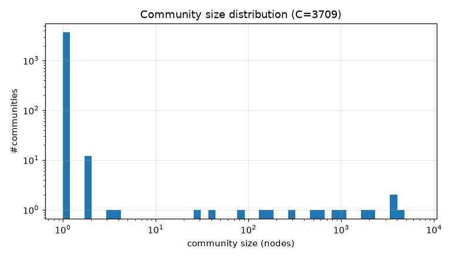

# コミュニティ分割 PoC レポート: bfs_geo_30k

生成: 2026-09-25T13:37:31 / seed=42 / resolution=0.5 / dump=2026-09-02

## 1. サブセット概要

| 項目 | 値 |
|---|---|
| 戦略 | outlink_bfs |
| ノード数 | 30,000 |
| 内部エッジ(有向・解決後) | 1,662,557 |
| 内部エッジ(無向・一意) | 422,937 |
| サブセット外へのリンク(outgoing) | 5,905,734 |
| サブセット外からのリンク(incoming) | 14,617,961 |
| リーク率 out/(int+out) | 0.780 |
| ページID範囲 | 10〜5,289,017 |

## 2. resolution スイープ(コミュニティサイズ分布)

| resolution | #comms | 最大シェア | top5シェア | サイズ中央値 | p25 | p75 | cross_edge_fraction |
|---|---|---|---|---|---|---|---|
| 0.5 | 3709 | 0.230 | 0.695 | 1.000 | 1.000 | 1.000 | 0.179 |
| 1.0 | 3720 | 0.109 | 0.462 | 1.000 | 1.000 | 1.000 | 0.223 |
| 2.0 | 3739 | 0.080 | 0.304 | 1.000 | 1.000 | 1.000 | 0.260 |

## 3. 全体指標(採用 resolution)

| 指標 | 値 |
|---|---|
| コミュニティ数 | 3,709 |
| 最大コミュニティのノードシェア | 0.230 |
| 上位5コミュニティのシェア | 0.695 |
| cross_edge_fraction(全体) | 0.179 |
| out_ratio(エッジ重み付き平均) | 0.303 |
| out_ratio(ノード重み付き中央値) | 0.327 |
| out_ratio p25/p50/p75 | 0.000/0.139/0.284 |
| conductance p25/p50/p75 | 0.000/0.074/0.165 |
| サブセット外へのリンク数(有向) | 5,905,734 |
| サブセット外からのリンク数(有向) | 14,617,961 |

## 4. 上位コミュニティ(サイズ順 top 15)

| comm | 代表記事 | N_c | E_in | E_out | E_ext(場外) | out_ratio | conductance | avg_deg | 境界ノード率 |
|---|---|---|---|---|---|---|---|---|---|
| 0 | 日本の地方公共団体一覧、タクシーの営業区域、消防本部一覧 | 6,899 | 82,629 | 40,121 | 2,113,722 | 0.327 | 0.195 | 24.0 | 0.775 |
| 1 | 日本の国際関係、日本の空港、日本一の一覧 | 4,216 | 56,447 | 28,625 | 1,624,721 | 0.336 | 0.202 | 26.8 | 0.798 |
| 2 | 日本史の出来事一覧、天皇の一覧、鎖国 | 3,866 | 45,430 | 19,511 | 1,228,990 | 0.300 | 0.177 | 23.5 | 0.754 |
| 3 | 広島県出身の人物一覧、毎日新聞東京本社、日本のラジオパーソナリティ一覧 | 3,769 | 26,413 | 11,073 | 1,764,262 | 0.295 | 0.173 | 14.0 | 0.669 |
| 4 | 日本の郷土料理一覧、廃棄物、土壌汚染 | 2,105 | 19,325 | 11,792 | 622,462 | 0.379 | 0.234 | 18.4 | 0.796 |
| 5 | 日本の山一覧、日本の川一覧、御嶽山 | 1,767 | 37,778 | 16,542 | 497,937 | 0.305 | 0.180 | 42.8 | 0.905 |
| 6 | 高知学園短期大学、桜の聖母短期大学、聖徳大学 | 1,000 | 15,897 | 5,366 | 359,377 | 0.252 | 0.144 | 31.8 | 0.834 |
| 7 | 仙台空港、広島空港、熊本空港 | 810 | 7,112 | 3,412 | 252,486 | 0.324 | 0.193 | 17.6 | 0.678 |
| 8 | 日本の島の一覧、琉球諸語、新島 | 643 | 21,898 | 7,095 | 232,650 | 0.245 | 0.139 | 68.1 | 0.899 |
| 9 | 国道48号、国道25号、海上国道 | 468 | 22,347 | 4,612 | 244,278 | 0.171 | 0.094 | 95.5 | 0.895 |
| 10 | 蹴鞠、ラフティング、シュアイジャオ | 274 | 2,569 | 1,049 | 99,858 | 0.290 | 0.170 | 18.8 | 0.723 |
| 11 | 京都国立博物館、北網圏北見文化センター、奈良国立博物館 | 176 | 4,432 | 801 | 58,689 | 0.153 | 0.083 | 50.4 | 0.875 |
| 12 | 東春日井郡、愛知県道59号名古屋中環状線、長野県道369号・静岡県道412号南信濃水窪線 | 150 | 2,252 | 475 | 91,892 | 0.174 | 0.095 | 30.0 | 0.927 |
| 13 | 呉音、水部、艸部 | 78 | 1,874 | 291 | 24,792 | 0.134 | 0.072 | 48.1 | 0.718 |
| 14 | 北海道農政事務所、地方農政局、東北農政局 | 41 | 695 | 250 | 3,370 | 0.265 | 0.152 | 33.9 | 1.000 |

## 5. コミュニティ間エッジ top 20

| comm A | comm B | エッジ数 | A代表 | B代表 |
|---|---|---|---|---|
| 0 | 1 | 9,376 | 日本の地方公共団体一覧、タクシーの営業区域 | 日本の国際関係、日本の空港 |
| 0 | 5 | 7,382 | 日本の地方公共団体一覧、タクシーの営業区域 | 日本の山一覧、日本の川一覧 |
| 0 | 2 | 6,972 | 日本の地方公共団体一覧、タクシーの営業区域 | 日本史の出来事一覧、天皇の一覧 |
| 1 | 2 | 6,093 | 日本の国際関係、日本の空港 | 日本史の出来事一覧、天皇の一覧 |
| 0 | 3 | 4,458 | 日本の地方公共団体一覧、タクシーの営業区域 | 広島県出身の人物一覧、毎日新聞東京本社 |
| 0 | 9 | 3,220 | 日本の地方公共団体一覧、タクシーの営業区域 | 国道48号、国道25号 |
| 0 | 4 | 3,148 | 日本の地方公共団体一覧、タクシーの営業区域 | 日本の郷土料理一覧、廃棄物 |
| 1 | 4 | 3,116 | 日本の国際関係、日本の空港 | 日本の郷土料理一覧、廃棄物 |
| 1 | 3 | 2,697 | 日本の国際関係、日本の空港 | 広島県出身の人物一覧、毎日新聞東京本社 |
| 1 | 5 | 2,316 | 日本の国際関係、日本の空港 | 日本の山一覧、日本の川一覧 |
| 0 | 8 | 2,108 | 日本の地方公共団体一覧、タクシーの営業区域 | 日本の島の一覧、琉球諸語 |
| 4 | 5 | 2,037 | 日本の郷土料理一覧、廃棄物 | 日本の山一覧、日本の川一覧 |
| 1 | 6 | 1,883 | 日本の国際関係、日本の空港 | 高知学園短期大学、桜の聖母短期大学 |
| 2 | 5 | 1,774 | 日本史の出来事一覧、天皇の一覧 | 日本の山一覧、日本の川一覧 |
| 0 | 6 | 1,580 | 日本の地方公共団体一覧、タクシーの営業区域 | 高知学園短期大学、桜の聖母短期大学 |
| 1 | 8 | 1,349 | 日本の国際関係、日本の空港 | 日本の島の一覧、琉球諸語 |
| 5 | 8 | 1,283 | 日本の山一覧、日本の川一覧 | 日本の島の一覧、琉球諸語 |
| 2 | 4 | 1,282 | 日本史の出来事一覧、天皇の一覧 | 日本の郷土料理一覧、廃棄物 |
| 2 | 3 | 1,167 | 日本史の出来事一覧、天皇の一覧 | 広島県出身の人物一覧、毎日新聞東京本社 |
| 1 | 7 | 1,011 | 日本の国際関係、日本の空港 | 仙台空港、広島空港 |

## 6. ハブ記事の影響(次数 top 20)

| # | 記事 | 内部次数 | 場外次数 | comm | フラグ |
|---|---|---|---|---|---|
| 1 | 東京都 | 0 | 109,058 | 2911 |  |
| 2 | 北海道 | 0 | 53,328 | 46 |  |
| 3 | 大阪府 | 0 | 46,062 | 2711 |  |
| 4 | 愛知県 | 0 | 46,057 | 2968 |  |
| 5 | 福岡県 | 0 | 34,663 | 2554 |  |
| 6 | 市町村 | 0 | 31,289 | 1416 |  |
| 7 | 長野県 | 0 | 25,686 | 43 |  |
| 8 | 広島県 | 0 | 25,268 | 45 |  |
| 9 | 京都府 | 0 | 24,676 | 2912 |  |
| 10 | 新潟県 | 0 | 23,987 | 44 |  |
| 11 | 宮城県 | 0 | 22,014 | 3190 |  |
| 12 | AKB48 | 0 | 10,577 | 3540 |  |
| 13 | トヨタ自動車 | 0 | 10,448 | 3671 |  |
| 14 | イスラエル | 0 | 10,424 | 290 |  |
| 15 | 駅ナンバリング | 0 | 10,297 | 2788 |  |
| 16 | 仙台市 | 0 | 10,259 | 2871 |  |
| 17 | 8月10日 | 0 | 10,258 | 456 | date |
| 18 | 10月3日 | 0 | 10,237 | 505 | date |
| 19 | 10月14日 | 0 | 10,174 | 509 | date |
| 20 | 10月6日 | 0 | 10,172 | 506 | date |

- 上位1%ノードが接する内部エッジのシェア: 0.115
- 内部次数 max: 874 / p50・p90・p99: 13.000・74.000・200.000

## 7. 階層化テスト(level-2)

| 指標 | 値 |
|---|---|
| 上位クラスタ数 K | 3,693 |
| 最大クラスタのシェア | 0.876 |
| out_ratio2(エッジ重み付き平均) | 0.000 |
| コミュニティ間グラフ modularity | 0.000 |

| cluster | #comms | N_nodes | E_in(記事) | E_between(comm間) | E_out2 | E_ext(場外) | out_ratio2 | conductance2 |
|---|---|---|---|---|---|---|---|---|
| 0 | 17 | 26,294 | 347407 | 75515 | 0 | 9228633 | 0.000 | 0.000 |
| 1 | 1 | 3 | 3 | 0 | 0 | 1054 | 0.000 | 0.000 |
| 2 | 1 | 2 | 1 | 0 | 0 | 217 | 0.000 | 0.000 |
| 3 | 1 | 2 | 1 | 0 | 0 | 145 | 0.000 | 0.000 |
| 4 | 1 | 2 | 1 | 0 | 0 | 23 | 0.000 | 0.000 |
| 5 | 1 | 2 | 1 | 0 | 0 | 280 | 0.000 | 0.000 |
| 6 | 1 | 2 | 1 | 0 | 0 | 119 | 0.000 | 0.000 |
| 7 | 1 | 2 | 1 | 0 | 0 | 81 | 0.000 | 0.000 |
| 8 | 1 | 2 | 1 | 0 | 0 | 633 | 0.000 | 0.000 |
| 9 | 1 | 2 | 1 | 0 | 0 | 429 | 0.000 | 0.000 |
| 10 | 1 | 2 | 1 | 0 | 0 | 950 | 0.000 | 0.000 |
| 11 | 1 | 2 | 1 | 0 | 0 | 73 | 0.000 | 0.000 |
| 12 | 1 | 2 | 1 | 0 | 0 | 1174 | 0.000 | 0.000 |
| 13 | 1 | 2 | 1 | 0 | 0 | 717 | 0.000 | 0.000 |
| 14 | 1 | 1 | 0 | 0 | 0 | 3555 | - | - |

## 8. 図

