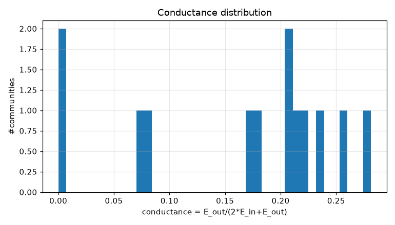
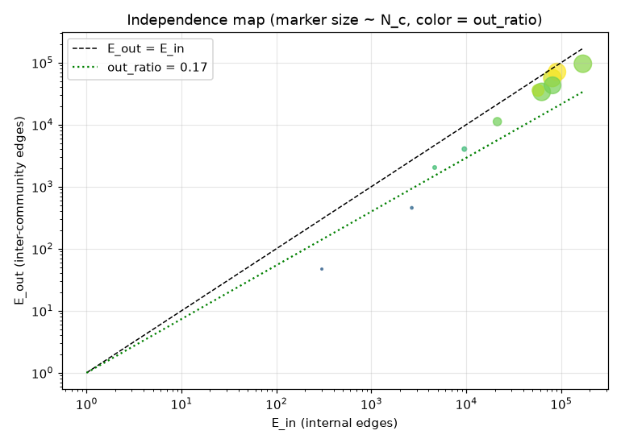
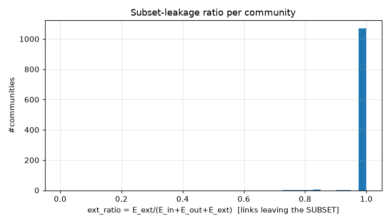
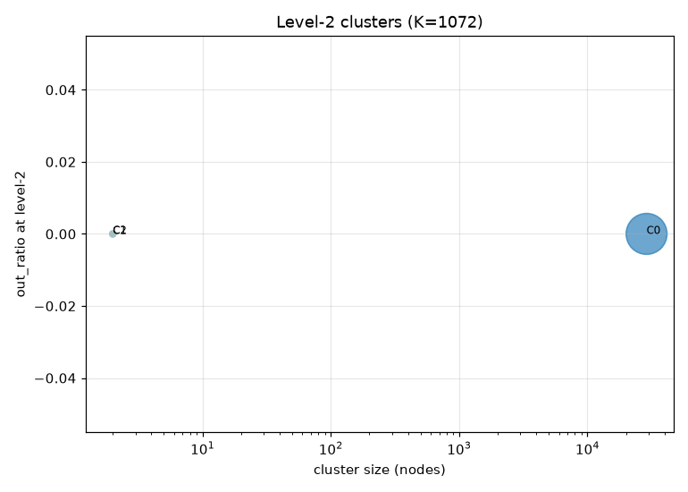
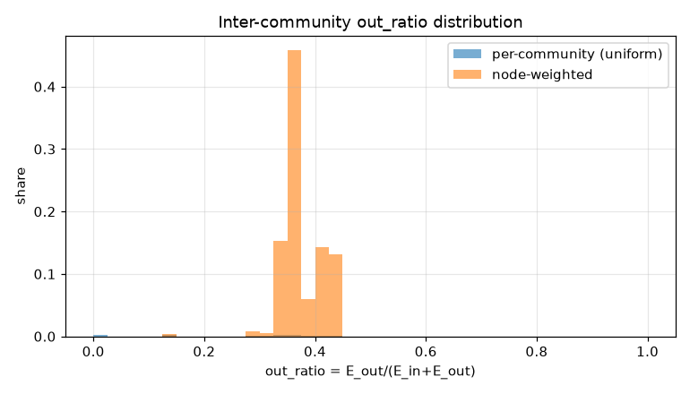
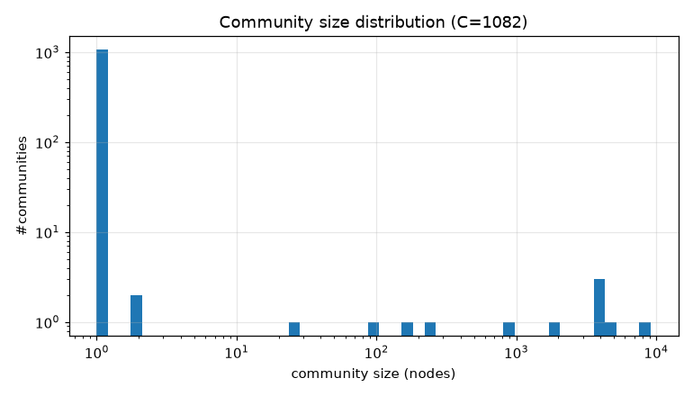

# コミュニティ分割 PoC レポート: bfs_geo_30k

生成: 2026-09-25T13:38:11 / seed=42 / resolution=0.5 / dump=2026-09-02

## 1. サブセット概要

| 項目 | 値 |
|---|---|
| 戦略 | outlink_bfs |
| ノード数 | 30,000 |
| 内部エッジ(有向・解決後) | 1,662,557 |
| 内部エッジ(無向・一意) | 756,138 |
| サブセット外へのリンク(outgoing) | 5,905,734 |
| サブセット外からのリンク(incoming) | 14,617,961 |
| リーク率 out/(int+out) | 0.780 |
| ページID範囲 | 10〜5,289,017 |

## 2. resolution スイープ(コミュニティサイズ分布)

| resolution | #comms | 最大シェア | top5シェア | サイズ中央値 | p25 | p75 | cross_edge_fraction |
|---|---|---|---|---|---|---|---|
| 0.5 | 1082 | 0.304 | 0.856 | 1.000 | 1.000 | 1.000 | 0.234 |
| 1.0 | 1092 | 0.121 | 0.521 | 1.000 | 1.000 | 1.000 | 0.300 |
| 2.0 | 1108 | 0.084 | 0.344 | 1.000 | 1.000 | 1.000 | 0.349 |

## 3. 全体指標(採用 resolution)

| 指標 | 値 |
|---|---|
| コミュニティ数 | 1,082 |
| 最大コミュニティのノードシェア | 0.304 |
| 上位5コミュニティのシェア | 0.856 |
| cross_edge_fraction(全体) | 0.234 |
| out_ratio(エッジ重み付き平均) | 0.379 |
| out_ratio(ノード重み付き中央値) | 0.361 |
| out_ratio p25/p50/p75 | 0.146/0.345/0.361 |
| conductance p25/p50/p75 | 0.079/0.208/0.221 |
| サブセット外へのリンク数(有向) | 5,905,734 |
| サブセット外からのリンク数(有向) | 14,617,961 |

## 4. 上位コミュニティ(サイズ順 top 15)

| comm | 代表記事 | N_c | E_in | E_out | E_ext(場外) | out_ratio | conductance | avg_deg | 境界ノード率 |
|---|---|---|---|---|---|---|---|---|---|
| 0 | 日本の文化、南西諸島、樺太 | 9,127 | 169,336 | 95,828 | 4,300,168 | 0.361 | 0.221 | 37.1 | 0.819 |
| 1 | 広島県出身の人物一覧、北海道新聞社、信濃毎日新聞 | 4,628 | 62,352 | 33,744 | 3,065,446 | 0.351 | 0.213 | 26.9 | 0.813 |
| 2 | 新幹線、東京都区部、南海電気鉄道 | 4,292 | 80,750 | 56,427 | 1,815,426 | 0.411 | 0.259 | 37.6 | 0.929 |
| 3 | 日本の地方公共団体一覧、推計人口、統計局 | 3,942 | 90,490 | 70,818 | 1,845,484 | 0.439 | 0.281 | 45.9 | 0.861 |
| 4 | 日本史の出来事一覧、元号一覧_(日本)、天皇の一覧 | 3,693 | 81,026 | 43,056 | 1,681,672 | 0.347 | 0.210 | 43.9 | 0.865 |
| 5 | トンネル、国土地理院、瀬戸内海 | 1,809 | 57,052 | 35,752 | 629,815 | 0.385 | 0.239 | 63.1 | 0.974 |
| 6 | 北関東、琉球大学、同志社女子大学 | 882 | 21,264 | 11,179 | 418,184 | 0.345 | 0.208 | 48.2 | 0.929 |
| 7 | アイヌ語、琉球諸語、日本語学 | 262 | 9,554 | 4,043 | 96,105 | 0.297 | 0.175 | 72.9 | 0.878 |
| 8 | 京都国立博物館、北網圏北見文化センター、奈良国立博物館 | 176 | 4,650 | 2,036 | 60,409 | 0.305 | 0.180 | 52.8 | 0.994 |
| 9 | 行政区画、国際標準化機構、ISO_3166-1 | 90 | 2,668 | 456 | 37,541 | 0.146 | 0.079 | 59.3 | 0.556 |
| 10 | 大同町、東又兵ヱ町、北内町_(名古屋市) | 26 | 301 | 47 | 7,017 | 0.135 | 0.072 | 23.2 | 1.000 |
| 11 | 船町_(豊橋市)、春日町_(豊橋市) | 2 | 1 | 0 | 1,174 | 0.000 | 0.000 | 1.0 | 0.000 |
| 12 | ムンダ語派、アスリ諸語 | 2 | 1 | 0 | 145 | 0.000 | 0.000 | 1.0 | 0.000 |
| 13 | 言語 | 1 | 0 | 0 | 3,555 | nan | nan | 0.0 | 0.000 |
| 14 | 地理学 | 1 | 0 | 0 | 3,077 | nan | nan | 0.0 | 0.000 |

## 5. コミュニティ間エッジ top 20

| comm A | comm B | エッジ数 | A代表 | B代表 |
|---|---|---|---|---|
| 0 | 3 | 21,433 | 日本の文化、南西諸島 | 日本の地方公共団体一覧、推計人口 |
| 0 | 4 | 19,782 | 日本の文化、南西諸島 | 日本史の出来事一覧、元号一覧_(日本) |
| 0 | 2 | 18,999 | 日本の文化、南西諸島 | 新幹線、東京都区部 |
| 2 | 3 | 18,026 | 新幹線、東京都区部 | 日本の地方公共団体一覧、推計人口 |
| 0 | 1 | 13,809 | 日本の文化、南西諸島 | 広島県出身の人物一覧、北海道新聞社 |
| 0 | 5 | 13,698 | 日本の文化、南西諸島 | トンネル、国土地理院 |
| 3 | 4 | 11,865 | 日本の地方公共団体一覧、推計人口 | 日本史の出来事一覧、元号一覧_(日本) |
| 3 | 5 | 10,747 | 日本の地方公共団体一覧、推計人口 | トンネル、国土地理院 |
| 1 | 2 | 8,436 | 広島県出身の人物一覧、北海道新聞社 | 新幹線、東京都区部 |
| 1 | 3 | 6,278 | 広島県出身の人物一覧、北海道新聞社 | 日本の地方公共団体一覧、推計人口 |
| 0 | 6 | 5,261 | 日本の文化、南西諸島 | 北関東、琉球大学 |
| 2 | 5 | 4,842 | 新幹線、東京都区部 | トンネル、国土地理院 |
| 4 | 5 | 4,219 | 日本史の出来事一覧、元号一覧_(日本) | トンネル、国土地理院 |
| 2 | 4 | 3,589 | 新幹線、東京都区部 | 日本史の出来事一覧、元号一覧_(日本) |
| 1 | 4 | 2,048 | 広島県出身の人物一覧、北海道新聞社 | 日本史の出来事一覧、元号一覧_(日本) |
| 2 | 6 | 1,906 | 新幹線、東京都区部 | 北関東、琉球大学 |
| 0 | 7 | 1,880 | 日本の文化、南西諸島 | アイヌ語、琉球諸語 |
| 3 | 6 | 1,489 | 日本の地方公共団体一覧、推計人口 | 北関東、琉球大学 |
| 1 | 6 | 1,400 | 広島県出身の人物一覧、北海道新聞社 | 北関東、琉球大学 |
| 1 | 5 | 1,318 | 広島県出身の人物一覧、北海道新聞社 | トンネル、国土地理院 |

## 6. ハブ記事の影響(次数 top 20)

| # | 記事 | 内部次数 | 場外次数 | comm | フラグ |
|---|---|---|---|---|---|
| 1 | 東京都 | 0 | 109,058 | 869 |  |
| 2 | 北海道 | 0 | 53,328 | 24 |  |
| 3 | 大阪府 | 0 | 46,062 | 824 |  |
| 4 | 愛知県 | 0 | 46,057 | 884 |  |
| 5 | 福岡県 | 0 | 34,663 | 787 |  |
| 6 | 市町村 | 0 | 31,289 | 571 |  |
| 7 | 長野県 | 0 | 25,686 | 21 |  |
| 8 | 広島県 | 0 | 25,268 | 23 |  |
| 9 | 京都府 | 0 | 24,676 | 870 |  |
| 10 | 新潟県 | 0 | 23,987 | 22 |  |
| 11 | 宮城県 | 0 | 22,014 | 943 |  |
| 12 | AKB48 | 0 | 10,577 | 1030 |  |
| 13 | トヨタ自動車 | 0 | 10,448 | 1066 |  |
| 14 | イスラエル | 0 | 10,424 | 160 |  |
| 15 | 駅ナンバリング | 0 | 10,297 | 846 |  |
| 16 | 仙台市 | 0 | 10,259 | 863 |  |
| 17 | 8月10日 | 0 | 10,258 | 264 | date |
| 18 | 10月3日 | 0 | 10,237 | 305 | date |
| 19 | 10月14日 | 0 | 10,174 | 309 | date |
| 20 | 10月6日 | 0 | 10,172 | 306 | date |

- 上位1%ノードが接する内部エッジのシェア: 0.140
- 内部次数 max: 1,154 / p50・p90・p99: 26.000・128.000・293.000

## 7. 階層化テスト(level-2)

| 指標 | 値 |
|---|---|
| 上位クラスタ数 K | 1,072 |
| 最大クラスタのシェア | 0.964 |
| out_ratio2(エッジ重み付き平均) | 0.000 |
| コミュニティ間グラフ modularity | 0.000 |

| cluster | #comms | N_nodes | E_in(記事) | E_between(comm間) | E_out2 | E_ext(場外) | out_ratio2 | conductance2 |
|---|---|---|---|---|---|---|---|---|
| 0 | 11 | 28,927 | 579443 | 176693 | 0 | 13957267 | 0.000 | 0.000 |
| 1 | 1 | 2 | 1 | 0 | 0 | 1174 | 0.000 | 0.000 |
| 2 | 1 | 2 | 1 | 0 | 0 | 145 | 0.000 | 0.000 |
| 3 | 1 | 1 | 0 | 0 | 0 | 3555 | - | - |
| 4 | 1 | 1 | 0 | 0 | 0 | 3077 | - | - |
| 5 | 1 | 1 | 0 | 0 | 0 | 4878 | - | - |
| 6 | 1 | 1 | 0 | 0 | 0 | 4298 | - | - |
| 7 | 1 | 1 | 0 | 0 | 0 | 8458 | - | - |
| 8 | 1 | 1 | 0 | 0 | 0 | 4596 | - | - |
| 9 | 1 | 1 | 0 | 0 | 0 | 6822 | - | - |
| 10 | 1 | 1 | 0 | 0 | 0 | 5610 | - | - |
| 11 | 1 | 1 | 0 | 0 | 0 | 25686 | - | - |
| 12 | 1 | 1 | 0 | 0 | 0 | 23987 | - | - |
| 13 | 1 | 1 | 0 | 0 | 0 | 25268 | - | - |
| 14 | 1 | 1 | 0 | 0 | 0 | 53328 | - | - |

## 8. 図

