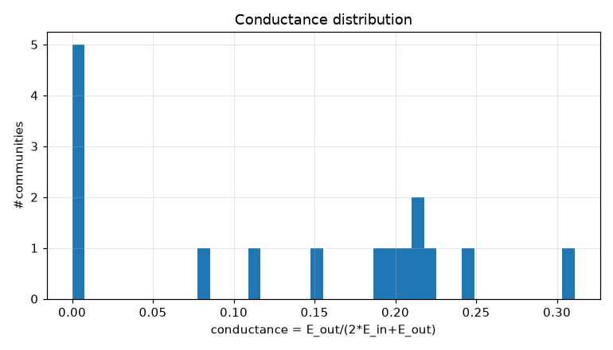
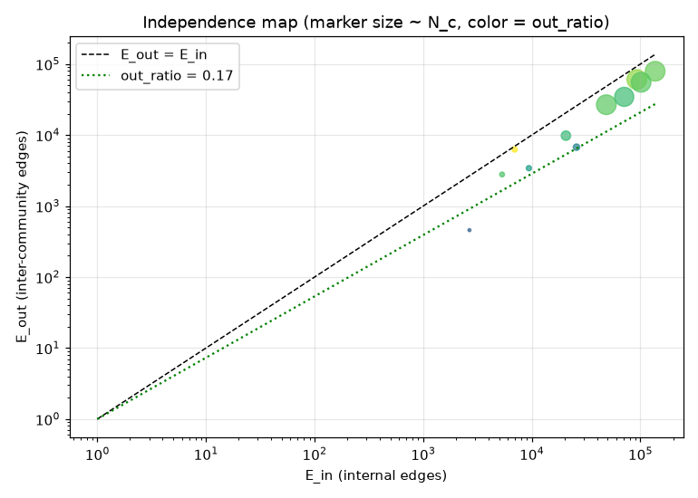
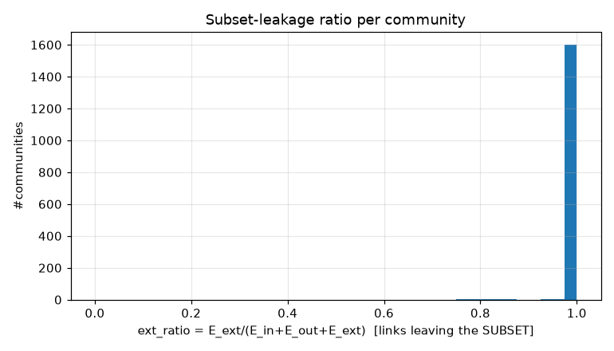
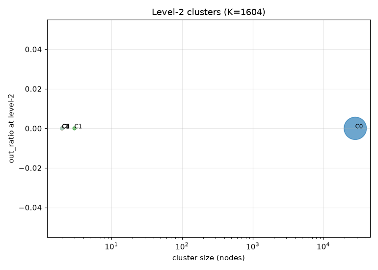
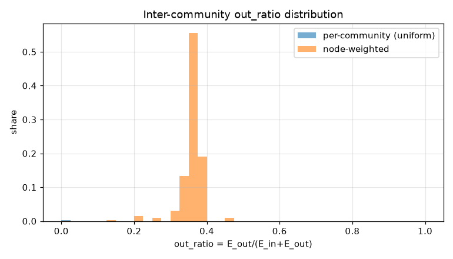
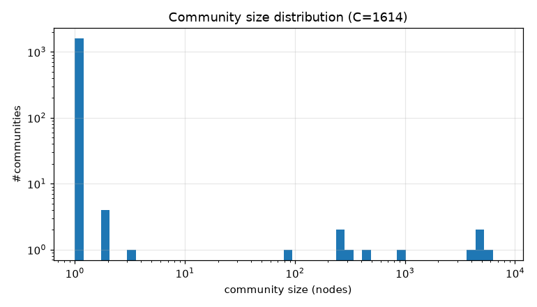

# コミュニティ分割 PoC レポート: bfs_geo_30k

生成: 2026-09-25T13:38:48 / seed=42 / resolution=0.5 / dump=2026-09-02

## 1. サブセット概要

| 項目 | 値 |
|---|---|
| 戦略 | outlink_bfs |
| ノード数 | 30,000 |
| 内部エッジ(有向・解決後) | 1,662,557 |
| 内部エッジ(無向・一意) | 664,200 |
| サブセット外へのリンク(outgoing) | 5,905,734 |
| サブセット外からのリンク(incoming) | 14,617,961 |
| リーク率 out/(int+out) | 0.780 |
| ページID範囲 | 10〜5,289,017 |

## 2. resolution スイープ(コミュニティサイズ分布)

| resolution | #comms | 最大シェア | top5シェア | サイズ中央値 | p25 | p75 | cross_edge_fraction |
|---|---|---|---|---|---|---|---|
| 0.5 | 1614 | 0.251 | 0.871 | 1.000 | 1.000 | 1.000 | 0.215 |
| 1.0 | 1625 | 0.127 | 0.532 | 1.000 | 1.000 | 1.000 | 0.280 |
| 2.0 | 1641 | 0.080 | 0.333 | 1.000 | 1.000 | 1.000 | 0.337 |

## 3. 全体指標(採用 resolution)

| 指標 | 値 |
|---|---|
| コミュニティ数 | 1,614 |
| 最大コミュニティのノードシェア | 0.251 |
| 上位5コミュニティのシェア | 0.871 |
| cross_edge_fraction(全体) | 0.215 |
| out_ratio(エッジ重み付き平均) | 0.354 |
| out_ratio(ノード重み付き中央値) | 0.355 |
| out_ratio p25/p50/p75 | 0.000/0.294/0.354 |
| conductance p25/p50/p75 | 0.000/0.173/0.215 |
| サブセット外へのリンク数(有向) | 5,905,734 |
| サブセット外からのリンク数(有向) | 14,617,961 |

## 4. 上位コミュニティ(サイズ順 top 15)

| comm | 代表記事 | N_c | E_in | E_out | E_ext(場外) | out_ratio | conductance | avg_deg | 境界ノード率 |
|---|---|---|---|---|---|---|---|---|---|
| 0 | 推計人口、統計局、市 | 7,524 | 136,717 | 79,239 | 3,101,569 | 0.367 | 0.225 | 36.3 | 0.848 |
| 1 | 樺太、内閣_(日本)、西日本 | 5,697 | 92,700 | 60,559 | 2,619,737 | 0.395 | 0.246 | 32.5 | 0.855 |
| 2 | 南西諸島、国土地理院、瀬戸内海 | 4,589 | 101,476 | 55,394 | 1,779,467 | 0.353 | 0.214 | 44.2 | 0.888 |
| 3 | 北海道新聞社、信濃毎日新聞、西日本新聞社 | 4,553 | 48,554 | 26,767 | 2,524,317 | 0.355 | 0.216 | 21.3 | 0.783 |
| 4 | 仙台藩、ミレニアム、下野国 | 3,777 | 70,964 | 34,526 | 1,616,986 | 0.327 | 0.196 | 37.6 | 0.841 |
| 5 | 放送大学、信州大学、幼稚園 | 919 | 20,630 | 9,816 | 416,910 | 0.322 | 0.192 | 44.9 | 0.917 |
| 6 | 一般国道、国道、国道18号 | 425 | 25,808 | 6,751 | 290,464 | 0.207 | 0.116 | 121.4 | 0.951 |
| 7 | 工業団地、小京都、茶室 | 297 | 6,949 | 6,274 | 159,244 | 0.474 | 0.311 | 46.8 | 0.973 |
| 8 | 琉球諸語、略語、八丈方言 | 282 | 9,406 | 3,416 | 97,412 | 0.266 | 0.154 | 66.7 | 0.851 |
| 9 | 東京国立博物館、指定管理者、北網圏北見文化センター | 238 | 5,329 | 2,784 | 84,573 | 0.343 | 0.207 | 44.8 | 0.954 |
| 10 | 行政区画、国際標準化機構、ISO_3166-1 | 90 | 2,668 | 458 | 38,017 | 0.147 | 0.079 | 59.3 | 0.556 |
| 11 | ハイ・レコード、ゴールドワックス・レコード、ジュニア・キンブロー | 3 | 3 | 0 | 137 | 0.000 | 0.000 | 2.0 | 0.000 |
| 12 | 春日町_(豊橋市)、船町_(豊橋市) | 2 | 1 | 0 | 1,174 | 0.000 | 0.000 | 1.0 | 0.000 |
| 13 | フランソワ・ボンヌ、ジャン・ピエール・レイ | 2 | 1 | 0 | 950 | 0.000 | 0.000 | 1.0 | 0.000 |
| 14 | ムンダ語派、アスリ諸語 | 2 | 1 | 0 | 145 | 0.000 | 0.000 | 1.0 | 0.000 |

## 5. コミュニティ間エッジ top 20

| comm A | comm B | エッジ数 | A代表 | B代表 |
|---|---|---|---|---|
| 0 | 2 | 23,611 | 推計人口、統計局 | 南西諸島、国土地理院 |
| 0 | 1 | 20,100 | 推計人口、統計局 | 樺太、内閣_(日本) |
| 1 | 2 | 15,709 | 樺太、内閣_(日本) | 南西諸島、国土地理院 |
| 0 | 4 | 12,338 | 推計人口、統計局 | 仙台藩、ミレニアム |
| 0 | 3 | 11,196 | 推計人口、統計局 | 北海道新聞社、信濃毎日新聞 |
| 1 | 4 | 9,710 | 樺太、内閣_(日本) | 仙台藩、ミレニアム |
| 1 | 3 | 7,839 | 樺太、内閣_(日本) | 北海道新聞社、信濃毎日新聞 |
| 2 | 4 | 7,633 | 南西諸島、国土地理院 | 仙台藩、ミレニアム |
| 0 | 6 | 5,184 | 推計人口、統計局 | 一般国道、国道 |
| 1 | 5 | 3,861 | 樺太、内閣_(日本) | 放送大学、信州大学 |
| 2 | 3 | 3,794 | 南西諸島、国土地理院 | 北海道新聞社、信濃毎日新聞 |
| 0 | 5 | 2,851 | 推計人口、統計局 | 放送大学、信州大学 |
| 0 | 7 | 2,123 | 推計人口、統計局 | 工業団地、小京都 |
| 3 | 4 | 1,966 | 北海道新聞社、信濃毎日新聞 | 仙台藩、ミレニアム |
| 1 | 7 | 1,519 | 樺太、内閣_(日本) | 工業団地、小京都 |
| 2 | 7 | 1,276 | 南西諸島、国土地理院 | 工業団地、小京都 |
| 3 | 5 | 1,198 | 北海道新聞社、信濃毎日新聞 | 放送大学、信州大学 |
| 0 | 9 | 1,134 | 推計人口、統計局 | 東京国立博物館、指定管理者 |
| 4 | 7 | 1,010 | 仙台藩、ミレニアム | 工業団地、小京都 |
| 2 | 5 | 997 | 南西諸島、国土地理院 | 放送大学、信州大学 |

## 6. ハブ記事の影響(次数 top 20)

| # | 記事 | 内部次数 | 場外次数 | comm | フラグ |
|---|---|---|---|---|---|
| 1 | 東京都 | 0 | 109,058 | 1193 |  |
| 2 | 北海道 | 0 | 53,328 | 27 |  |
| 3 | 大阪府 | 0 | 46,062 | 1110 |  |
| 4 | 愛知県 | 0 | 46,057 | 1224 |  |
| 5 | 福岡県 | 0 | 34,663 | 1034 |  |
| 6 | 市町村 | 0 | 31,289 | 668 |  |
| 7 | 長野県 | 0 | 25,686 | 24 |  |
| 8 | 広島県 | 0 | 25,268 | 26 |  |
| 9 | 京都府 | 0 | 24,676 | 1194 |  |
| 10 | 新潟県 | 0 | 23,987 | 25 |  |
| 11 | 宮城県 | 0 | 22,014 | 1335 |  |
| 12 | AKB48 | 0 | 10,577 | 1508 |  |
| 13 | トヨタ自動車 | 0 | 10,448 | 1590 |  |
| 14 | イスラエル | 0 | 10,424 | 180 |  |
| 15 | 駅ナンバリング | 0 | 10,297 | 1146 |  |
| 16 | 仙台市 | 0 | 10,259 | 1180 |  |
| 17 | 8月10日 | 0 | 10,258 | 290 | date |
| 18 | 10月3日 | 0 | 10,237 | 332 | date |
| 19 | 10月14日 | 0 | 10,174 | 336 | date |
| 20 | 10月6日 | 0 | 10,172 | 333 | date |

- 上位1%ノードが接する内部エッジのシェア: 0.131
- 内部次数 max: 909 / p50・p90・p99: 23.000・114.000・252.000

## 7. 階層化テスト(level-2)

| 指標 | 値 |
|---|---|
| 上位クラスタ数 K | 1,604 |
| 最大クラスタのシェア | 0.946 |
| out_ratio2(エッジ重み付き平均) | 0.000 |
| コミュニティ間グラフ modularity | 0.000 |

| cluster | #comms | N_nodes | E_in(記事) | E_between(comm間) | E_out2 | E_ext(場外) | out_ratio2 | conductance2 |
|---|---|---|---|---|---|---|---|---|
| 0 | 11 | 28,391 | 521201 | 142992 | 0 | 12728696 | 0.000 | 0.000 |
| 1 | 1 | 3 | 3 | 0 | 0 | 137 | 0.000 | 0.000 |
| 2 | 1 | 2 | 1 | 0 | 0 | 1174 | 0.000 | 0.000 |
| 3 | 1 | 2 | 1 | 0 | 0 | 950 | 0.000 | 0.000 |
| 4 | 1 | 2 | 1 | 0 | 0 | 145 | 0.000 | 0.000 |
| 5 | 1 | 2 | 1 | 0 | 0 | 81 | 0.000 | 0.000 |
| 6 | 1 | 1 | 0 | 0 | 0 | 3555 | - | - |
| 7 | 1 | 1 | 0 | 0 | 0 | 3077 | - | - |
| 8 | 1 | 1 | 0 | 0 | 0 | 4878 | - | - |
| 9 | 1 | 1 | 0 | 0 | 0 | 4298 | - | - |
| 10 | 1 | 1 | 0 | 0 | 0 | 8458 | - | - |
| 11 | 1 | 1 | 0 | 0 | 0 | 4596 | - | - |
| 12 | 1 | 1 | 0 | 0 | 0 | 6822 | - | - |
| 13 | 1 | 1 | 0 | 0 | 0 | 5610 | - | - |
| 14 | 1 | 1 | 0 | 0 | 0 | 25686 | - | - |

## 8. 図

