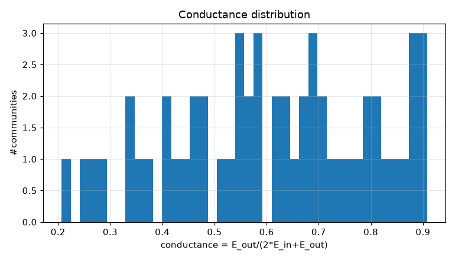
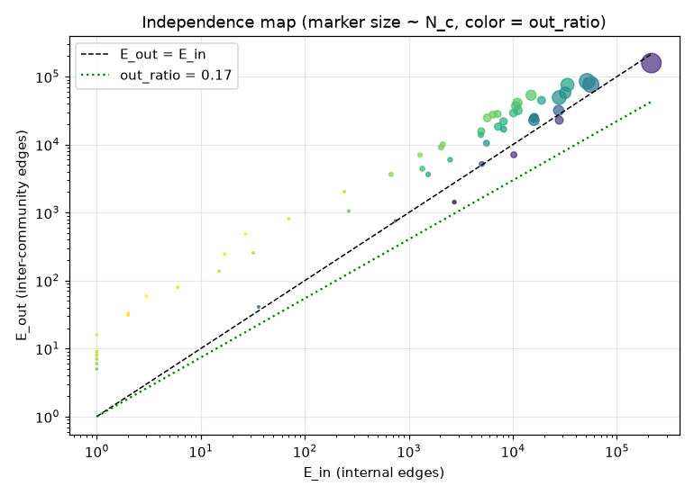
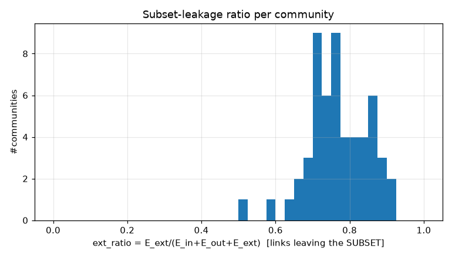
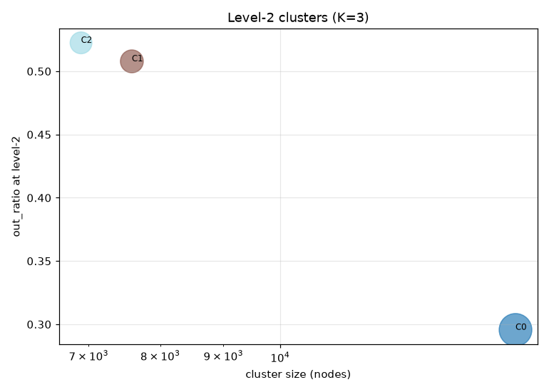
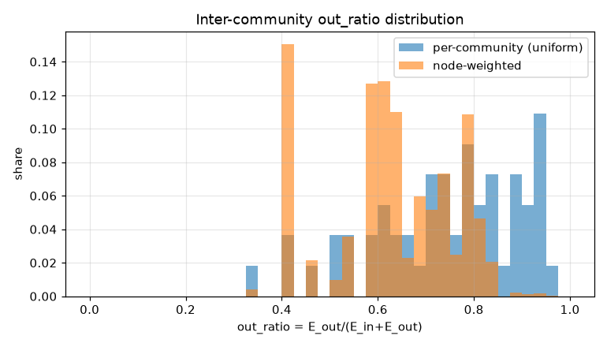
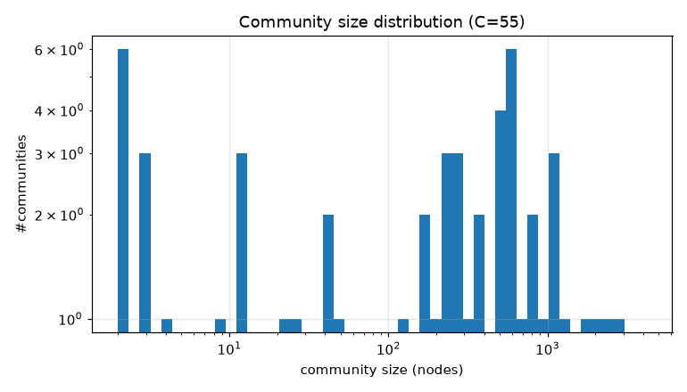

# コミュニティ分割 PoC レポート: bfs_geo_30k

生成: 2026-09-25T13:48:07 / seed=42 / resolution=1.0 / dump=2026-09-02

## 1. サブセット概要

| 項目 | 値 |
|---|---|
| 戦略 | outlink_bfs |
| ノード数 | 30,000 |
| 内部エッジ(有向・解決後) | 1,662,557 |
| 内部エッジ(無向・一意) | 1,239,983 |
| サブセット外へのリンク(outgoing) | 5,905,734 |
| サブセット外からのリンク(incoming) | 14,617,961 |
| リーク率 out/(int+out) | 0.780 |
| ページID範囲 | 10〜5,289,017 |

## 2. resolution スイープ(コミュニティサイズ分布)

| resolution | #comms | 最大シェア | top5シェア | サイズ中央値 | p25 | p75 | cross_edge_fraction |
|---|---|---|---|---|---|---|---|
| 0.5 | 32 | 0.170 | 0.694 | 204.000 | 5.500 | 989.750 | 0.377 |
| 1.0 | 55 | 0.139 | 0.436 | 276.000 | 18.000 | 628.500 | 0.447 |
| 2.0 | 102 | 0.079 | 0.262 | 206.500 | 66.250 | 359.000 | 0.511 |

## 3. 全体指標(採用 resolution)

| 指標 | 値 |
|---|---|
| コミュニティ数 | 55 |
| 最大コミュニティのノードシェア | 0.139 |
| 上位5コミュニティのシェア | 0.436 |
| cross_edge_fraction(全体) | 0.447 |
| out_ratio(エッジ重み付き平均) | 0.618 |
| out_ratio(ノード重み付き中央値) | 0.638 |
| out_ratio p25/p50/p75 | 0.642/0.767/0.866 |
| conductance p25/p50/p75 | 0.473/0.622/0.764 |
| サブセット外へのリンク数(有向) | 5,905,734 |
| サブセット外からのリンク数(有向) | 14,617,961 |

## 4. 上位コミュニティ(サイズ順 top 15)

| comm | 代表記事 | N_c | E_in | E_out | E_ext(場外) | out_ratio | conductance | avg_deg | 境界ノード率 |
|---|---|---|---|---|---|---|---|---|---|
| 0 | 天皇、明治維新、8月29日 | 4,159 | 214,655 | 158,523 | 4,477,701 | 0.425 | 0.270 | 103.2 | 0.906 |
| 1 | 毎日新聞社、土曜日、中日新聞 | 2,667 | 56,162 | 76,733 | 2,684,096 | 0.577 | 0.406 | 42.1 | 0.970 |
| 2 | 内閣総理大臣、日本共産党、昭和天皇 | 2,519 | 51,668 | 85,344 | 1,777,502 | 0.623 | 0.452 | 41.0 | 0.972 |
| 3 | 農林水産省、農業、日本料理 | 1,949 | 27,909 | 49,284 | 1,031,329 | 0.638 | 0.469 | 28.6 | 0.920 |
| 4 | 大阪府、京都府、3月13日 | 1,791 | 33,483 | 75,689 | 1,060,982 | 0.693 | 0.531 | 37.4 | 0.974 |
| 5 | 北陸地方、太平洋、日本海 | 1,353 | 31,804 | 57,949 | 777,216 | 0.646 | 0.477 | 47.0 | 0.982 |
| 6 | 阪神タイガース、福岡ソフトバンクホークス、広島東洋カープ | 1,145 | 15,950 | 22,802 | 824,538 | 0.588 | 0.417 | 27.9 | 0.918 |
| 7 | 東京都、1891年、東京駅 | 1,075 | 14,968 | 53,201 | 718,836 | 0.780 | 0.640 | 27.8 | 0.984 |
| 8 | 文部科学省、大学、東北大学 | 1,066 | 27,537 | 31,817 | 709,216 | 0.536 | 0.366 | 51.7 | 0.964 |
| 9 | 宮城県、国勢調査_(日本)、仙台市 | 886 | 11,067 | 41,163 | 404,462 | 0.788 | 0.650 | 25.0 | 0.963 |
| 10 | 環境省、山、Google_マップ | 786 | 16,017 | 24,556 | 315,851 | 0.605 | 0.434 | 40.8 | 0.987 |
| 11 | 福岡県、北九州市、九州旅客鉄道 | 751 | 11,166 | 31,831 | 383,353 | 0.740 | 0.588 | 29.7 | 0.981 |
| 12 | 地方公共団体、統計局、厚生労働省 | 748 | 10,665 | 37,043 | 357,306 | 0.776 | 0.635 | 28.5 | 0.985 |
| 13 | 道の駅、岡山市、福山市 | 638 | 27,921 | 22,891 | 397,883 | 0.451 | 0.291 | 87.5 | 0.969 |
| 14 | 日本銀行、高度経済成長、林業 | 619 | 5,666 | 24,753 | 307,623 | 0.814 | 0.686 | 18.3 | 0.974 |

## 5. コミュニティ間エッジ top 20

| comm A | comm B | エッジ数 | A代表 | B代表 |
|---|---|---|---|---|
| 0 | 2 | 22,303 | 天皇、明治維新 | 内閣総理大臣、日本共産党 |
| 0 | 1 | 15,322 | 天皇、明治維新 | 毎日新聞社、土曜日 |
| 0 | 4 | 12,554 | 天皇、明治維新 | 大阪府、京都府 |
| 0 | 7 | 9,233 | 天皇、明治維新 | 東京都、1891年 |
| 0 | 15 | 8,585 | 天皇、明治維新 | 日本の地方公共団体一覧、日本の国際関係 |
| 4 | 7 | 8,517 | 大阪府、京都府 | 東京都、1891年 |
| 0 | 9 | 8,265 | 天皇、明治維新 | 宮城県、国勢調査_(日本) |
| 2 | 15 | 7,882 | 内閣総理大臣、日本共産党 | 日本の地方公共団体一覧、日本の国際関係 |
| 0 | 5 | 6,978 | 天皇、明治維新 | 北陸地方、太平洋 |
| 0 | 3 | 6,955 | 天皇、明治維新 | 農林水産省、農業 |
| 1 | 2 | 6,810 | 毎日新聞社、土曜日 | 内閣総理大臣、日本共産党 |
| 0 | 21 | 6,383 | 天皇、明治維新 | 北海道、郡 |
| 2 | 12 | 5,632 | 内閣総理大臣、日本共産党 | 地方公共団体、統計局 |
| 4 | 11 | 5,529 | 大阪府、京都府 | 福岡県、北九州市 |
| 1 | 6 | 5,270 | 毎日新聞社、土曜日 | 阪神タイガース、福岡ソフトバンクホークス |
| 3 | 5 | 4,957 | 農林水産省、農業 | 北陸地方、太平洋 |
| 1 | 4 | 4,764 | 毎日新聞社、土曜日 | 大阪府、京都府 |
| 0 | 8 | 4,745 | 天皇、明治維新 | 文部科学省、大学 |
| 0 | 6 | 4,663 | 天皇、明治維新 | 阪神タイガース、福岡ソフトバンクホークス |
| 1 | 16 | 4,406 | 毎日新聞社、土曜日 | トヨタ自動車、純資産 |

## 6. ハブ記事の影響(次数 top 20)

| # | 記事 | 内部次数 | 場外次数 | comm | フラグ |
|---|---|---|---|---|---|
| 1 | 東京都 | 5,198 | 109,058 | 7 |  |
| 2 | 北海道 | 4,233 | 53,328 | 21 |  |
| 3 | 大阪府 | 2,805 | 46,062 | 4 |  |
| 4 | 愛知県 | 2,713 | 46,057 | 17 |  |
| 5 | 福岡県 | 2,404 | 34,663 | 11 |  |
| 6 | 市町村 | 1,441 | 31,289 | 22 |  |
| 7 | 長野県 | 2,071 | 25,686 | 22 |  |
| 8 | 広島県 | 1,922 | 25,268 | 28 |  |
| 9 | 京都府 | 1,880 | 24,676 | 4 |  |
| 10 | 新潟県 | 1,878 | 23,987 | 22 |  |
| 11 | 宮城県 | 1,945 | 22,014 | 9 |  |
| 12 | 仙台市 | 1,140 | 10,259 | 9 |  |
| 13 | 8月10日 | 1,014 | 10,258 | 0 | date |
| 14 | 10月3日 | 968 | 10,237 | 0 | date |
| 15 | 10月14日 | 1,029 | 10,174 | 0 | date |
| 16 | トヨタ自動車 | 745 | 10,448 | 16 |  |
| 17 | 9月20日 | 981 | 10,114 | 0 | date |
| 18 | 10月6日 | 915 | 10,172 | 0 | date |
| 19 | 4月23日 | 958 | 10,125 | 0 | date |
| 20 | AKB48 | 494 | 10,577 | 1 |  |

- 上位1%ノードが接する内部エッジのシェア: 0.212
- 内部次数 max: 5,198 / p50・p90・p99: 39.000・199.000・720.000

## 7. 階層化テスト(level-2)

| 指標 | 値 |
|---|---|
| 上位クラスタ数 K | 3 |
| 最大クラスタのシェア | 0.517 |
| out_ratio2(エッジ重み付き平均) | 0.398 |
| コミュニティ間グラフ modularity | 0.005 |

| cluster | #comms | N_nodes | E_in(記事) | E_between(comm間) | E_out2 | E_ext(場外) | out_ratio2 | conductance2 |
|---|---|---|---|---|---|---|---|---|
| 0 | 21 | 15,514 | 434419 | 148658 | 244685 | 12756520 | 0.296 | 0.173 |
| 1 | 19 | 7,586 | 126972 | 43623 | 176029 | 3779651 | 0.508 | 0.340 |
| 2 | 15 | 6,900 | 123763 | 54612 | 195158 | 3987524 | 0.522 | 0.354 |

## 8. 図

