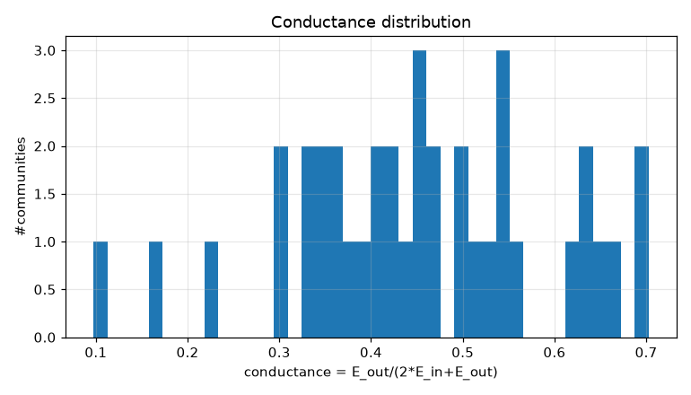
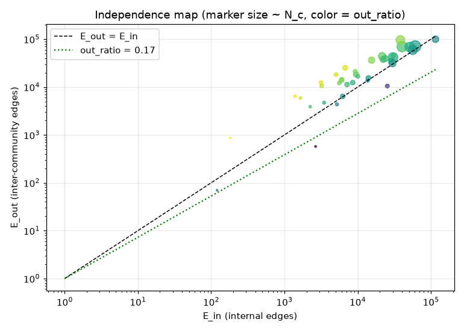
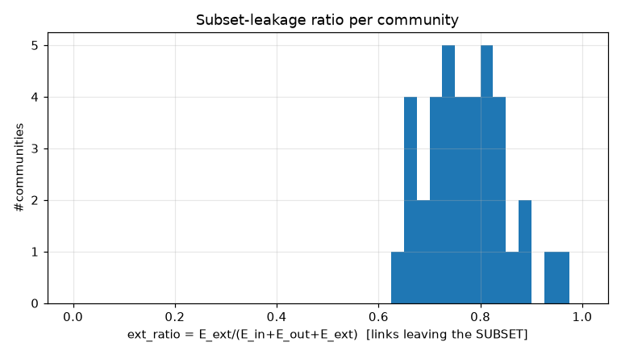
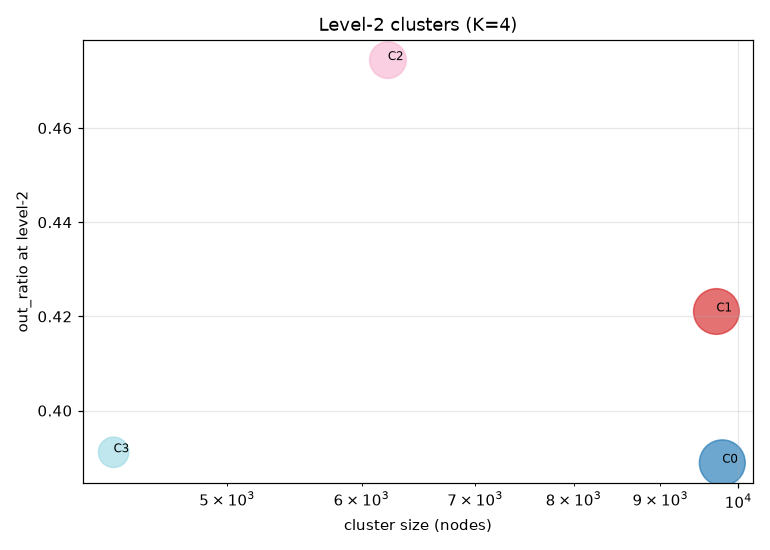
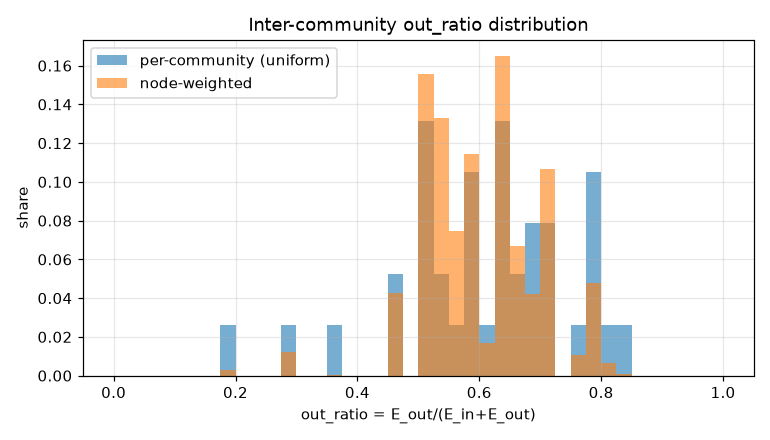
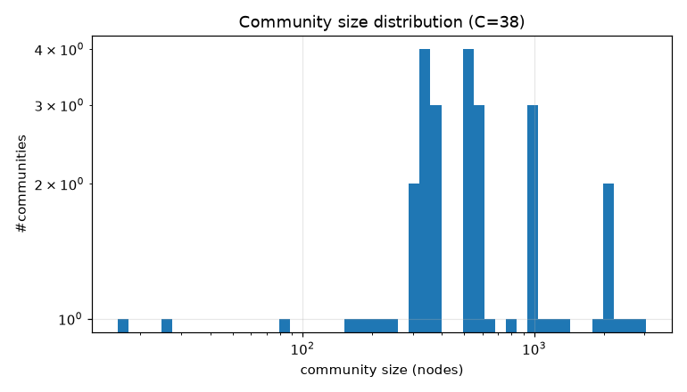

# コミュニティ分割 PoC レポート: bfs_geo_30k

生成: 2026-09-25T13:45:45 / seed=42 / resolution=2.0 / dump=2026-09-02

## 1. サブセット概要

| 項目 | 値 |
|---|---|
| 戦略 | outlink_bfs |
| ノード数 | 30,000 |
| 内部エッジ(有向・解決後) | 1,662,557 |
| 内部エッジ(無向・一意) | 1,239,983 |
| サブセット外へのリンク(outgoing) | 5,905,734 |
| サブセット外からのリンク(incoming) | 14,617,961 |
| リーク率 out/(int+out) | 0.780 |
| ページID範囲 | 10〜5,289,017 |

## 2. resolution スイープ(コミュニティサイズ分布)

| resolution | #comms | 最大シェア | top5シェア | サイズ中央値 | p25 | p75 | cross_edge_fraction |
|---|---|---|---|---|---|---|---|
| 0.5 | 7 | 0.325 | 0.963 | 4825.000 | 1843.500 | 5830.500 | 0.268 |
| 1.0 | 18 | 0.138 | 0.584 | 1278.000 | 631.250 | 2620.000 | 0.368 |
| 2.0 | 38 | 0.101 | 0.404 | 510.500 | 318.750 | 979.000 | 0.417 |

## 3. 全体指標(採用 resolution)

| 指標 | 値 |
|---|---|
| コミュニティ数 | 38 |
| 最大コミュニティのノードシェア | 0.101 |
| 上位5コミュニティのシェア | 0.404 |
| cross_edge_fraction(全体) | 0.417 |
| out_ratio(エッジ重み付き平均) | 0.589 |
| out_ratio(ノード重み付き中央値) | 0.578 |
| out_ratio p25/p50/p75 | 0.527/0.625/0.701 |
| conductance p25/p50/p75 | 0.358/0.455/0.540 |
| サブセット外へのリンク数(有向) | 5,905,734 |
| サブセット外からのリンク数(有向) | 14,617,961 |

## 4. 上位コミュニティ(サイズ順 top 15)

| comm | 代表記事 | N_c | E_in | E_out | E_ext(場外) | out_ratio | conductance | avg_deg | 境界ノード率 |
|---|---|---|---|---|---|---|---|---|---|
| 0 | 毎日新聞社、中日新聞、東京新聞 | 3,040 | 61,049 | 71,043 | 2,869,650 | 0.538 | 0.368 | 40.2 | 0.971 |
| 1 | 19世紀、外務省、17世紀 | 2,594 | 40,440 | 69,798 | 1,786,443 | 0.633 | 0.463 | 31.2 | 0.968 |
| 2 | 天皇、室町時代、徳川家康 | 2,237 | 51,526 | 68,436 | 1,262,945 | 0.570 | 0.399 | 46.1 | 0.975 |
| 3 | 日本料理、米、食品 | 2,160 | 30,444 | 41,655 | 1,019,131 | 0.578 | 0.406 | 28.2 | 0.917 |
| 4 | 東海旅客鉄道、国鉄分割民営化、九州旅客鉄道 | 2,090 | 56,384 | 59,827 | 1,145,468 | 0.515 | 0.347 | 54.0 | 0.991 |
| 5 | 長野県、宮城県、新潟県 | 1,895 | 38,239 | 95,948 | 1,177,082 | 0.715 | 0.556 | 40.4 | 0.972 |
| 6 | トヨタ自動車、純資産、中央区_(東京都) | 1,371 | 21,562 | 44,018 | 892,779 | 0.671 | 0.505 | 31.5 | 0.980 |
| 7 | 北陸地方、文部科学省、大学 | 1,222 | 29,890 | 31,280 | 738,128 | 0.511 | 0.344 | 48.9 | 0.975 |
| 8 | 8月29日、3月13日、3月12日 | 1,049 | 115,460 | 99,697 | 2,696,588 | 0.463 | 0.302 | 220.1 | 0.972 |
| 9 | 内閣総理大臣、日本共産党、昭和天皇 | 981 | 23,641 | 39,408 | 754,653 | 0.625 | 0.455 | 48.2 | 0.998 |
| 10 | 厚生労働省、経済産業省、環境省 | 973 | 15,480 | 36,525 | 427,611 | 0.702 | 0.541 | 31.8 | 0.978 |
| 11 | 日本の地理、川、トンネル | 944 | 29,049 | 34,486 | 398,200 | 0.543 | 0.372 | 61.5 | 0.992 |
| 12 | 明治維新、1868年、1872年 | 825 | 22,258 | 37,536 | 428,459 | 0.628 | 0.457 | 54.0 | 0.996 |
| 13 | 愛知県、東海地方、豊橋市 | 635 | 9,468 | 18,359 | 353,175 | 0.660 | 0.492 | 29.8 | 0.978 |
| 14 | 東京都、東京都区部、東京府 | 590 | 6,745 | 25,190 | 396,019 | 0.789 | 0.651 | 22.9 | 0.990 |

## 5. コミュニティ間エッジ top 20

| comm A | comm B | エッジ数 | A代表 | B代表 |
|---|---|---|---|---|
| 2 | 8 | 12,152 | 天皇、室町時代 | 8月29日、3月13日 |
| 2 | 12 | 11,038 | 天皇、室町時代 | 明治維新、1868年 |
| 0 | 8 | 10,647 | 毎日新聞社、中日新聞 | 8月29日、3月13日 |
| 4 | 8 | 10,195 | 東海旅客鉄道、国鉄分割民営化 | 8月29日、3月13日 |
| 1 | 8 | 9,834 | 19世紀、外務省 | 8月29日、3月13日 |
| 8 | 12 | 8,827 | 8月29日、3月13日 | 明治維新、1868年 |
| 5 | 8 | 8,803 | 長野県、宮城県 | 8月29日、3月13日 |
| 2 | 5 | 7,769 | 天皇、室町時代 | 長野県、宮城県 |
| 0 | 6 | 7,487 | 毎日新聞社、中日新聞 | トヨタ自動車、純資産 |
| 8 | 9 | 6,823 | 8月29日、3月13日 | 内閣総理大臣、日本共産党 |
| 4 | 5 | 6,779 | 東海旅客鉄道、国鉄分割民営化 | 長野県、宮城県 |
| 1 | 9 | 6,248 | 19世紀、外務省 | 内閣総理大臣、日本共産党 |
| 0 | 5 | 6,067 | 毎日新聞社、中日新聞 | 長野県、宮城県 |
| 1 | 3 | 5,624 | 19世紀、外務省 | 日本料理、米 |
| 1 | 18 | 5,496 | 19世紀、外務省 | 日本史の出来事一覧、太平洋 |
| 4 | 6 | 5,426 | 東海旅客鉄道、国鉄分割民営化 | トヨタ自動車、純資産 |
| 2 | 18 | 5,175 | 天皇、室町時代 | 日本史の出来事一覧、太平洋 |
| 5 | 11 | 4,890 | 長野県、宮城県 | 日本の地理、川 |
| 0 | 1 | 4,664 | 毎日新聞社、中日新聞 | 19世紀、外務省 |
| 1 | 2 | 4,181 | 19世紀、外務省 | 天皇、室町時代 |

## 6. ハブ記事の影響(次数 top 20)

| # | 記事 | 内部次数 | 場外次数 | comm | フラグ |
|---|---|---|---|---|---|
| 1 | 東京都 | 5,198 | 109,058 | 14 |  |
| 2 | 北海道 | 4,233 | 53,328 | 24 |  |
| 3 | 大阪府 | 2,805 | 46,062 | 26 |  |
| 4 | 愛知県 | 2,713 | 46,057 | 13 |  |
| 5 | 福岡県 | 2,404 | 34,663 | 28 |  |
| 6 | 市町村 | 1,441 | 31,289 | 5 |  |
| 7 | 長野県 | 2,071 | 25,686 | 5 |  |
| 8 | 広島県 | 1,922 | 25,268 | 27 |  |
| 9 | 京都府 | 1,880 | 24,676 | 32 |  |
| 10 | 新潟県 | 1,878 | 23,987 | 5 |  |
| 11 | 宮城県 | 1,945 | 22,014 | 5 |  |
| 12 | 仙台市 | 1,140 | 10,259 | 5 |  |
| 13 | 8月10日 | 1,014 | 10,258 | 8 | date |
| 14 | 10月3日 | 968 | 10,237 | 8 | date |
| 15 | 10月14日 | 1,029 | 10,174 | 8 | date |
| 16 | トヨタ自動車 | 745 | 10,448 | 6 |  |
| 17 | 9月20日 | 981 | 10,114 | 8 | date |
| 18 | 10月6日 | 915 | 10,172 | 8 | date |
| 19 | 4月23日 | 958 | 10,125 | 8 | date |
| 20 | AKB48 | 494 | 10,577 | 0 |  |

- 上位1%ノードが接する内部エッジのシェア: 0.212
- 内部次数 max: 5,198 / p50・p90・p99: 39.000・199.000・720.000

## 7. 階層化テスト(level-2)

| 指標 | 値 |
|---|---|
| 上位クラスタ数 K | 4 |
| 最大クラスタのシェア | 0.326 |
| out_ratio2(エッジ重み付き平均) | 0.412 |
| コミュニティ間グラフ modularity | -0.018 |

| cluster | #comms | N_nodes | E_in(記事) | E_between(comm間) | E_out2 | E_ext(場外) | out_ratio2 | conductance2 |
|---|---|---|---|---|---|---|---|---|
| 0 | 17 | 9,787 | 229855 | 84219 | 199888 | 5208669 | 0.389 | 0.241 |
| 1 | 10 | 9,709 | 191819 | 60563 | 183546 | 5833010 | 0.421 | 0.267 |
| 2 | 7 | 6,218 | 109954 | 17599 | 115140 | 5005853 | 0.474 | 0.311 |
| 3 | 4 | 4,286 | 190898 | 33658 | 144262 | 4476163 | 0.391 | 0.243 |

## 8. 図

