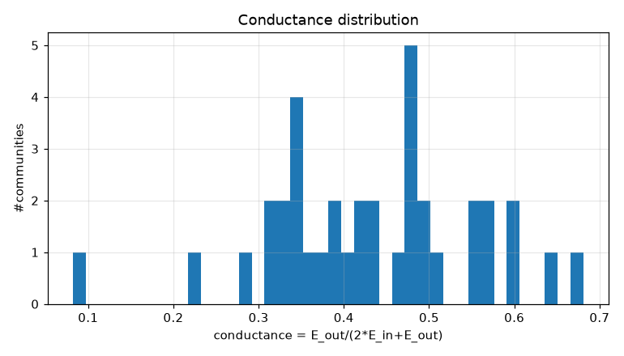
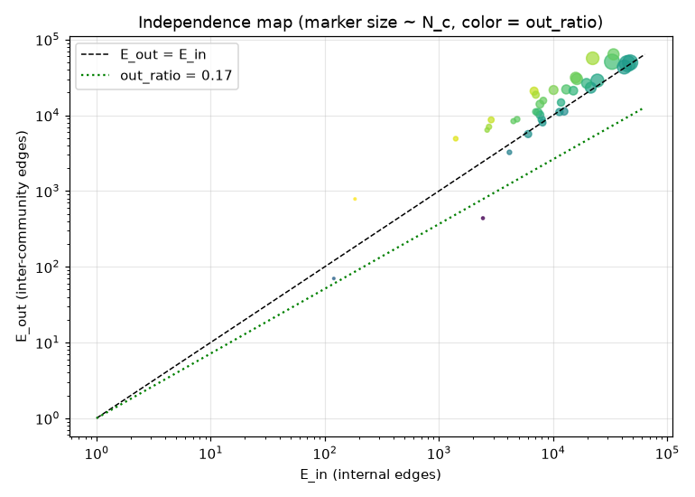
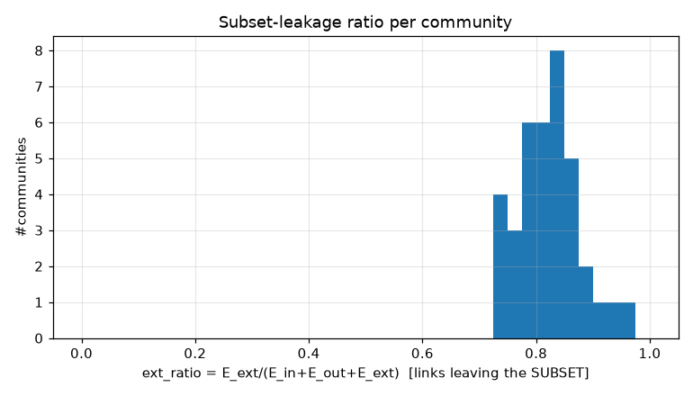
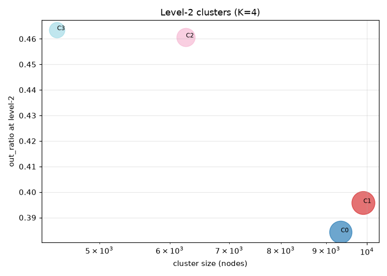
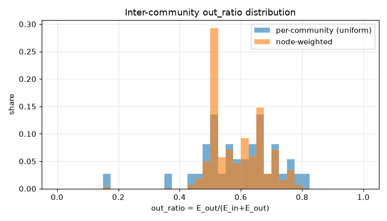
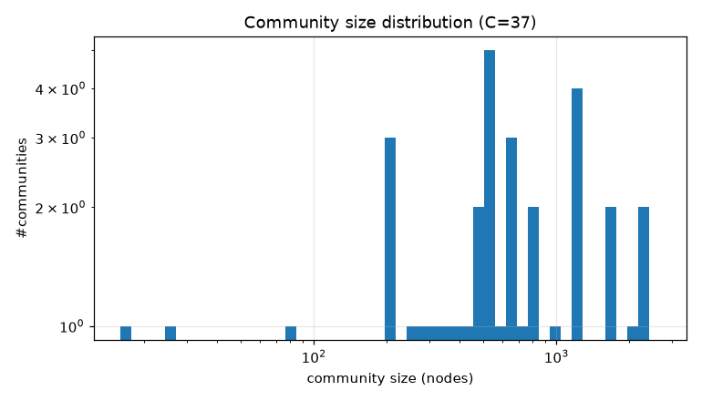

# コミュニティ分割 PoC レポート: bfs_geo_30k

生成: 2026-09-25T14:11:49 / seed=42 / resolution=2.0 / dump=2026-09-02

## 1. サブセット概要

| 項目 | 値 |
|---|---|
| 戦略 | outlink_bfs |
| ノード数 | 30,000 |
| 内部エッジ(有向・解決後) | 1,662,557 |
| 内部エッジ(無向・一意) | 858,204 |
| サブセット外へのリンク(outgoing) | 5,905,734 |
| サブセット外からのリンク(incoming) | 14,617,961 |
| リーク率 out/(int+out) | 0.780 |
| ページID範囲 | 10〜5,289,017 |

## 2. resolution スイープ(コミュニティサイズ分布)

| resolution | #comms | 最大シェア | top5シェア | サイズ中央値 | p25 | p75 | cross_edge_fraction |
|---|---|---|---|---|---|---|---|
| 0.5 | 7 | 0.320 | 0.952 | 4201.000 | 1687.500 | 6250.500 | 0.276 |
| 1.0 | 19 | 0.131 | 0.536 | 1195.000 | 447.000 | 2584.500 | 0.370 |
| 2.0 | 37 | 0.089 | 0.371 | 549.000 | 354.000 | 1160.000 | 0.423 |

## 3. 全体指標(採用 resolution)

| 指標 | 値 |
|---|---|
| コミュニティ数 | 37 |
| 最大コミュニティのノードシェア | 0.089 |
| 上位5コミュニティのシェア | 0.371 |
| cross_edge_fraction(全体) | 0.423 |
| out_ratio(エッジ重み付き平均) | 0.595 |
| out_ratio(ノード重み付き中央値) | 0.584 |
| out_ratio p25/p50/p75 | 0.518/0.607/0.666 |
| conductance p25/p50/p75 | 0.349/0.436/0.499 |
| サブセット外へのリンク数(有向) | 5,905,734 |
| サブセット外からのリンク数(有向) | 14,617,961 |

## 4. 上位コミュニティ(サイズ順 top 15)

| comm | 代表記事 | N_c | E_in | E_out | E_ext(場外) | out_ratio | conductance | avg_deg | 境界ノード率 |
|---|---|---|---|---|---|---|---|---|---|
| 0 | 毎日新聞社、オールニッポン・ニュースネットワーク、共同通信社 | 2,674 | 44,844 | 48,145 | 2,686,339 | 0.518 | 0.349 | 33.5 | 0.972 |
| 1 | 19世紀、外務省、20世紀 | 2,379 | 32,911 | 50,905 | 1,709,337 | 0.607 | 0.436 | 27.7 | 0.972 |
| 2 | 明治維新、1872年、1868年 | 2,369 | 47,409 | 49,794 | 1,266,526 | 0.512 | 0.344 | 40.0 | 0.974 |
| 3 | 東海旅客鉄道、九州旅客鉄道、駅ナンバリング | 1,988 | 42,125 | 43,415 | 1,076,340 | 0.508 | 0.340 | 42.4 | 0.992 |
| 4 | 食品、米、日本料理 | 1,718 | 24,469 | 28,740 | 829,672 | 0.540 | 0.370 | 28.5 | 0.922 |
| 5 | 新潟県、宮城県、市町村 | 1,641 | 22,252 | 56,595 | 1,026,331 | 0.718 | 0.560 | 27.1 | 0.971 |
| 6 | 8月29日、3月13日、1875年 | 1,269 | 33,876 | 63,818 | 2,668,416 | 0.653 | 0.485 | 53.4 | 0.981 |
| 7 | 純資産、トヨタ自動車、東京証券取引所 | 1,267 | 16,198 | 30,122 | 837,379 | 0.650 | 0.482 | 25.6 | 0.983 |
| 8 | 北陸地方、文部科学省、大学 | 1,213 | 21,413 | 23,119 | 750,671 | 0.519 | 0.351 | 35.3 | 0.974 |
| 9 | 厚生労働省、農林水産省、環境省 | 1,160 | 15,785 | 31,469 | 545,650 | 0.666 | 0.499 | 27.2 | 0.975 |
| 10 | 内閣総理大臣、日本共産党、参議院 | 975 | 19,656 | 26,397 | 768,718 | 0.573 | 0.402 | 40.3 | 0.996 |
| 11 | 日本書紀、神道、重要文化財 | 844 | 13,061 | 21,958 | 554,407 | 0.627 | 0.457 | 31.0 | 0.986 |
| 12 | 農業、林業、高速道路 | 809 | 10,108 | 21,567 | 472,113 | 0.681 | 0.516 | 25.0 | 0.974 |
| 13 | 川、トンネル、ヘクタール | 758 | 15,066 | 21,137 | 328,288 | 0.584 | 0.412 | 39.8 | 0.991 |
| 14 | 東京都、東京府、住居表示 | 644 | 6,824 | 20,860 | 440,962 | 0.754 | 0.604 | 21.2 | 0.992 |

## 5. コミュニティ間エッジ top 20

| comm A | comm B | エッジ数 | A代表 | B代表 |
|---|---|---|---|---|
| 2 | 6 | 11,427 | 明治維新、1872年 | 8月29日、3月13日 |
| 3 | 6 | 6,872 | 東海旅客鉄道、九州旅客鉄道 | 8月29日、3月13日 |
| 1 | 6 | 6,624 | 19世紀、外務省 | 8月29日、3月13日 |
| 0 | 6 | 6,500 | 毎日新聞社、オールニッポン・ニュースネットワーク | 8月29日、3月13日 |
| 2 | 11 | 5,784 | 明治維新、1872年 | 日本書紀、神道 |
| 2 | 5 | 5,360 | 明治維新、1872年 | 新潟県、宮城県 |
| 0 | 7 | 5,062 | 毎日新聞社、オールニッポン・ニュースネットワーク | 純資産、トヨタ自動車 |
| 1 | 10 | 4,640 | 19世紀、外務省 | 内閣総理大臣、日本共産党 |
| 5 | 6 | 4,494 | 新潟県、宮城県 | 8月29日、3月13日 |
| 6 | 10 | 4,287 | 8月29日、3月13日 | 内閣総理大臣、日本共産党 |
| 3 | 5 | 3,901 | 東海旅客鉄道、九州旅客鉄道 | 新潟県、宮城県 |
| 1 | 4 | 3,782 | 19世紀、外務省 | 食品、米 |
| 1 | 9 | 3,517 | 19世紀、外務省 | 厚生労働省、農林水産省 |
| 3 | 7 | 3,440 | 東海旅客鉄道、九州旅客鉄道 | 純資産、トヨタ自動車 |
| 1 | 2 | 3,403 | 19世紀、外務省 | 明治維新、1872年 |
| 9 | 10 | 3,250 | 厚生労働省、農林水産省 | 内閣総理大臣、日本共産党 |
| 0 | 5 | 2,948 | 毎日新聞社、オールニッポン・ニュースネットワーク | 新潟県、宮城県 |
| 4 | 12 | 2,881 | 食品、米 | 農業、林業 |
| 0 | 1 | 2,814 | 毎日新聞社、オールニッポン・ニュースネットワーク | 19世紀、外務省 |
| 5 | 18 | 2,748 | 新潟県、宮城県 | 道の駅、一般国道 |

## 6. ハブ記事の影響(次数 top 20)

| # | 記事 | 内部次数 | 場外次数 | comm | フラグ |
|---|---|---|---|---|---|
| 1 | 東京都 | 3,470 | 109,058 | 14 |  |
| 2 | 北海道 | 2,955 | 53,328 | 24 |  |
| 3 | 大阪府 | 1,731 | 46,062 | 27 |  |
| 4 | 愛知県 | 1,705 | 46,057 | 16 |  |
| 5 | 福岡県 | 1,420 | 34,663 | 28 |  |
| 6 | 市町村 | 1,175 | 31,289 | 5 |  |
| 7 | 長野県 | 1,481 | 25,686 | 33 |  |
| 8 | 広島県 | 1,304 | 25,268 | 29 |  |
| 9 | 京都府 | 1,180 | 24,676 | 31 |  |
| 10 | 新潟県 | 1,271 | 23,987 | 5 |  |
| 11 | 宮城県 | 1,193 | 22,014 | 5 |  |
| 12 | トヨタ自動車 | 448 | 10,448 | 7 |  |
| 13 | 駅ナンバリング | 576 | 10,297 | 3 |  |
| 14 | AKB48 | 263 | 10,577 | 0 |  |
| 15 | 仙台市 | 563 | 10,259 | 5 |  |
| 16 | イスラエル | 356 | 10,424 | 1 |  |
| 17 | 8月10日 | 377 | 10,258 | 6 | date |
| 18 | 10月3日 | 341 | 10,237 | 6 | date |
| 19 | 10月14日 | 382 | 10,174 | 6 | date |
| 20 | 4月23日 | 388 | 10,125 | 6 | date |

- 上位1%ノードが接する内部エッジのシェア: 0.164
- 内部次数 max: 3,470 / p50・p90・p99: 39.000・112.000・349.000

## 7. 階層化テスト(level-2)

| 指標 | 値 |
|---|---|
| 上位クラスタ数 K | 4 |
| 最大クラスタのシェア | 0.330 |
| out_ratio2(エッジ重み付き平均) | 0.417 |
| コミュニティ間グラフ modularity | -0.017 |

| cluster | #comms | N_nodes | E_in(記事) | E_between(comm間) | E_out2 | E_ext(場外) | out_ratio2 | conductance2 |
|---|---|---|---|---|---|---|---|---|
| 1 | 10 | 9,911 | 149362 | 46111 | 128002 | 5986409 | 0.396 | 0.247 |
| 0 | 17 | 9,348 | 161343 | 55590 | 135371 | 4891480 | 0.384 | 0.238 |
| 2 | 7 | 6,259 | 89758 | 16756 | 90933 | 5156457 | 0.461 | 0.299 |
| 3 | 3 | 4,482 | 94346 | 18890 | 97790 | 4489349 | 0.463 | 0.302 |

## 8. 図

