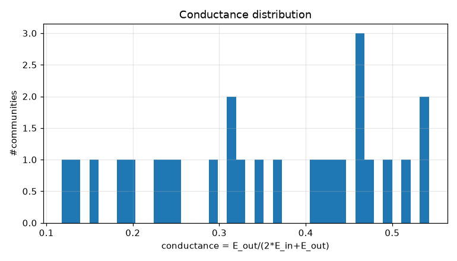
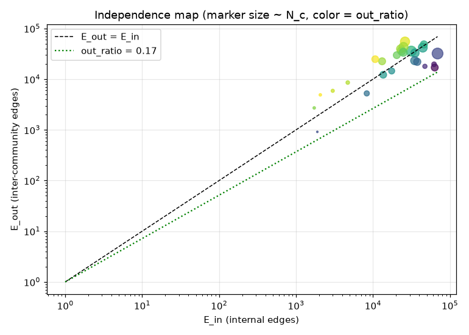
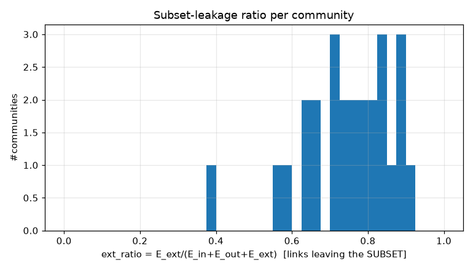
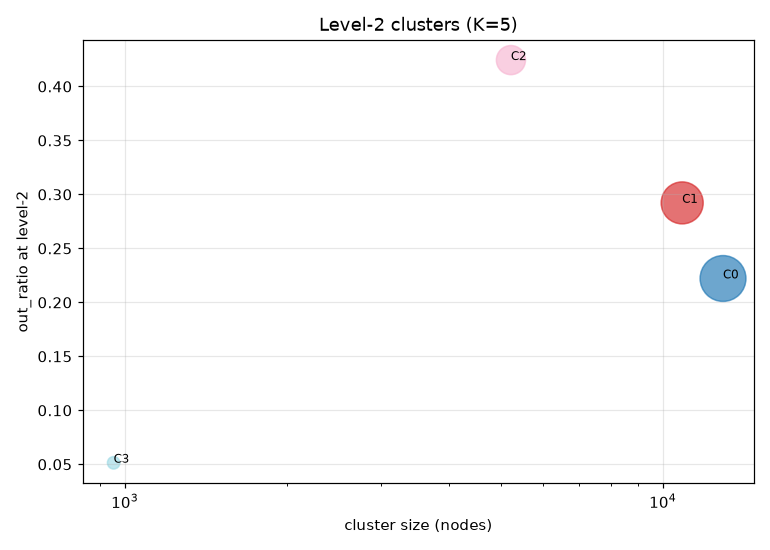
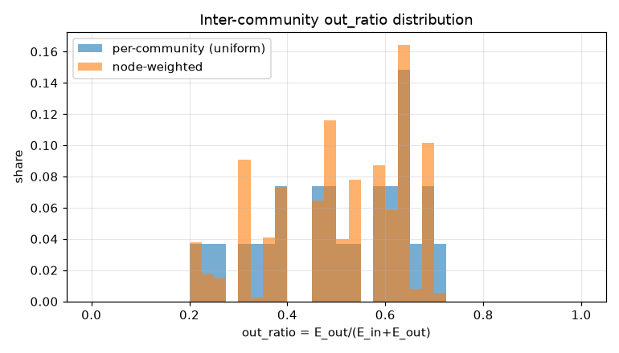
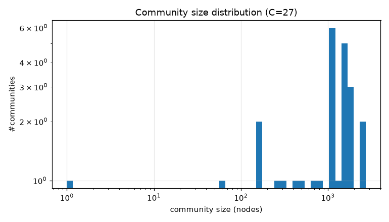

# コミュニティ分割 PoC レポート: bfs_mixed_30k

生成: 2026-09-25T14:12:33 / seed=42 / resolution=2.0 / dump=2026-09-02

## 1. サブセット概要

| 項目 | 値 |
|---|---|
| 戦略 | outlink_bfs |
| ノード数 | 30,000 |
| 内部エッジ(有向・解決後) | 1,376,803 |
| 内部エッジ(無向・一意) | 1,006,893 |
| サブセット外へのリンク(outgoing) | 4,829,817 |
| サブセット外からのリンク(incoming) | 11,854,813 |
| リーク率 out/(int+out) | 0.778 |
| ページID範囲 | 5〜5,288,357 |

## 2. resolution スイープ(コミュニティサイズ分布)

| resolution | #comms | 最大シェア | top5シェア | サイズ中央値 | p25 | p75 | cross_edge_fraction |
|---|---|---|---|---|---|---|---|
| 0.5 | 10 | 0.520 | 0.941 | 1394.500 | 209.750 | 2598.000 | 0.138 |
| 1.0 | 14 | 0.240 | 0.766 | 1380.000 | 688.750 | 2858.750 | 0.215 |
| 2.0 | 27 | 0.091 | 0.360 | 1130.000 | 477.000 | 1573.500 | 0.313 |

## 3. 全体指標(採用 resolution)

| 指標 | 値 |
|---|---|
| コミュニティ数 | 27 |
| 最大コミュニティのノードシェア | 0.091 |
| 上位5コミュニティのシェア | 0.360 |
| cross_edge_fraction(全体) | 0.313 |
| out_ratio(エッジ重み付き平均) | 0.477 |
| out_ratio(ノード重み付き中央値) | 0.532 |
| out_ratio p25/p50/p75 | 0.390/0.523/0.633 |
| conductance p25/p50/p75 | 0.242/0.354/0.463 |
| サブセット外へのリンク数(有向) | 4,829,817 |
| サブセット外からのリンク数(有向) | 11,854,813 |

## 4. 上位コミュニティ(サイズ順 top 15)

| comm | 代表記事 | N_c | E_in | E_out | E_ext(場外) | out_ratio | conductance | avg_deg | 境界ノード率 |
|---|---|---|---|---|---|---|---|---|---|
| 0 | コンピュータ、オペレーティングシステム、ソフトウェア | 2,727 | 69,180 | 32,104 | 822,018 | 0.317 | 0.188 | 50.7 | 0.839 |
| 1 | アニメ_(日本のアニメーション作品)、インターネットアーカイブ、アニメーション | 2,331 | 31,523 | 35,789 | 1,597,043 | 0.532 | 0.362 | 27.0 | 0.938 |
| 2 | 19世紀、20世紀、エジプト | 1,968 | 26,122 | 55,170 | 1,541,979 | 0.679 | 0.514 | 26.5 | 0.964 |
| 3 | 仙台市、東芝、日本電気 | 1,918 | 24,923 | 43,223 | 1,615,300 | 0.634 | 0.464 | 26.0 | 0.924 |
| 4 | 化学、原子、水 | 1,871 | 44,439 | 41,925 | 623,780 | 0.485 | 0.321 | 47.5 | 0.903 |
| 5 | 物理学、Bibcode、電子 | 1,613 | 35,194 | 32,838 | 409,520 | 0.483 | 0.318 | 43.6 | 0.962 |
| 6 | 医学、タンパク質、生物学 | 1,593 | 23,533 | 36,118 | 673,162 | 0.605 | 0.434 | 29.5 | 0.957 |
| 7 | 天皇、明治維新、中世 | 1,554 | 22,911 | 39,476 | 1,160,797 | 0.633 | 0.463 | 29.5 | 0.970 |
| 8 | 数学、数学者、数学の哲学 | 1,545 | 34,889 | 23,201 | 248,669 | 0.399 | 0.250 | 45.2 | 0.873 |
| 9 | 毎日新聞社、コマーシャルメッセージ、スポーツニッポン | 1,498 | 24,779 | 33,883 | 1,634,715 | 0.578 | 0.406 | 33.1 | 0.981 |
| 10 | 食品、ラーメン、蕎麦 | 1,225 | 37,651 | 22,019 | 505,348 | 0.369 | 0.226 | 61.5 | 0.908 |
| 11 | 18世紀、17世紀、4月14日 | 1,201 | 45,952 | 48,469 | 1,829,720 | 0.513 | 0.345 | 76.5 | 0.977 |
| 12 | 筑摩書房、河出書房新社、小説 | 1,147 | 13,149 | 22,558 | 433,106 | 0.632 | 0.462 | 22.9 | 0.962 |
| 13 | チェス、柔道、テニス | 1,130 | 63,562 | 16,987 | 582,973 | 0.211 | 0.118 | 112.5 | 0.937 |
| 14 | 哲学、ギリシア語、科学 | 1,115 | 20,405 | 29,782 | 423,628 | 0.593 | 0.422 | 36.6 | 0.980 |

## 5. コミュニティ間エッジ top 20

| comm A | comm B | エッジ数 | A代表 | B代表 |
|---|---|---|---|---|
| 19 | 20 | 15,422 | 日本将棋連盟、加藤一二三 | 将棋、棋士_(将棋) |
| 4 | 5 | 10,551 | 化学、原子 | 物理学、Bibcode |
| 2 | 11 | 8,591 | 19世紀、20世紀 | 18世紀、17世紀 |
| 1 | 9 | 7,711 | アニメ_(日本のアニメーション作品)、インターネットアーカイブ | 毎日新聞社、コマーシャルメッセージ |
| 7 | 11 | 7,403 | 天皇、明治維新 | 18世紀、17世紀 |
| 4 | 6 | 6,801 | 化学、原子 | 医学、タンパク質 |
| 5 | 8 | 4,999 | 物理学、Bibcode | 数学、数学者 |
| 3 | 7 | 4,907 | 仙台市、東芝 | 天皇、明治維新 |
| 0 | 8 | 4,780 | コンピュータ、オペレーティングシステム | 数学、数学者 |
| 8 | 14 | 4,641 | 数学、数学者 | 哲学、ギリシア語 |
| 2 | 7 | 4,601 | 19世紀、20世紀 | 天皇、明治維新 |
| 2 | 3 | 4,554 | 19世紀、20世紀 | 仙台市、東芝 |
| 0 | 1 | 4,515 | コンピュータ、オペレーティングシステム | アニメ_(日本のアニメーション作品)、インターネットアーカイブ |
| 3 | 11 | 4,471 | 仙台市、東芝 | 18世紀、17世紀 |
| 3 | 9 | 4,298 | 仙台市、東芝 | 毎日新聞社、コマーシャルメッセージ |
| 6 | 10 | 4,121 | 医学、タンパク質 | 食品、ラーメン |
| 1 | 12 | 3,889 | アニメ_(日本のアニメーション作品)、インターネットアーカイブ | 筑摩書房、河出書房新社 |
| 2 | 14 | 3,427 | 19世紀、20世紀 | 哲学、ギリシア語 |
| 2 | 6 | 3,377 | 19世紀、20世紀 | 医学、タンパク質 |
| 0 | 4 | 3,351 | コンピュータ、オペレーティングシステム | 化学、原子 |

## 6. ハブ記事の影響(次数 top 20)

| # | 記事 | 内部次数 | 場外次数 | comm | フラグ |
|---|---|---|---|---|---|
| 1 | サッカー | 1,174 | 23,892 | 18 |  |
| 2 | 仙台市 | 500 | 11,083 | 3 |  |
| 3 | 8月10日 | 610 | 10,798 | 11 | date |
| 4 | 駅ナンバリング | 166 | 11,116 | 3 |  |
| 5 | 4月28日 | 617 | 10,598 | 11 | date |
| 6 | 5月10日 | 602 | 10,580 | 11 | date |
| 7 | 4月26日 | 635 | 10,449 | 11 | date |
| 8 | 12月24日 | 598 | 10,456 | 11 | date |
| 9 | 12月18日 | 647 | 10,300 | 11 | date |
| 10 | イスラエル | 612 | 10,327 | 2 |  |
| 11 | 4月9日 | 617 | 10,322 | 11 | date |
| 12 | EMIミュージック・ジャパン | 131 | 10,789 | 9 |  |
| 13 | 広島市 | 385 | 10,528 | 3 |  |
| 14 | 2月8日 | 617 | 10,274 | 11 | date |
| 15 | 1月15日 | 594 | 10,280 | 11 | date |
| 16 | 11月22日 | 624 | 10,247 | 11 | date |
| 17 | 5月5日 | 611 | 10,251 | 11 | date |
| 18 | 4月16日 | 599 | 10,224 | 11 | date |
| 19 | 10月22日 | 584 | 10,236 | 11 | date |
| 20 | 10月26日 | 613 | 10,141 | 11 | date |

- 上位1%ノードが接する内部エッジのシェア: 0.160
- 内部次数 max: 1,255 / p50・p90・p99: 34.000・156.000・459.010

## 7. 階層化テスト(level-2)

| 指標 | 値 |
|---|---|
| 上位クラスタ数 K | 5 |
| 最大クラスタのシェア | 0.432 |
| out_ratio2(エッジ重み付き平均) | 0.254 |
| コミュニティ間グラフ modularity | -0.027 |

| cluster | #comms | N_nodes | E_in(記事) | E_between(comm間) | E_out2 | E_ext(場外) | out_ratio2 | conductance2 |
|---|---|---|---|---|---|---|---|---|
| 0 | 11 | 12,949 | 288485 | 69426 | 102201 | 4226711 | 0.222 | 0.125 |
| 1 | 9 | 10,872 | 220784 | 67579 | 119017 | 8264007 | 0.292 | 0.171 |
| 2 | 4 | 5,224 | 72453 | 16331 | 65467 | 3846183 | 0.424 | 0.269 |
| 3 | 2 | 954 | 109682 | 15422 | 6777 | 347729 | 0.051 | 0.026 |
| 4 | 1 | 1 | 0 | 0 | 0 | 0 | - | - |

## 8. 図

