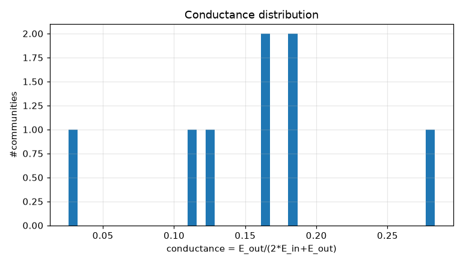
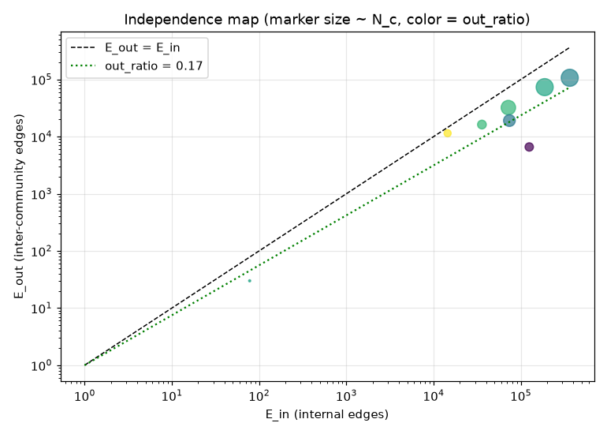
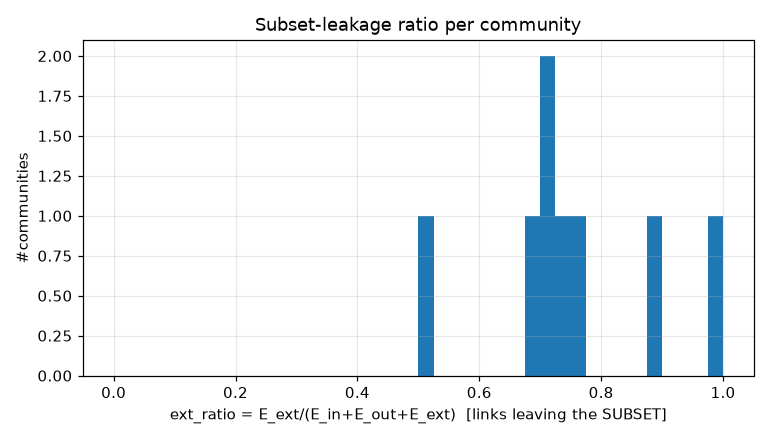
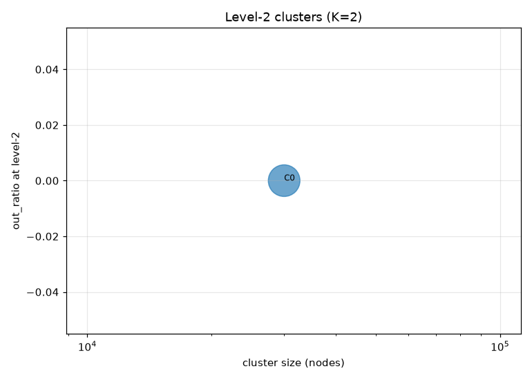
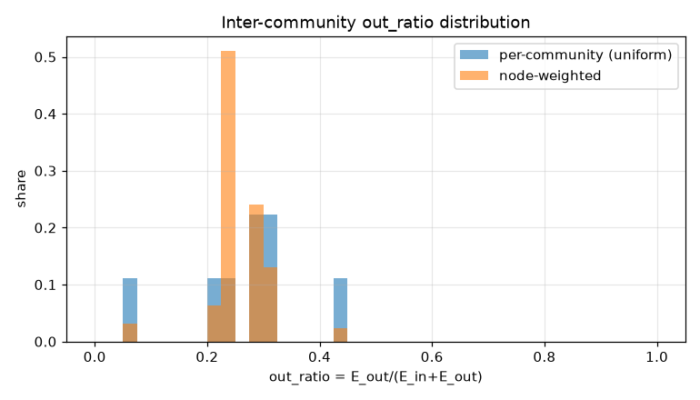
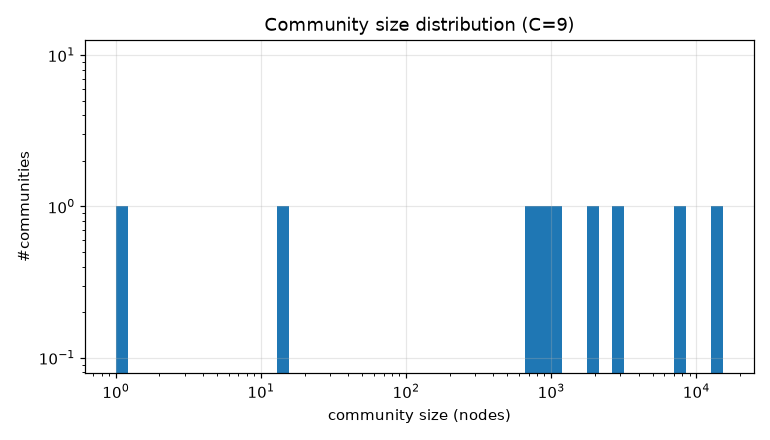

# コミュニティ分割 PoC レポート: bfs_mixed_30k

生成: 2026-09-25T14:24:28 / seed=42 / resolution=0.5 / dump=2026-09-02

## 1. サブセット概要

| 項目 | 値 |
|---|---|
| 戦略 | outlink_bfs |
| ノード数 | 30,000 |
| 内部エッジ(有向・解決後) | 1,376,803 |
| 内部エッジ(無向・一意) | 1,006,893 |
| サブセット外へのリンク(outgoing) | 4,829,817 |
| サブセット外からのリンク(incoming) | 11,854,813 |
| リーク率 out/(int+out) | 0.778 |
| ページID範囲 | 5〜5,288,357 |

## 2. resolution スイープ(コミュニティサイズ分布)

| resolution | #comms | 最大シェア | top5シェア | サイズ中央値 | p25 | p75 | cross_edge_fraction |
|---|---|---|---|---|---|---|---|
| 0.5 | 9 | 0.510 | 0.945 | 1050.000 | 686.000 | 2870.000 | 0.132 |
| 1.0 | 14 | 0.177 | 0.734 | 1268.000 | 953.250 | 4045.000 | 0.227 |
| 2.0 | 32 | 0.113 | 0.443 | 581.500 | 182.750 | 1368.750 | 0.301 |

## 3. 全体指標(採用 resolution)

| 指標 | 値 |
|---|---|
| コミュニティ数 | 9 |
| 最大コミュニティのノードシェア | 0.510 |
| 上位5コミュニティのシェア | 0.945 |
| cross_edge_fraction(全体) | 0.132 |
| out_ratio(エッジ重み付き平均) | 0.234 |
| out_ratio(ノード重み付き中央値) | 0.227 |
| out_ratio p25/p50/p75 | 0.222/0.279/0.310 |
| conductance p25/p50/p75 | 0.125/0.162/0.183 |
| サブセット外へのリンク数(有向) | 4,829,817 |
| サブセット外からのリンク数(有向) | 11,854,813 |

## 4. 上位コミュニティ(サイズ順 top 15)

| comm | 代表記事 | N_c | E_in | E_out | E_ext(場外) | out_ratio | conductance | avg_deg | 境界ノード率 |
|---|---|---|---|---|---|---|---|---|---|
| 1 | 19世紀、20世紀、18世紀 | 15,315 | 364,159 | 107,126 | 11,864,612 | 0.227 | 0.128 | 47.6 | 0.709 |
| 3 | 数学、物理学、化学 | 7,211 | 187,948 | 73,517 | 2,067,291 | 0.281 | 0.164 | 52.1 | 0.774 |
| 0 | コンピュータ、オペレーティングシステム、ソフトウェア | 2,870 | 72,041 | 32,223 | 861,232 | 0.309 | 0.183 | 50.2 | 0.827 |
| 4 | サッカー、チェス、柔道 | 1,891 | 74,072 | 19,109 | 921,066 | 0.205 | 0.114 | 78.3 | 0.864 |
| 5 | 食品、ラーメン、蕎麦 | 1,050 | 35,861 | 16,268 | 360,590 | 0.312 | 0.185 | 68.3 | 0.909 |
| 6 | 将棋、日本将棋連盟、棋士_(将棋) | 963 | 125,069 | 6,597 | 343,673 | 0.050 | 0.026 | 259.7 | 0.790 |
| 2 | 国際音声記号、言語学、言語 | 686 | 14,501 | 11,458 | 257,043 | 0.441 | 0.283 | 42.3 | 0.897 |
| 8 | 千葉県道129号誉田停車場中野線、千葉県道271号館山停車場線、千葉県道86号館山白浜線 | 13 | 78 | 30 | 9,123 | 0.278 | 0.161 | 12.0 | 1.000 |
| 7 | 電熱 | 1 | 0 | 0 | 0 | nan | nan | 0.0 | 0.000 |

## 5. コミュニティ間エッジ top 20

| comm A | comm B | エッジ数 | A代表 | B代表 |
|---|---|---|---|---|
| 1 | 3 | 52,120 | 19世紀、20世紀 | 数学、物理学 |
| 0 | 1 | 16,949 | コンピュータ、オペレーティングシステム | 19世紀、20世紀 |
| 1 | 4 | 16,052 | 19世紀、20世紀 | サッカー、チェス |
| 0 | 3 | 12,692 | コンピュータ、オペレーティングシステム | 数学、物理学 |
| 1 | 5 | 10,073 | 19世紀、20世紀 | 食品、ラーメン |
| 1 | 2 | 6,934 | 19世紀、20世紀 | 国際音声記号、言語学 |
| 3 | 5 | 5,112 | 数学、物理学 | 食品、ラーメン |
| 1 | 6 | 4,969 | 19世紀、20世紀 | 将棋、日本将棋連盟 |
| 2 | 3 | 1,962 | 国際音声記号、言語学 | 数学、物理学 |
| 0 | 2 | 1,686 | コンピュータ、オペレーティングシステム | 国際音声記号、言語学 |
| 3 | 4 | 1,339 | 数学、物理学 | サッカー、チェス |
| 4 | 6 | 884 | サッカー、チェス | 将棋、日本将棋連盟 |
| 2 | 5 | 611 | 国際音声記号、言語学 | 食品、ラーメン |
| 0 | 4 | 367 | コンピュータ、オペレーティングシステム | サッカー、チェス |
| 0 | 6 | 356 | コンピュータ、オペレーティングシステム | 将棋、日本将棋連盟 |
| 3 | 6 | 291 | 数学、物理学 | 将棋、日本将棋連盟 |
| 2 | 4 | 242 | 国際音声記号、言語学 | サッカー、チェス |
| 4 | 5 | 225 | サッカー、チェス | 食品、ラーメン |
| 0 | 5 | 173 | コンピュータ、オペレーティングシステム | 食品、ラーメン |
| 5 | 6 | 74 | 食品、ラーメン | 将棋、日本将棋連盟 |

## 6. ハブ記事の影響(次数 top 20)

| # | 記事 | 内部次数 | 場外次数 | comm | フラグ |
|---|---|---|---|---|---|
| 1 | サッカー | 1,174 | 23,892 | 4 |  |
| 2 | 仙台市 | 500 | 11,083 | 1 |  |
| 3 | 8月10日 | 610 | 10,798 | 1 | date |
| 4 | 駅ナンバリング | 166 | 11,116 | 1 |  |
| 5 | 4月28日 | 617 | 10,598 | 1 | date |
| 6 | 5月10日 | 602 | 10,580 | 1 | date |
| 7 | 4月26日 | 635 | 10,449 | 1 | date |
| 8 | 12月24日 | 598 | 10,456 | 1 | date |
| 9 | 12月18日 | 647 | 10,300 | 1 | date |
| 10 | イスラエル | 612 | 10,327 | 1 |  |
| 11 | 4月9日 | 617 | 10,322 | 1 | date |
| 12 | EMIミュージック・ジャパン | 131 | 10,789 | 1 |  |
| 13 | 広島市 | 385 | 10,528 | 1 |  |
| 14 | 2月8日 | 617 | 10,274 | 1 | date |
| 15 | 1月15日 | 594 | 10,280 | 1 | date |
| 16 | 11月22日 | 624 | 10,247 | 1 | date |
| 17 | 5月5日 | 611 | 10,251 | 1 | date |
| 18 | 4月16日 | 599 | 10,224 | 1 | date |
| 19 | 10月22日 | 584 | 10,236 | 1 | date |
| 20 | 10月26日 | 613 | 10,141 | 1 | date |

- 上位1%ノードが接する内部エッジのシェア: 0.160
- 内部次数 max: 1,255 / p50・p90・p99: 34.000・156.000・459.010

## 7. 階層化テスト(level-2)

| 指標 | 値 |
|---|---|
| 上位クラスタ数 K | 2 |
| 最大クラスタのシェア | 1.000 |
| out_ratio2(エッジ重み付き平均) | 0.000 |
| コミュニティ間グラフ modularity | 0.000 |

| cluster | #comms | N_nodes | E_in(記事) | E_between(comm間) | E_out2 | E_ext(場外) | out_ratio2 | conductance2 |
|---|---|---|---|---|---|---|---|---|
| 0 | 8 | 29,999 | 873729 | 133164 | 0 | 16684630 | 0.000 | 0.000 |
| 1 | 1 | 1 | 0 | 0 | 0 | 0 | - | - |

## 8. 図

