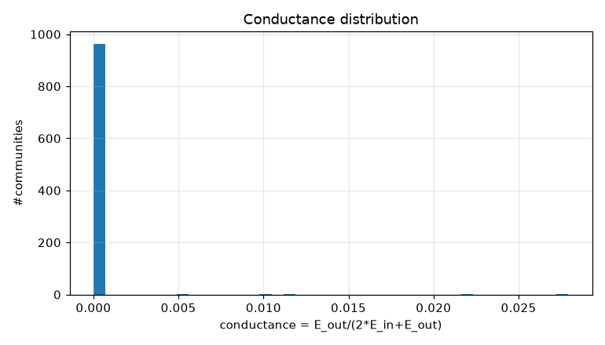
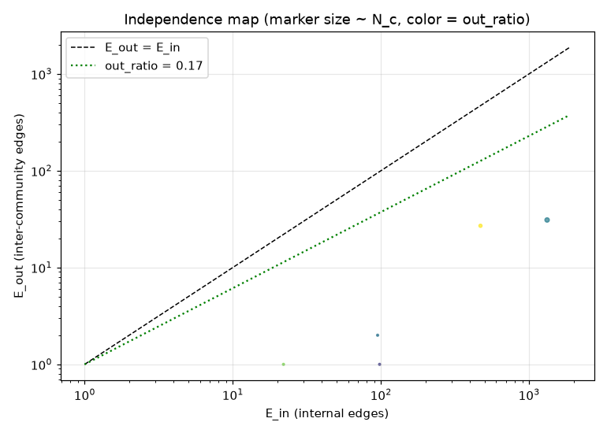
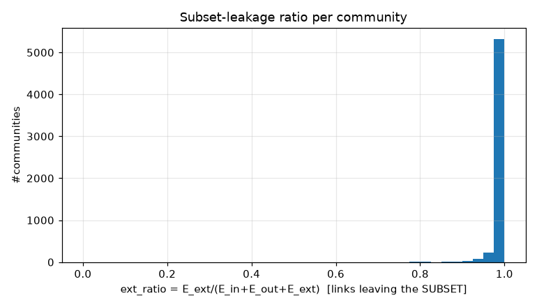
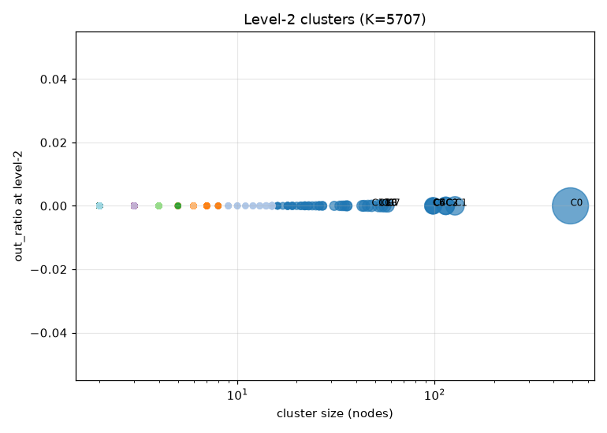
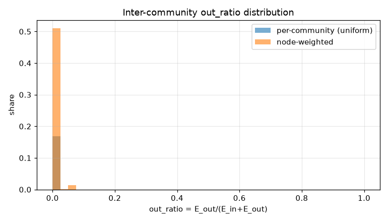
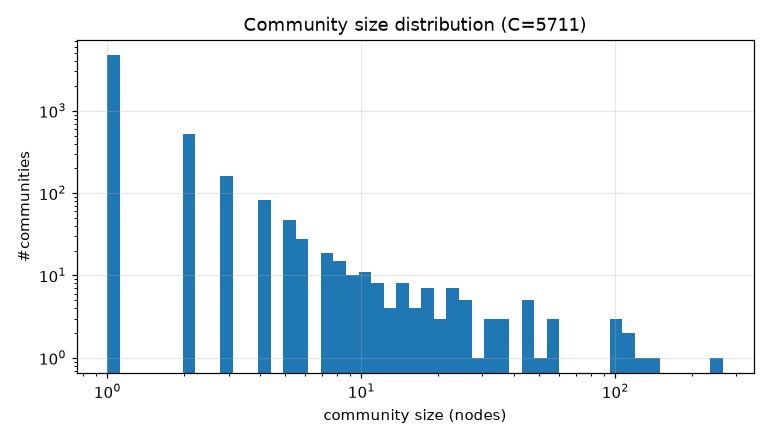

# コミュニティ分割 PoC レポート: idwin_late_10k

生成: 2026-09-25T13:38:54 / seed=42 / resolution=0.5 / dump=2026-09-02

## 1. サブセット概要

| 項目 | 値 |
|---|---|
| 戦略 | page_id_window(late) |
| ノード数 | 10,000 |
| 内部エッジ(有向・解決後) | 28,229 |
| 内部エッジ(無向・一意) | 16,323 |
| サブセット外へのリンク(outgoing) | 554,316 |
| サブセット外からのリンク(incoming) | 207,723 |
| リーク率 out/(int+out) | 0.952 |
| ページID範囲 | 5,259,112〜5,289,084 |

## 2. resolution スイープ(コミュニティサイズ分布)

| resolution | #comms | 最大シェア | top5シェア | サイズ中央値 | p25 | p75 | cross_edge_fraction |
|---|---|---|---|---|---|---|---|
| 0.5 | 5711 | 0.026 | 0.076 | 1.000 | 1.000 | 1.000 | 0.002 |
| 1.0 | 5713 | 0.028 | 0.074 | 1.000 | 1.000 | 1.000 | 0.003 |
| 2.0 | 5718 | 0.016 | 0.062 | 1.000 | 1.000 | 1.000 | 0.006 |

## 3. 全体指標(採用 resolution)

| 指標 | 値 |
|---|---|
| コミュニティ数 | 5,711 |
| 最大コミュニティのノードシェア | 0.026 |
| 上位5コミュニティのシェア | 0.076 |
| cross_edge_fraction(全体) | 0.002 |
| out_ratio(エッジ重み付き平均) | 0.004 |
| out_ratio(ノード重み付き中央値) | 0.000 |
| out_ratio p25/p50/p75 | 0.000/0.000/0.000 |
| conductance p25/p50/p75 | 0.000/0.000/0.000 |
| サブセット外へのリンク数(有向) | 554,316 |
| サブセット外からのリンク数(有向) | 207,723 |

## 4. 上位コミュニティ(サイズ順 top 15)

| comm | 代表記事 | N_c | E_in | E_out | E_ext(場外) | out_ratio | conductance | avg_deg | 境界ノード率 |
|---|---|---|---|---|---|---|---|---|---|
| 0 | フェミニスト美学、フェミニスト理論、トランスフェミニズム | 265 | 1,324 | 31 | 38,047 | 0.023 | 0.012 | 10.0 | 0.075 |
| 1 | 名辞論理学、構造_(数理論理学)、理論_(数理論理学) | 140 | 470 | 27 | 12,632 | 0.054 | 0.028 | 6.7 | 0.114 |
| 2 | バードライフ・インターナショナル地域別パートナーシップ団体の一覧、アフリカ・ユーラシアフライウェイ・システム、野生鳥類の保全に関する欧州議会及び理事会指令2009/147/EC | 127 | 219 | 0 | 3,502 | 0.000 | 0.000 | 3.4 | 0.000 |
| 3 | 長門俊介、名城大学女子駅伝部、城西大学陸上競技部 | 114 | 225 | 0 | 8,691 | 0.000 | 0.000 | 3.9 | 0.000 |
| 4 | 2026_FIFAワールドカップ・ノックアウトステージ_ラウンド32、AFCチャンピオンズリーグエリート2026/27_リーグステージ、リーガ・エスパニョーラ2026-2027 | 114 | 299 | 0 | 16,332 | 0.000 | 0.000 | 5.2 | 0.000 |
| 5 | UFC_Fight_Night:_du_Plessis_vs._Usman、UFC_Fight_Night:_Ankalaev_vs._Guskov、UFC_Fight_Night:_Hernandez_vs._Rodrigues | 99 | 1,232 | 0 | 75,986 | 0.000 | 0.000 | 24.9 | 0.000 |
| 6 | イースター・リリー、ア・デイ・ウィズアウト・ミー、ストリート・オブ・ドリームス_(U2の曲) | 98 | 732 | 0 | 13,425 | 0.000 | 0.000 | 14.9 | 0.000 |
| 7 | フッ化テクネチウム(V)、フッ化過テクネチル、CompTox化学物質ダッシュボード | 98 | 1,882 | 0 | 30,681 | 0.000 | 0.000 | 38.4 | 0.000 |
| 8 | 衆徒国民、成身院順盛、官符衆徒 | 58 | 140 | 0 | 2,862 | 0.000 | 0.000 | 4.8 | 0.000 |
| 9 | スコット・コリー、ボビー・ワトソン_(サックス奏者)、シェイマス・ブレイク | 56 | 72 | 0 | 2,868 | 0.000 | 0.000 | 2.6 | 0.000 |
| 10 | ロイヤルパレス、ティーノソ、シャーロットタウン_(競走馬) | 54 | 232 | 0 | 10,715 | 0.000 | 0.000 | 8.6 | 0.000 |
| 11 | パンクラーツ駅、フロレンツ駅、ヴルタヴスカー駅 | 52 | 243 | 0 | 1,028 | 0.000 | 0.000 | 9.3 | 0.000 |
| 12 | Yes!_東京、でこぼこライフ、畑駿平 | 48 | 144 | 0 | 15,054 | 0.000 | 0.000 | 6.0 | 0.000 |
| 13 | アショト1世_(イベリア公)、クラルジェティ、アチャラ_(歴史的地域) | 46 | 90 | 0 | 1,373 | 0.000 | 0.000 | 3.9 | 0.000 |
| 14 | 聖母の誕生_(ジョット)、キリストの嘲弄_(ジョット)、キリストの昇天_(ジョット) | 44 | 746 | 0 | 1,620 | 0.000 | 0.000 | 33.9 | 0.000 |

## 5. コミュニティ間エッジ top 20

| comm A | comm B | エッジ数 | A代表 | B代表 |
|---|---|---|---|---|
| 0 | 1 | 27 | フェミニスト美学、フェミニスト理論 | 名辞論理学、構造_(数理論理学) |
| 0 | 23 | 2 | フェミニスト美学、フェミニスト理論 | 玉座の聖母子と聖人たち、聖母戴冠_(クリヴェッリ) |
| 0 | 59 | 1 | フェミニスト美学、フェミニスト理論 | 水平細胞、スターバーストアマクリン細胞 |
| 0 | 16 | 1 | フェミニスト美学、フェミニスト理論 | 財政の持続可能性、政府債務 |

## 6. ハブ記事の影響(次数 top 20)

| # | 記事 | 内部次数 | 場外次数 | comm | フラグ |
|---|---|---|---|---|---|
| 1 | CompTox化学物質ダッシュボード | 68 | 7,579 | 7 |  |
| 2 | 宝塚歌劇団112期生 | 2 | 1,897 | 206 |  |
| 3 | UFC_328 | 48 | 1,545 | 5 |  |
| 4 | UFC_329 | 51 | 1,541 | 5 |  |
| 5 | UFC_327 | 47 | 1,543 | 5 |  |
| 6 | UFC_Fight_Night:_Tsarukyan_vs._Hooker | 47 | 1,542 | 5 |  |
| 7 | UFC_Fight_Night:_Adesanya_vs._Pyfer | 51 | 1,533 | 5 |  |
| 8 | UFC_on_ESPN:_Machado_Garry_vs._Prates | 47 | 1,536 | 5 |  |
| 9 | UFC_Fight_Night:_Emmett_vs._Vallejos | 51 | 1,532 | 5 |  |
| 10 | UFC_Fight_Night:_Ankalaev_vs._Guskov | 51 | 1,531 | 5 |  |
| 11 | UFC_326 | 47 | 1,535 | 5 |  |
| 12 | UFC_Fight_Night:_Muhammad_vs._Bonfim | 49 | 1,532 | 5 |  |
| 13 | UFC_on_ABC:_Whittaker_vs._de_Ridder | 48 | 1,533 | 5 |  |
| 14 | UFC_on_ESPN:_Lewis_vs._Teixeira | 48 | 1,532 | 5 |  |
| 15 | UFC_Fight_Night:_Song_vs._Figueiredo | 47 | 1,532 | 5 |  |
| 16 | UFC_330 | 47 | 1,532 | 5 |  |
| 17 | UFC_Fight_Night:_de_Ridder_vs._Allen | 48 | 1,531 | 5 |  |
| 18 | UFC_Fight_Night:_Della_Maddalena_vs._Prates | 49 | 1,529 | 5 |  |
| 19 | UFC_Fight_Night:_Bautista_vs._Oliveira | 50 | 1,528 | 5 |  |
| 20 | UFC_on_ESPN:_Usman_vs._Buckley | 48 | 1,529 | 5 |  |

- 上位1%ノードが接する内部エッジのシェア: 0.214
- 内部次数 max: 113 / p50・p90・p99: 1.000・8.000・48.000

## 7. 階層化テスト(level-2)

| 指標 | 値 |
|---|---|
| 上位クラスタ数 K | 5,707 |
| 最大クラスタのシェア | 0.049 |
| out_ratio2(エッジ重み付き平均) | 0.000 |
| コミュニティ間グラフ modularity | 0.000 |

| cluster | #comms | N_nodes | E_in(記事) | E_between(comm間) | E_out2 | E_ext(場外) | out_ratio2 | conductance2 |
|---|---|---|---|---|---|---|---|---|
| 0 | 5 | 489 | 2009 | 31 | 0 | 53422 | 0.000 | 0.000 |
| 1 | 1 | 127 | 219 | 0 | 0 | 3502 | 0.000 | 0.000 |
| 2 | 1 | 114 | 225 | 0 | 0 | 8691 | 0.000 | 0.000 |
| 3 | 1 | 114 | 299 | 0 | 0 | 16332 | 0.000 | 0.000 |
| 4 | 1 | 99 | 1232 | 0 | 0 | 75986 | 0.000 | 0.000 |
| 5 | 1 | 98 | 732 | 0 | 0 | 13425 | 0.000 | 0.000 |
| 6 | 1 | 98 | 1882 | 0 | 0 | 30681 | 0.000 | 0.000 |
| 7 | 1 | 58 | 140 | 0 | 0 | 2862 | 0.000 | 0.000 |
| 8 | 1 | 56 | 72 | 0 | 0 | 2868 | 0.000 | 0.000 |
| 9 | 1 | 54 | 232 | 0 | 0 | 10715 | 0.000 | 0.000 |
| 10 | 1 | 52 | 243 | 0 | 0 | 1028 | 0.000 | 0.000 |
| 11 | 1 | 48 | 144 | 0 | 0 | 15054 | 0.000 | 0.000 |
| 12 | 1 | 46 | 90 | 0 | 0 | 1373 | 0.000 | 0.000 |
| 13 | 1 | 44 | 746 | 0 | 0 | 1620 | 0.000 | 0.000 |
| 14 | 1 | 43 | 648 | 0 | 0 | 3548 | 0.000 | 0.000 |

## 8. 図

